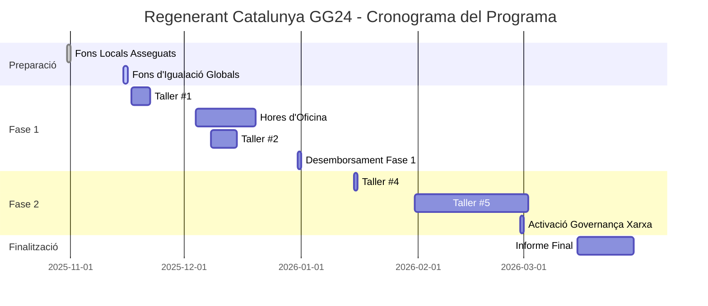

# Regenerant Catalunya - Cronograma del Programa

Cronograma complet per a la ronda de finançament Regenerant Catalunya, des de la preparació del programa fins a l'informe final.

---

## Visió General del Cronograma del Programa

---

## Fase 1: Preparació del Programa (octubre 2025)

### 31 d'octubre de 2025 ✅

**Fons locals (€11k) assegurats en cadena**

- Multisig de tresoreria llest per rebre fons
- Compromisos de socis locals confirmats
- **Estat:** Completat

### Final de novembre de 2025

**Fons d'igualació globals assegurats en cadena**

- Desemborsament estimat $18.000 (≈ €16.380) del Localism Fund
- Fons disponibles per a distribució

---

## Fase 2: Inici del Programa i Assignació Base (novembre–desembre 2025)

### 17-21 de novembre de 2025

**Taller #1: Introducció a Regenerant Catalunya**

- **Format:** En línia (1,5 hores)
- **Idioma:** Espanyol
- **Contingut:**
  - Presentació de ReFi Barcelona
  - Per què Web3 (abordant mites i preocupacions)
  - Visió a llarg termini (BioFi i Infraestructura de Finances Biorecionals)
  - Presentació de la ronda i els socis
  - Cronograma i activitats
  - Com es distribuiran els fons
  - Configuració de cartera Web3 (amb grups de treball)
- **Lliurable:** Obrir Cartera Web3

### 4-19 de desembre de 2025

**Hores d'Oficina per a Suport de Projectes**

- Suport segons calgui per a projectes que treballen en presentacions de Karma
- Assistència tècnica i resolució de problemes
- **Lliurable:** Enviar activitats a Karma (almenys 3 activitats passades i 3 plans futurs)

### 8-14 de desembre de 2025

**Taller #2: Documentar l'Impacte**

- **Format:** En línia
- **Idioma:** Espanyol
- **Contingut:**
  - Com documentar l'impacte de manera efectiva
  - La importància de bones dades (independentment de cripto)
  - Establir mètriques adequades per a la regeneració
  - Què és Karma i per què utilitzar-lo
  - Com registrar activitats a Karma
  - Exemples de projectes que utilitzen Karma efectivament
  - Què busquem (3 activitats passades + 3 plans futurs)
- **Lliurable:** Obrir compte a Karma

### Final de desembre de 2025

**Desemborsament de la Fase 1**

- **Mínim €1.000 per projecte** (vinculat als requisits mínims de participació)
- **Fins a €1.500 per projecte** (basat en avaluació simplificada d'impacte)
- Fons distribuïts a carteres Web3 de projectes a Celo
- Suport d'off-ramp proporcionat (sense responsabilitats legals)

**Requisits Mínims de Participació:**

- ✅ Participar en almenys 2 tallers
- ✅ Obrir cartera web3
- ✅ Enviar almenys 3 activitats passades i 3 plans futurs a Karma

---

## Fase 3: Governança Col·lectiva a Nivell de Xarxa (gener–febrer 2026)

### Gener de 2026

**Taller #4: Eines Web3 Avançades (per xarxa)**

- **Format:** En línia, sessions separades per a cada xarxa
- **Idioma:** Espanyol
- **Contingut:**
  - Establir expectatives adequades per a governança de xarxa
  - Com les eines es poden utilitzar per a governança:
    - Gardens (votació per convicció)
    - Contractes multistakeholder
  - Eines financeres:
    - Safe (multisigs)
    - Sarafu (moneda local / agrupació de compromisos)
    - Cycles (protocol de compensació obert)
- **Lliurables:**
  - Acordar quins mecanismes utilitzar per gestionar el fons col·lectiu
  - Activar la governança dels fons

### Gener/febrer de 2026

**Taller #5: BioFi i Més Enllà**

- **Format:** En línia
- **Idioma:** Espanyol
- **Contingut:**
  - Què és BioFi?
  - Visió a llarg termini — com s'ajusta amb el que estem fent
  - Programa com a pilot
  - Construir Infraestructura de Finances Biorecionals (BFFs)
- **Lliurable:** Retroalimentació

### Final de febrer de 2026

**Les Xarxes Activen la Governança Col·lectiva dels Fons de la Fase 2**

- **Xarxa Miceli Social:** ~€6.000 fons col·lectiu activat
- **Xarxa La Fundició / Keras Buti:** ~€5.000 fons col·lectiu activat
- Les xarxes governen col·lectivament els fons utilitzant eines de governança Web3
- Primeres decisions col·lectives preses

---

## Fase 4: Finalització del Programa (març 2026)

### Març de 2026

**Informe Final Publicat**

- Tots els artefactes publicats en **Català, Espanyol i Anglès**
- Publicat a [regenerant.refibcn.cat](https://regenerant.refibcn.cat/)
- Inclou:
  - Informe final
  - Metodologia de documentació d'impacte
  - Anàlisi regional amb visualitzacions
  - Eina de replicació
  - Plantilles de governança de xarxa
  - Estudis de cas i històries de projectes

---

## Resum de Fites Clau

| Data                 | Fita                                          | Estat         |
| -------------------- | --------------------------------------------- | ------------- |
| **31 oct 2025**      | Fons locals (€11k) assegurats en cadena       | ✅ Completat  |
| **Mitjans nov 2025** | Fons d'igualació globals assegurats en cadena | 🔄 En Progrés |
| **17-21 nov 2025**   | Taller #1 — Inici del programa                | 📅 Proper     |
| **4-19 des 2025**    | Hores d'oficina per a suport de projectes     | 📅 Proper     |
| **8-14 des 2025**    | Taller #2 — Documentació d'impacte            | 📅 Proper     |
| **Final des 2025**   | Desemborsament de la Fase 1                   | 📅 Proper     |
| **Gen 2026**         | Taller #4 — Eines Web3 avançades              | 📅 Planificat |
| **Gen/feb 2026**     | Taller #5 — BioFi i més enllà                 | 📅 Planificat |
| **Final feb 2026**   | Les xarxes activen governança col·lectiva     | 📅 Planificat |
| **Mar 2026**         | Informe final publicat                        | 📅 Planificat |

---

## Flux de Finançament en Dues Fases

```mermaid
graph LR
    A[Incorporació de Projectes<br/>Nov 2025] --> B[Fase 1: Base<br/>Nov-Des 2025]
    B --> C[Informes Karma<br/>+ Avaluació Simplificada d'Impacte]
    C --> D[Desemborsament<br/>Mín €1.000, fins a €1.500/projecte]
    D --> E[Fase 2: Governança Xarxa<br/>Gen-Feb 2026]
    E --> F[Eines a Nivell de Xarxa<br/>Gardens, Safe, Sarafu, Cycles]
    F --> G[Activació Fons Col·lectiu<br/>Miceli ~€6k, La Fundició ~€5k]
    G --> H[Informe Final<br/>Feb-Mar 2026]

    style B fill:#90EE90
    style E fill:#87CEEB
    style H fill:#FFD700
```

---

## Dates Importants per a Projectes

### Esdeveniments Obligatoris

- **17-21 de novembre de 2025:** Taller #1 (requerit per a participació mínima)
- **8-14 de desembre de 2025:** Taller #2 (requerit per a participació mínima)
- **4-19 de desembre de 2025:** Hores d'oficina (recomanat per a suport de Karma)

### Opcional però Recomanat

- **Gener de 2026:** Taller #4 (per a governança de xarxa)
- **Gener/febrer de 2026:** Taller #5 (per a visió a llarg termini)

### Terminis

- **Final de desembre de 2025:** Enviar activitats de Karma (3 passades + 3 futures) per qualificar-se per al finançament de la Fase 1
- **Final de febrer de 2026:** Les xarxes activen la governança de la Fase 2

---

## Suport Continu i Infraestructura

Durant tot el programa, els projectes tenen accés a:

**Suport Tècnic:**
- Hores d'oficina setmanals per a preguntes tècniques i resolució de problemes
- Suport a la carta per a problemes crítics i emergències
- Actualitzacions de plataforma i introducció de noves funcionalitats
- Orientació sobre seguretat i millors pràctiques

**Programa de Mentoria:**
- Sessions mensuals mentor-projecte amb experts Web3 globals
- Oportunitats d'aprenentatge entre iguals i col·laboració entre projectes
- Suport ad-hoc per a reptes i oportunitats específiques

**Construcció de Comunitat:**
- Reunions regulars de cohort i compartició de progrés
- Facilitació de col·laboració entre projectes
- Construcció de xarxa i desenvolupament de relacions

---

## Recursos

- [Guia de Projectes](/ca/program/project-guidebook) — Guia detallada per a projectes participants
- [Guia de Xarxa](/ca/program/network-guidebook) — Guia per a la governança de xarxa de la Fase 2
- [Recursos](/ca/resources) — Enllaços a tota la documentació d'eines i materials de suport
- [Programa](/ca/program) — Informació completa del programa

---

**Preguntes sobre el cronograma?** Contacta'ns a hola@ReFiBCN.cat
