# REGENERANT CATALUNYA GG24 [MASTER DOC]

-@Commons Agency add all links when draft is ready

-Many parts have to be updated regarding what GG24 finally is, the name of the round etc etc, do a proper final check of this aspect alone when ready

> **Future Points TBD**
> 
> - [ ]  Funds allocation according to past / future work
>     
>     **Advisors:**
>     
>     - **Oriol** - Miceli Social: Rural resilience and municipal collaboration expertise
>     - **Mariló** - La Fundició • Keras Buti: Urban cooperative economics and cultural innovation experience
>     - Oscar/Erika?
>     - Clara Gromaches?
>     - Representative from Arran de Terra

# A. Introduction

---

## **1. A Participatory Funding Round for Regeneration in Catalonia - [Introduction]**

***Programa de Finançament Participatiu Bioregional a Catalunya***

**Regenerant Catalunya** is a participatory funding round dedicated to channeling resources into projects that are regenerating life in the Catalan bioregion. From conserving and restoring natural ecosystems like the Fluvià River basin to developing community infrastructure in L'Hospitalet de Llobregat — Catalonia's second most populous municipality and one of Europe's most densely populated cities — this initiative supports **on-the-ground regenerative work** across the region.

Launching in the **last week of October 2025**, the program is led by **ReFi Barcelona** as a bridge between local needs and global support. We provide a curated cohort of **10–12 local projects** with funding, capacity-building workshops, and hands-on mentorship to experiment with **Web3 technologies and financial tools** (blockchain-based impact tracking, transparent treasury management, digital measurement systems) that could open new income streams and improve their long-term resilience.

Both the funding pool *and* the activities of Regenerant Catalunya emerged through a mediation of local and global interests. Established Catalan regenerative networks like **Miceli Social** and **La Fundició** have together committed around **€11,000**, that is being matched with up to $20,000 **by global sponsors through the Localism Fund** – bringing the total pool to **€29,200**, which will be used to directly support 10-12 regenerative projects in Catalonia.

---
## **2. Why Now? - enabling entanglements [Contextualization]**

Enabling entanglements - write intro to section

### **Web3, Public Goods, and Regenerative Finance (ReFi)**

Around the world, new approaches to finance are emerging that bring together transparency, decentralization, and democratic processes in service of solidarity and regeneration. **Web3** — the decentralized web powered by blockchain — enables communities to directly fund and govern projects without intermediaries, aligning incentives around shared values.

**Regenerative Finance (ReFi)** has emerged as a movement to reimagine economic systems toward restorative outcomes for people and planet. ReFi projects leverage blockchain, digital measurement (dMRV), and AI to channel resources into public goods and ecological regeneration rather than extraction.

A major focus of Web3 and ReFi has been **public goods funding** — developing open-access resources that benefit all while ensuring ecosystem development is appropriately funded. [**Gitcoin Grants**](https://grants.gitcoin.co/) is one of the most visible examples, having distributed over $60 million using mechanisms like [**quadratic funding**](https://en.wikipedia.org/wiki/Quadratic_voting#Quadratic_funding) (QF) to amplify community preferences and democratize resource allocation.

### **Regen Coordination: A Global Movement Bridging Scales**

.png)

From the Web3 ecosystem, [**Regen Coordination**](https://www.regencoordination.xyz/) emerged as a global alliance dedicated to weaving together local experiments into a coherent movement. Founded by **ReFi DAO** and **Greenpill Network** with support from Gitcoin and Celo Public Goods, Regen Coordination spans a constellation of communities — including ReFi DAO Local Nodes, Greenpill Chapters, **Bloom Network**, **The BioFi Project**, **Ma Earth**, **AgroforestDAO**, and many others — united by a mission to drive ecological, social, and economic regeneration through open collaboration.

**Key past programs include:**

- **Regen Coordination Global Round (GG23)** — deployed a $96,000 matching pool to support 50 projects at the intersection of ReFi, Ethereum, and local social-ecological impact
- **ReFi Mediterranean GG23** — the first bioregional quadratic funding round across the Mediterranean
- **Regen Rio de Janeiro GG23** — bringing Web3 funding tools to Brazilian contexts
- **Zazelenimo (Split, Croatia)** — pilot blend blending Ethereum-based participatory funding with a *3:1 matching contribution from the local municipal government*, enabling citizen-led tree planting through a public–private–community capital stack.

In its first year, Regen Coordination raised and distributed over **$370,000** to regenerative communities globally. These experiments align with the growing **Ethereum Localism** movement, which embeds Web3 tools into place-based communities to coordinate resources, measure impact, and strengthen local economies — building toward a **"cosmo-local"** network where global resources and technology meet local knowledge and action.

### **The Localism Fund: Supporting Place-Based Ethereum Adoption**

Building on this momentum, the [**Localism Fund**](https://www.localism.fund/) launched in 2025 as a dedicated grants program supporting **credible local networks and place-based groups** building practical models of political, economic, cultural, and ecological localism using Ethereum infrastructure.

**Local Grant Programs | Round 01** is the Localism Fund's inaugural round, operated by [**OpenCivics**](https://opencivics.co/) (Patricia Parkinson & Benjamin Life) and **Regen Coordination** (Monty Merlin):

1. Each selected local hub runs its **own local funding round**, directing matching funds toward projects that strengthen local conditions. Applications are evaluated by an [**Attested Expert Network**](https://www.localism.fund/expert-network) — a peer-vouched collective of 9–12 practitioners with proven experience in grant-making, Web3/Ethereum tooling, and localism.
2. Programs receive **up to 2× matching** (max $20,000). The framework ensures funding flows to credible, high-potential programs while building collective intelligence about what works in place-based Ethereum adoption.

### **Regenerant Catalunya in Context**

**Regenerant Catalunya** is one of the first programs funded by Localism Fund, with the intention to demonstrate the potential of Web3 tools to serve real community needs, while being strongly locally anchored and co-funded by our local partners **Miceli Social & La Fundició / Keras Buti.**

Catalonia is an ideal proving ground: the region boasts a vibrant **Social and Solidarity Economy (SSE)** with a century-long history of cooperativism, numerous organizations working on sustainable development and commons-based initiatives, and strong alignment with ReFi values like bioregionalism, ecological restoration, degrowth, and community governance.

By embedding Web3 funding mechanisms into Catalonia's existing ecosystem, we aim to amplify what's already working on the ground while generating insights and open-source templates for other localities. The learnings will flow back to the the global network and strengthen the infrastructure for place-based coordination.
---

## **3.** Introducing the Regenerant Catalunya**: A Living Laboratory for Bioregional Finance**

Regenerant Catalunya is designed as more than a one-time funding round — it's a **capacity-building process** and **living laboratory** for testing how Web3 tools can strengthen place-based regenerative work.

### **How It Works: Local + Global Funding**

Both the funding pool and the program design emerged through collaboration between local and global stakeholders:

**Local Co-Funding (€11,000):**

- [**Miceli Social**](https://miceli.social/) (€6,000) — a cooperative service hub based in Ripoll (Girona) focused on **rural resilience**, catalyzing regenerative development across rural *comarques* (counties) by supporting municipalities and community groups in ecological transition.
- [**La Fundició / Keras Buti**](https://lafundicio.net/) (€5,000) — a multi-stakeholder cooperative and official hub within the *Xarxa d'Ateneus Cooperatius*, based in L'Hospitalet de Llobregat (Barcelona metro). Since 2006, they've linked the **urban commons** to bioregional practice through culture, education, and feminist economics.

**Global Matching ($20,000 ≈ €18,200):**
Secured through the [**Localism Fund**](https://www.localism.fund/) — a new grants program supporting credible local networks building practical models of political, economic, cultural, and ecological localism using Ethereum infrastructure.

**Total Program Budget: ~€29,200 (~$32,120)**

### **Two-Stage Funding Mechanism**

Projects receive funding through a **two-phase distribution** tied to completion of requirements and impact evaluation:

1. **Phase 1 — Baseline Allocation (Nov–Dec 2025):** 
    - **Minimum €1,000 per project** (tied to minimum participation requirements)
    - **Up to €1,500 per project** based on simplified impact evaluation
    - **Minimum participation requirements** (required for €1k minimum):
        - Participate in at least 2 workshops
        - Open web3 wallet
        - Submit at least 3 past activities and 3 future plans to **Karma**
    - **Impact evaluation:** Simplified evaluation continues but won't dictate distribution much since the 50% split with €1k minimum leaves limited variance for allocation differences
    - Projects can receive less than €1k if they don't meet minimum participation requirements
2. **Phase 2 — Network-Level Collective Governance (Jan–Feb 2026):** **€1,000 per project** allocated to network-level pools:
    - **Miceli Social network:** ~€6,000 collective pool
    - **La Fundició / Keras Buti network:** ~€5,000 collective pool
    - Networks collectively govern funds using Web3 governance tools (Gardens, multistakeholder contracts, Safe multisigs, Sarafu, Cycles)

### **Program Design**

**1. Curated Cohort, Not Open Call**

Rather than casting a wide net, we work with **Miceli Social** and **La Fundició** to invite **11 high-potential projects** already doing meaningful work. This allows us to:

- Stay close to each project and provide hands-on support
- Identify where Web3 tools add genuine value (not impose solutions)
- Build a cohesive learning community across rural and urban contexts
- Generate deeper insights than a large, dispersed cohort would allow

**2. Network-Driven Adoption**

Innovations are introduced **within trusted ecosystems** rather than asking communities to adopt unfamiliar tools from scratch. By working through Miceli's **rural resilience networks** and La Fundició's **urban cooperative fabric**, new practices can spread organically through existing relationships of trust and solidarity.

**3. Two-Phase Funding: Baseline + Network-Level Governance**

```mermaid
graph LR
    A[Project Onboarding<br/>Nov 2025] --> B[Phase 1: Baseline<br/>Nov-Dec 2025]
    B --> C[Karma Reports<br/>+ Simplified Impact Evaluation]
    C --> D[Disbursement<br/>Min €1,000, up to €1,500/project]
    D --> E[Phase 2: Network Governance<br/>Jan-Feb 2026]
    E --> F[Network-Level Tools<br/>Gardens, Safe, Sarafu, Cycles]
    F --> G[Collective Pool Activation<br/>Miceli ~€6k, La Fundició ~€5k]
    G --> H[Final Reporting<br/>Feb-Mar 2026]

    style B fill:#90EE90
    style E fill:#87CEEB
    style H fill:#FFD700

```

This phased approach:

- **Rewards completion of minimum participation requirements** (Phase 1 minimum €1k) while allowing **simplified impact evaluation** to determine allocation up to €1,500
- Empowers networks to collectively govern Phase 2 funds using Web3 tools
- Creates natural checkpoints for learning and adjustment
- Reduces risk for both projects and funders

**4. Impact Documentation & Simplified Evaluation**

Our approach combines **impact documentation training** with **simplified impact evaluation**:

- **Structured reporting** through Karma following Common Approach frameworks
- **Impact documentation training** in Workshop #2 (December 8-14, 2025) covering how to document impact effectively, importance of good data, setting metrics for regeneration, and using Karma
- **Simplified impact evaluation:** Evaluation continues in Phase 1 but won't dictate distribution much since the 50% split with €1k minimum leaves limited variance for allocation differences
- **Allocation structure**: 
    - **Minimum €1,000 per project** tied to minimum participation requirements (participate in 2+ workshops, open wallet, submit 3 past + 3 future activities to Karma)
    - **Up to €1,500 per project** based on simplified impact evaluation
    - Projects can receive less than €1k if they don't meet minimum participation requirements

This approach empowers projects with skills they can use beyond this program while ensuring transparent, verifiable impact reporting and maintaining a simplified evaluation process.

**5. Open Knowledge Generation**

All documentation, methodologies, and learnings are published openly at [**regenerant.refibcn.cat**](https://regenerant.refibcn.cat/) in Catalan, Spanish, and English. This includes:

- Program design and network governance templates
- Impact documentation methodology and training materials
- Technical onboarding guides and tool tutorials
- Impact data and regional analysis
- Case studies and project stories
- Replication toolkit for other bioregions

---

### **Technology Serving Community**

Rather than imposing complex blockchain systems, we start with **minimal Web3 stack** requirements:

**Required Tools (Phase 1):** All projects use **Karma** for transparent impact reporting and receive **Web3 wallets on Celo** (preferably with social recovery like Valora or Minipay) for secure fund management. We provide comprehensive support for wallet setup, security, backups, and secure fund handling.

**Network-Level Tools (Phase 2):** Networks collectively govern Phase 2 funds using Web3 governance and finance tools:

- **Governance:** Gardens (conviction voting), multistakeholder contracts
- **Finance:** Safe (multisigs), Sarafu (local currency / commitment pooling), Cycles (open clearing protocol)

### **Technology Stack**

**Required for all projects:**

- **Karma GAP** — on-chain activity and impact reporting (living public "project resume")
- **Web3 wallet on Celo** — secure fund management (Valora, Minipay, MetaMask, etc.)

**Optional pilots:**

- **Silvi** (tree planting dMRV), **Hypercerts/Ecocerts** (impact credentials), **Gainforest** (forest MRV), **Sarafu** (local currency), **Kokonut Network** (syntropic agroforestry), **Gardens** (conviction voting), **Cycles** (clearing protocol)

### **Technology Stack: Minimal Requirements, Maximum Flexibility**

Rather than imposing complex blockchain systems, we start with a **minimal Web3 stack** and let projects opt into deeper experimentation based on their needs and capacity.

**Required Tools (Phase 1):**

1. **Karma** — On-chain activity and impact reporting
    - Living public "project resume" making impact visible and verifiable
    - Aligned with Common Approach guidelines using bioregionalized templates
    - Improves discoverability for future funders
    - Training and templates provided by ReFi BCN in Workshop #2
    - Projects submit at least 3 past activities and 3 future plans to Karma
2. **Web3 Wallet on Celo** — Secure fund management
    - **Priority:** Social recovery capability strongly preferred (Valora, Minipay)
    - Also supported: Prosperity Pass, MetaMask, Zerion, Rainbow
    - Comprehensive onboarding: setup, security, backups, practical use
    - Off-ramp support provided (without legal liabilities)

**Network-Level Tools (Phase 2):**

- **Governance:** [**Gardens**](https://gardens.1hive.org/) (conviction voting for community funding and governance), multistakeholder contracts
- **Finance:** [**Safe**](https://safe.global/) (multisigs), [**Sarafu Network**](https://sarafu.network/) (local currency / commitment pooling), [**Cycles**](https://www.cycles.so/) (open clearing protocol)

**Why network-level tools matter:** Networks collectively govern Phase 2 funds using these Web3 tools, creating **portable, verifiable governance structures** that:

- Demonstrate practical value of Ethereum tooling for regenerative work
- Enable networks to manage collective resources transparently
- Build on-chain governance capacity that can be reused for future rounds
- Create templates for other bioregions to replicate

**Community Infrastructure:**

- **Notion workspace** — Aggregates updates from all projects for easy following
- **WhatsApp groups** — Informal progress sharing among participants and supporters
- **Regular sync calls** — Peer learning and troubleshooting sessions

---

### **Measuring What Matters**

Our approach combines **impact documentation training** with **simplified impact evaluation**:

- **Structured reporting** through Karma following Common Approach frameworks
- **Impact documentation training** in Workshop #2 (December 8-14, 2025) covering:
    - How to document impact effectively
    - The importance of good data (regardless of crypto)
    - Setting appropriate metrics for regeneration
    - How to log activities in Karma
- **Simplified impact evaluation:** Evaluation continues in Phase 1 but won't dictate distribution much since the 50% split with €1k minimum leaves limited variance for allocation differences
- **Allocation structure**: 
    - **Minimum €1,000 per project** tied to minimum participation requirements (participate in 2+ workshops, open wallet, submit 3 past + 3 future activities to Karma)
    - **Up to €1,500 per project** based on simplified impact evaluation
    - Projects can receive less than €1k if they don't meet minimum participation requirements

This approach empowers projects with skills they can use beyond this program while ensuring transparent, verifiable impact reporting and maintaining a simplified evaluation process.

### **Measuring Impact: On-Chain + Off-Chain**

**On-Chain Metrics (via Karma & blockchain analytics):**

- New Web3 wallets created in Catalonia
- Local vs. external fund flows
- Karma update frequency and quality
- Tool adoption and retention rates across cohort
- Network-level governance activity (Phase 2)
- Transaction patterns and on-chain activity

**Off-Chain Impact Metrics (by domain):**

- **Ecological:** Water quality improvements, hectares restored, biodiversity indicators
- **Social:** Participants reached, workshops delivered, community members engaged
- **Cultural:** Schools involved, narratives created, cultural spaces activated
- **Economic:** Jobs created, cooperative members, local procurement, circular economy flows
- **Network:** New partnerships, replication attempts, knowledge artifacts produced

**Qualitative Outcomes:**

- Case studies documenting project journeys
- Testimonials from participants and beneficiaries
- Learning stories about tool adoption challenges and breakthroughs
- Reflections on what worked and what didn't

**Regional Analysis:**
A comprehensive footprint dashboard summarizing:

- Geographic distribution of wallets and activity
- Fund flows (local ↔ global)
- Tool adoption patterns across project types
- Comparative analysis: rural vs. urban contexts
- Data package to attract future funding and demonstrate Catalonia's Web3 readiness
- **Transparent Treasury:** All funds are managed through a **Safe multisig on Celo** (`0x91889ea97FeD05180fb5A70cB9570630f3C0Be77`) with public on-chain records.
- **Public Reporting:** Complete program documentation, impact reports, and learning artifacts are published at [**regenerant.refibcn.cat**](https://regenerant.refibcn.cat/) in Catalan, Spanish, and English.

---

### **Building Beyond This Round**

Most importantly, Regenerant Catalunya is designed as a **capacity-building process** that extends before and after the funding moment. The open report we'll publish in early 2026 serves both as accountability to sponsors and as a knowledge product for the wider regenerative finance community.

The goal isn't just to fund the 10-12 projects — it's to demonstrate that **Web3 tools can directly serve the urgent needs of people and ecosystems** while building infrastructure for ongoing bioregional regeneration through network-level governance.

If successful, 2026 may see:

- **Regenerant Catalunya Round 2**
- **Permanent Bioregional Finance Infrastructure** for continuous resource channeling
- **Replication in other bioregions, in the Mediterranean and beyond,** using our open-source toolkit
- **Integration with municipal and institutional funding** (like Zazelenimo)
- **Stronger bridges** between Catalan cooperatives and global Web3 ecosystems

### **Program Timeline: November 2025 – March 2026**

1. **Program Preparation - October ‘25**
    - **Oct 31 2025:** Local funds **(€11k)** secured on-chain (treasury readiness) ✅
    - **Mid-November 2025:** Global matching funds secured on-chain
2.  **Program / Phase 1 Kickoff - November ‘25:**
    - **November 17-21:** Workshop #1 — Program kickoff with projects
    - **December 8-14:** Workshop #2 — Impact documentation training
    - **December 4-19:** Office hours for project support
    - **End of December:** Phase 1 disbursement — minimum €1,000 per project (tied to minimum participation requirements), up to €1,500 per project (based on simplified impact evaluation)
3.  **Phase 2 Kickoff - January ‘26:**
    - **January 2026:** Workshop #4
    - **January/February 2026:** Workshop #5
    - **End of February 2026:** Networks activate collective governance of Phase 2 funds
4. **Program Wrap-Up**
    - **Mar 2026:** All artifacts - final report, datasets, templates, … - published in **CA/ES/EN** at **regenerant.refibcn.cat**

### **The Project Cohort: Regenerating Catalonia from Rural to Urban**

Our curated cohort of **10-12 projects** reflects a full spectrum of Catalonia's regenerative work, spanning **ecosystem restoration, community health, education, sustainable tourism, housing, and cultural innovation**.

**From Rural Resilience (invited by Miceli Social):**

- [**Resilience Earth**](https://resilience.earth/) — Worker cooperative applying blockchain and AI systems to improve environmental data collection for the **Fluvià River basin**, creating digital infrastructure for bioregional governance
- [**De Bat a Bat**](http://www.debatabat.org/) — Developing holistic community health models rooted in nature, supported by Erasmus+ and LIFE funding
- [**Mixité**](https://www.mixite.cat/) — Designing new policies and strategies for **rural housing sustainability**, offering support services for municipalities
- [**Chapter#2**](https://chapter2.cat/) — Bringing regenerative storytelling into schools, helping them recover their link with place through artistic co-creation
- [**Anigami**](https://www.anigami.cat/) — Advancing regenerative tourism models combining Erasmus+ funding with training programs
- [**Regeneració.XYZ**](https://regeneracio.xyz/) — Creative agency crafting new narratives for regeneration through art, recognized by Culture Hack Labs' *Rhizome* program

**From Urban Innovation (invited by La Fundició / Keras Buti):**

- [**Les Juntes**](https://www.lesjuntes.coop/) — Cooperative housing project under a "use-right" model (*cesión de uso*), recovering housing from investment funds to guarantee housing sovereignty
- [**La Suculenta**](https://www.instagram.com/suculentalh/?hl=es) — Community dining providing affordable ecological meals while training people who have suffered rights violations
- [**Laurel 31**](https://www.instagram.com/laurel31_economiassilvestres/?hl=es) — Space for textile creation guided by environmental sustainability and political thought
- **La Marmita** — Implementing low-cost, healthy meal production using **thermopol** cooking technology in the La Florida neighborhood
- **La Granja del Tilo** — Worker cooperative running an organic egg farm in the **Parc Agrari del Baix Llobregat**, ensuring generational renewal in farming

**Additional invitations (by ReFi Barcelona):** Fundació Emprius, Arran de Terra, Decolonizing Permaculture (TBD)

---

## 5. Conclusion – **Financing the Future, One Bioregion at a Time**

***Alternative: Funding the Ecosocial Transition in Catalunya and Beyond***

In summary, **Regenerant Catalunya** is more than a one-time grant competition – it's an *experiment in how we finance the future*. By combining the trust and relationships of local communities with the open-access digital infrastructure of global networks, we are charting a new path for funding the commons. This initiative will show that **Web3 tools can directly serve the urgent needs of people and ecosystems**, not in a distant or theoretical way, but right here in Catalonia's forests, rivers, towns, and neighborhoods.

**Regenerant Catalunya** is not intended to be a one-time grant competition — it is an ***experiment in how we finance the future***. By weaving together the trust and relationships of local communities with the open-access digital infrastructure of global networks, we're charting a new path for funding the commons.

Looking ahead, the lessons from this round will inform a longer journey. 2026 may see new rounds or perhaps the birth of a **Bioregional Finance Infrastructure** for Catalonia – a more permanent system to continuously channel resources into regenerative projects. Imagine a future where Catalan cooperatives and environmental groups have access to ongoing community funding portals, where impact data flows seamlessly into funding decisions, and where local currencies and credits incentivize regenerative behaviors across society. That vision is already being seeded by various organizations in the territory (some of which are part of this round), and **ReFi Barcelona was created precisely to connect, support, and amplify these efforts**. Our role is to ensure the spark lit by Regenerant Catalunya grows into a sustained flame of *regenerative finance* powering the eco-social transition of our region.

### **What We're Proving**

This initiative demonstrates that **Web3 tools can directly serve the urgent needs of people and ecosystems** — not in a distant or theoretical way, but right here in Catalonia's forests, rivers, towns, and neighborhoods. Through this program, we're showing that:

- **Local knowledge + global resources = powerful synergy** when mediated through transparent, accountable infrastructure
- **Cooperative traditions and blockchain technology** are natural allies, not opposites
- **Impact can be made visible and verifiable** without sacrificing nuance or local context
- **Small, curated cohorts with deep support** generate more learning than large, dispersed grants
- **Phased funding tied to adoption** creates sustainable pathways for communities to integrate new tools

### **Looking Ahead: From Pilot to Infrastructure**

The lessons from this round will inform a longer journey. If successful, 2026 may see:

**Immediate Next Steps:**

- **Regenerant Catalunya Round 2** — expanded cohort, refined mechanisms, deeper tool integration
- **Replication toolkit** enabling other Mediterranean bioregions to launch similar programs
- **Integration with institutional funders** — exploring municipal and EU co-funding models (like Zazelenimo's 3:1 match)

**Long-Term Vision:**

- **Permanent Bioregional Finance Infrastructure** for Catalonia — continuous resource channeling to regenerative work
- **Network of local funding programs** across the Mediterranean and beyond, coordinated through shared standards
- **Seamless integration** where Catalan cooperatives and environmental groups routinely access community funding portals, impact data flows into decisions, and local currencies incentivize regenerative behaviors

That vision is already being seeded by organizations in our territory (many of which are part of this round). **ReFi Barcelona was created precisely to connect, support, and amplify these efforts** — ensuring the spark lit by Regenerant Catalunya grows into a sustained flame of regenerative finance powering the eco-social transition of our region.

### **The Broader Movement**

Regenerant Catalunya is part of a larger wave of **Ethereum Localism** experiments worldwide — from Zazelenimo's municipal partnership in Split to Regen Rio's bioregional coordination in Brazil. Together, these initiatives are building a **"cosmo-local" infrastructure** where:

- Global capital flows to local priorities through transparent mechanisms
- Impact data flows back to inform better funding decisions
- Knowledge and tools circulate freely across bioregions
- Communities maintain sovereignty while accessing global support

The open-source artifacts we produce — methodologies, templates, case studies, technical guides — become public goods that strengthen the entire ecosystem.

We invite both local and global allies to join this journey. Whether you are a Catalan community member, a Web3 developer, an impact investor, or simply a concerned citizen of the world – there are ways to get involved: contribute to the funding pool, help shape the emerging tools and governance models, or volunteer expertise to the projects on the ground. **Regenerant Catalunya is an open collaboration**. By participating, you're not only helping Catalonia; you're helping prototype solutions that can be reused worldwide in the climate and social justice movement.

*And finally, if you've read this far and feel inspired:* It's not too late to **contribute funds or support** to the current round! Every additional euro or token will go directly to the frontlines of regeneration in Catalonia, and through the quadratic matching mechanism, even small donations can have a big amplified impact. Keep an eye out for the public launch in October – we'd love your support in making Regenerant Catalunya a resounding success and a model for community-driven funding of public goods. Together, let's finance the future we want to see – one bioregion at a time.

### **The Invitation**

**Regenerant Catalunya is an open collaboration.** By participating, you're not only helping Catalonia — you're helping prototype solutions that can be reused worldwide in the climate and social justice movement.

Every additional contribution amplifies impact. Every tool improvement benefits all users. Every lesson learned strengthens the movement. Every connection made weaves the network tighter.

*Together, let's finance the future we want to see — one bioregion at a time.*

---

**Stay Connected:**

### **Diverse Projects, Unified Vision**

The project cohort reflects Catalonia's regenerative diversity:

**From Rural Resilience:** [Resilience Earth](https://resilience.earth/) applies blockchain and AI systems to improve environmental data collection for the Fluvià River basin. [De Bat a Bat](http://www.debatabat.org/) develops holistic community health models rooted in nature. [Mixité](https://www.mixite.cat/) designs new policies for rural housing sustainability.

**From Urban Innovation:** [Les Juntes](https://www.lesjuntes.coop/) creates cooperative housing models that resist commodification. [La Suculenta](https://www.instagram.com/suculentalh/?hl=es) provides affordable ecological meals while training people who have suffered rights violations. [Laurel 31](https://www.instagram.com/laurel31_economiassilvestres/?hl=es) advances textile sustainability in neighborhood contexts.

**From Creative Regeneration:** [Regeneració.XYZ](https://regeneracio.xyz/) crafts new narratives for regeneration through artistic expression. [Chapter#2](https://chapter2.cat/) brings regenerative storytelling into schools. [Anigami](https://www.anigami.cat/) advances regenerative tourism models.

---

- **Website:** [regenerant.refibcn.cat](https://regenerant.refibcn.cat/)
- **ReFi Barcelona:** [refibcn.cat](https://refibcn.cat/)
- **Localism Fund:** [localism.fund](https://www.localism.fund/)
- **Regen Coordination:** [regencoordination.xyz](https://www.regencoordination.xyz/)

**Contact:**

- **Email:** [contact details]
- **Telegram:** [community channel]
- **Twitter/X:** [@ReFiBCN](https://x.com/ReFiBCN)

## 6. References

- [Ethereum Localism x Regen Coordination: Powering Regenerative Local Economies with Web3](https://blog.refidao.com/ethereum-localism-x-regen-coordination/)
- [Ethereum Localism x Regen Coordination: Powering Regenerative Lo… — ReFi DAO](https://mirror.xyz/refidao.eth/RpOe93-mSKlOorZVgeSGjGelkJ7ma3j19vbc-YW2Ujk?ref=blog.refidao.com)
- [Impact Results | Gitcoin](https://impact.gitcoin.co/)
- [Gitcoin Grants – Quadratic Funding for the World | Gitcoin Blog](https://www.gitcoin.co/blog/gitcoin-grants-quadratic-funding-for-the-world)
- [AI ImpactQF Regen Coordination Global GG23 Retrospective](https://gov.gitcoin.co/t/ai-impactqf-regen-coordination-global-gg23-retrospective/20385)
- [Miceli Social - ReFi Barcelona](https://refibcn.cat/Bioregional+Knowledge+Commons/Bioregionalisme+a+Catalunya/Projects+%26+Organizations/Miceli+Social)
- [[TEMP CHECK] Fair Fees for GG24 | Gitcoin](https://app.x23.ai/gitcoin/discussions/topic/22560/temp-check-fair-fees-for-gg24)
- [Karma GAP - Grantee Accountability and reputation protocol - Public Good Projects Discussion - Octant](https://discuss.octant.app/t/karma-gap-grantee-accountability-and-reputation-protocol/232)
- [ReFi Barcelona Bioregional Knowledge Commons](https://refibcn.cat/)

---

---

---

# **B.** Program **Design & Details**

## Program Details

## **1️⃣ Program Scope & Theory of Change**

*Original version → * 

### A. Program Scope

**Regenerant Catalunya** is a participatory funding round for projects regenerating life across the Catalan bioregion. This first round is **small and curated**: we invite high-potential local initiatives and stay close to each project to identify where ReFi/Web3 adds real value.

**Local partners**

- [**Miceli Social**](https://miceli.social/): cooperative hub for rural resilience, **co-funding €6,000** and helping identify candidate projects. Their involvement grounds the round in territorial needs and ongoing ecological transition across rural **comarques** (counties).
    - **Rural context:** based in Ripoll (Girona), Miceli supports municipalities and community groups to catalyze regenerative development.
- [**La Fundició / Keras Buti**](https://lafundicio.net/): multi-stakeholder cooperative and **Xarxa d’Ateneus Cooperatius** hub, **co-funding €5,000** and inviting projects from its networks. Since 2006 they’ve linked the **urban commons** to bioregional practice through culture, education, and feminist economics.
    - **Urban context:** based in L’Hospitalet de Llobregat (Barcelona metro), Catalonia’s second most populous municipality and among the densest in Europe.
- Together, they curate invitations, co-host workshops, co-define the program with ReFi Barcelona, support due diligence and mentorship, and embed practices locally so learning spreads through trusted networks.

### B. Theory of Change

By equipping a **small cohort** with **funding, technology, connections, and know-how**, we create **visible success stories** that catalyze wider ReFi/Web3 adoption. Projects serve as **living labs** for participatory funding, transparent impact tracking, and collaborative governance, introduced **within Miceli and La Fundició’s ecosystems** so practices diffuse through existing social infrastructure.

### C. How it works

- **Impact measurement:** activities and **impact reported on-chain via Karma**.
- **Capacity-building workshops & mentorships:** hands-on **workshops** in Web3 fundamentals, impact documentation, and network-level governance — led by ReFi BCN with domain experts (including, where relevant, the Localism Fund Expert Network).
- **Two-stage funding & participation:**
    - **Phase 1 — Baseline Allocation**: 
        - **Minimum €1,000 per project** (tied to minimum participation requirements)
        - **Up to €1,500 per project** based on simplified impact evaluation
        - **Minimum participation requirements** (required for €1k minimum):
            - Participate in at least 2 workshops
            - Open web3 wallet
            - Submit at least 3 past activities and 3 future plans to Karma
        - **Simplified impact evaluation:** Evaluation continues but won't dictate distribution much since the 50% split with €1k minimum leaves limited variance
        - Projects can receive less than €1k if they don't meet minimum participation requirements
    - **Phase 2 — Network-Level Collective Governance**: €1,000 per project allocated to network-level pools (Miceli ~€6k, La Fundició ~€5k) for collective governance using Web3 tools.

### D. Who & What is being funded

We will fund **11 projects** across **ecosystem restoration, community health, education, sustainable tourism, and housing**.

- **Phase 1 — Baseline Allocation:** each project receives **minimum €1,000** (tied to minimum participation) up to **€1,500** (based on simplified impact evaluation) to boost ongoing work, with activity/impact **reported on-chain via Karma** and supported by ReFi Barcelona through workshops and office hours.
- **Phase 2 — Network-Level Collective Governance:** networks collectively govern Phase 2 funds (Miceli ~€6k, La Fundició ~€5k) using Web3 governance tools (such as Gardens, Safe, Sarafu and Cycles). ReFi BCN provides hands-on support to networks to implement collective governance structures.
    - Additionally, projects can opt-in to pilot a Web3/ReFi integration that can **open additional income streams** (e.g., dMRV with Silvi/Gainforest, impact credentials with Hypercerts/Ecocerts). ReFi BCN and experts provide hands-on support to trial how Ethereum tooling can benefit local initiatives.

### E. Intended outcomes

- **Tangible:** **workshops delivered** (3 Phase 1 + 2 Phase 2); **complete on-chain impact records (Karma)**; **two-stage disbursement** executed; network-level governance structures activated.
- **Innovative:** impact documentation training methodology; simplified impact evaluation approach; playbooks for cooperative local rounds; stronger bridges between Catalan initiatives and global Web3; open artifacts demonstrating **cosmo-local** funding and network-level governance.
- **Definition of success:** a value-aligned Catalan cohort that **meets Phase 1 requirements** and **networks successfully implement collective governance**—demonstrating practical value of Web3 tools for regenerative work and enabling future rounds.

## **✳️ Key Stakeholders**

The round is a collaborative effort between:

**A. ReFi Barcelona (ReFi BCN)** is the collective coordinating Regenerant Catalunya. We are a cooperative in formation, being incubated by and housed at Bloc4BCN, one of Europe's major coop hubs.

**B. Local Partners:** For Regenerant Catalunya, two Catalan organizations are anchoring the effort and co-funding the round:

- [**Miceli Social**](https://miceli.social/) – a cooperative service hub within the social economy focused on rural resilience. Based in Ripoll (Girona), Miceli catalyzes regenerative development in rural areas by supporting municipalities and community groups. They have helped identify several candidate projects for this funding round (see below) and contributed €6,000 to the matching pool. Miceli's involvement ensures the round is grounded in the needs of Catalonia's territory, tapping into ongoing efforts around ecological transition in rural comarcas (counties).
- **La Fundició / Keras Buti** – a cultural and social innovation cooperative and official hub within the Xarxa d'Ateneus Cooperatius, based in L'Hospitalet de Llobregat in Barcelona's metropolitan area (Catalonia's second most populous municipality and one of Europe's densest). La Fundició / Keras Buti has committed €5,000 to the matching pool and will invite projects from its networks—e.g., neighborhood initiatives around community spaces, cooperative housing, and cultural heritage. Their involvement brings a strong urban and peri-urban lens, linking the **urban commons** to a bioregional perspective; since 2006 they've run collective processes of knowledge-building and cultural practice, reimagining art and education as tools for feminist economics and local resilience.

**C. Global Partners & Funders:** The international sponsors backing Regenerant Catalunya represent some of the most socially-engaged communities in the blockchain space:

- **Global Partner - [Regen Coordination](https://www.regencoordination.xyz/) :** A global alliance weaving together local regenerative finance experiments into a coherent movement. It organizes decentralized funding rounds and toolkits that channel resources into ecological and community projects worldwide.
- **Global Funders:**
    - **Celo Public Goods:** Celo is a ****blockchain ecosystem designed for climate action and financial inclusion. Its Public Goods program supports regenerative initiatives that link digital finance with ecological and social impact, making money work for people and the planet.
    - **Gitcoin:** The leading Web3 funding platform for public goods, having distributed over $60M using mechanisms like quadratic funding.
    - **Ethereum Foundation:** The main steward of Ethereum’s open-source ecosystem. By sponsoring localism experiments, it supports applying Ethereum tools — from wallets to governance — in real-world contexts, proving their value for civic life and regenerative economies.

For local partners, **Regenerant Catalunya** offers not only new resources and visibility, but also a hands-on opportunity to shape how these global tools work in practice. For the global sponsors, it's a two-way street as well: a chance to learn from Catalonia's rich tradition of cooperativism and environmental activism, and to **embed their technology in real communities** striving for resilience. In sum, this collaboration bridges local and global – reflecting the cosmo-local ethos that knowledge and resources should circulate globally, but action is grounded locally.

## **✳️** Project Cohort Selection

---

Regenerant Catalunya unites a diverse cohort of local projects under one funding umbrella. Projects were scouted and invited by our partners based on proven regenerative commitment and openness to learning:

(it’s kind of a pain to put/move images inside the list and keep the format, so I just put them there for now. No photos and/or no links means they didn’t provide any URL yet. Some images are not confirmed, as ugly/low quality) 

**Projects invited by Miceli Social:**

- **Regeneració.XYZ - Communicating Regeneration**
A creative agency at the intersection of **art, regeneration, and rural narratives**. Born out of a community project in La Garrotxa, Regeneració is crafting new narratives for regeneration through artistic expression. They have been recognized by Culture Hack Labs' *Rhizome* program as a pioneer in *bioregional community governance*.

- [**Resilience Earth](https://resilience.earth/) &** [Simbiosi Fluvial](https://balkar.earth/fluvia/) **- Bioregional Governance & Digital River Stewardship

Resilience Earth** is a worker cooperative working on **bioregional governance and digital river stewardship**. [Resilience Earth](https://resilience.earth/) has been working for years with more than a hundred municipalities across Catalonia, co-designing democratic public policies rooted in **bioregional governance**. Building on this deep track record, the organization now seeks to take a step further by **experimenting with novel technologies** to enhance ecological decision-making.

Through the **Fluvià River project**, they want to apply blockchain and AI systems to **improve environmental data collection and analysis**, creating a digital infrastructure that can feed directly into governance processes for the river basin. 

- [De Bat a Bat](http://www.debatabat.org/) **- Community Health**

De Bat a Bat is developing a regenerative model of community health that is holistic, participatory, and rooted in nature, supported by Erasmus+ and LIFE funding. They collaborate with health centers, schools, and associations, and aim to expand into therapeutic leisure and holiday programs for rural patients.

- [Chapter#2](https://chapter2.cat/) **- Education & Art**

This initiative brings regenerative storytelling into schools, helping them recover their link with place and co-create artistic figures celebrating each school's identity. The process aims to heal past traumas and reveal the regenerative potential of educational communities.

- ****[Anigami](https://www.anigami.cat/) **- Regenerative Tourism**

Anigami is advancing regenerative tourism models in Catalonia, combining Erasmus+ funding with a training program in regenerative tourism to be shared with Balkar.Earth's learning community.

.png)

1. [Mixité](https://www.mixite.cat/) **- Rural Housing**

This initiative is designing new policies and strategies for rural housing, offering support services for municipalities and community groups. They plan to publish a manual documenting their process to make it available to the wider ecosystem.

.png)

**Projects invited by Keras Buti:**

- [**Laurel 31](https://www.instagram.com/laurel31_economiassilvestres/?hl=es) - Textile sustainability & neighboorood creativity**

Laurel 31 is a space for textile creation and production guided by principles of environmental sustainability and political thought.

- **La Marmita - Community food systems & cooperative health**

La Marmita, based in the La Florida neighborhood, seeks to implement a system for producing low-cost, healthy, and ecological meals using **thermopol** cooking technology. La Marmita is managed by the consumer cooperative **Keras Buti**.

- [**Les Juntes](https://www.lesjuntes.coop/) - Cooperative Housing and Urban Regeneration**

Les Juntes is a **cooperative housing** project under a “use-right” model (cesión de uso in spanish, not perfectly translatable). Its aim is to recover housing currently held by investment funds in the northern area of L’Hospitalet de Llobregat, in order to guarantee the right to secure housing through collective and shared ownership structures that resist the commodification of a good that should ensure the housing sovereignty of local residents.

- [**La Suculenta](https://www.instagram.com/suculentalh/?hl=es) - Food sovereignty & social inclusion**

La Suculenta is a community dining initiative at the **Casal Cívic Comunitari de Bellvitge**. It focuses on offering affordable meals prepared with ecological and locally sourced ingredients, while also providing hospitality training and employment opportunities to people who have suffered violations of their fundamental rights.

- **La Granja del Tilo - Agroecology & generational renewal**

La Granja del Tilo is a worker cooperative running an **organic egg farm** in the **Parc Agrari del Baix Llobregat**. The initiative works to ensure generational renewal in farming by creating structures that support young farmers and recovering agricultural land in the Delta del Llobregat. Its goal is to resist urban development pressure and preserve the agroecological systems of the delta.

**Projects invited by ReFi Barcelona - TBD:**

- Fundació Emprius
- Arran de Terra
- Decolonizing Permaculture

**Selection Criteria:** The project scope reflects a broad regeneration definition: from ecological restoration and community projects to regional civic innovation and educational initiatives. We prioritized projects involving ecological restoration and community empowerment that could be good testing cases and benefit from the use of the web3 tools for impact we are promoting. We explicitly avoided profit-driven businesses, maintaining community-centricity, cooperative approach and public-good orientations to ensure cohort coherence.

---

## Program Design

## **1️⃣ Mechanisms & Tooling**

*Original version → * 

---

### A. Funding Mechanism & Distribution Strategy

- **Two-stage funding** to a curated cohort (no open call), tied to completion of requirements and simplified impact evaluation:
    - **Phase 1 (Nov–Dec 2025) — Baseline Allocation**: 
        - **Minimum €1,000 per project** (tied to minimum participation requirements)
        - **Up to €1,500 per project** based on simplified impact evaluation
        - **Minimum participation requirements** (required for €1k minimum):
            - Participate in at least 2 workshops
            - Open web3 wallet
            - Submit at least 3 past activities and 3 future plans to Karma
        - **Impact evaluation:** Simplified evaluation continues but won't dictate distribution much since the 50% split with €1k minimum leaves limited variance
        - Projects can receive less than €1k if they don't meet minimum participation requirements
    - **Phase 2 (Jan–Feb 2026) — Network-Level Collective Governance**: €1,000 per project allocated to network-level pools (Miceli ~€6k, La Fundició ~€5k). Networks collectively govern funds using Web3 governance tools (e.g. Gardens, Safe, Sarafu, Cycles).
- **Funds management & distribution:** Safe multisig on Celo — **0x91889ea97FeD05180fb5A70cB9570630f3C0Be77**.
- **Support:** wallet security guidance and **off-ramping** support (without legal liabilities).

### B. Tech Requirements (to projects)

All participating projects will be onboarded to a minimal Web3 stack for reporting their activities & managing funds:

- **Karma GAP — activities & impact reporting**
    - On-chain progress updates and milestone publishing (living public “project resume”).
    - Reporting aligned with **Common Approach** guidelines using bioregionalized templates.
    - Projects submit at least 3 past activities and 3 future plans to Karma as part of Phase 1 requirements.
- **Web3 wallet on Celo — funds management**
    - Supported options: **Valora** (social recovery), **Minipay** (stablecoin-focused)**, MetaMask, Zerion, Rainbow**
        - *Social recovery capability strongly preferred to minimize key-loss risk*
    - Training on setup, security, backups, and practical use; **off-ramp support** provided (without legal liabilities).
- **Communications Channel - WhatsApp:** Also, likely a chat group or Discord for all participants and supporters to share progress informally.

### C. Project-Level Tools (optional)

- **Silvi** (tree planting & stewardship dMRV), **Hypercerts/Ecocerts** (impact credentials), **Gainforest** (forest MRV), **Sarafu** (local currency / commitment pooling), **Kokonut Network** (syntropic agroforestry design), **Gardens** (conviction voting for funding & governance), **Cycles** (open clearing protocol), among others.
- **Why this matters:** adopting these tools in **Phase 2** can create **portable, verifiable impact credentials** and data trails that improve discoverability and **unlock future funding** (e.g., hypercert-based claims, MRV-linked grants, ecosystem incentives).

### **D. Network-Level Tools (Phase 2)**

**Phase 2 funds are** collectively governed by each of the two local networks — Miceli’s and La Fundició’s **—** using Web3 tools such as: **Gardens** (conviction voting for funding & governance); **Safe** (multisigs); **Sarafu** (local currency / commitment pooling); and **Cycles** (open clearing protocol).

---

## **2️⃣** Impact & Measurement

*Original version → * 

### A. Impact Reporting & Simplified Evaluation

- **Methodology:** Projects document their activities and impact through **Karma**, following **Common Approach** guidelines using program template.
- **Flow:** projects publish activities/impact in **Karma** → simplified impact evaluation → allocations reflect completion of minimum participation requirements and demonstrated impact.
- **Simplified impact evaluation:** Evaluation continues in Phase 1 but won't dictate distribution much since the 50% split with €1k minimum leaves limited variance for allocation differences.
- **Allocation structure:**
    - **Minimum €1,000 per project** tied to minimum participation requirements (participate in 2+ workshops, open wallet, submit 3 past + 3 future activities to Karma)
    - **Up to €1,500 per project** based on simplified impact evaluation
    - Projects can receive less than €1k if they don't meet minimum participation requirements
- **Cadence:** Projects submit at least 3 past activities and 3 future plans to Karma as part of Phase 1 requirements; ongoing support through office hours (December 4-19, 2025).

### B. Program Metrics

- **On-chain metrics:** new wallets in Catalonia; local vs external fund flows; **Karma** updates; network-level governance activity.
- **Off-chain metrics:** **ecological** (water quality, hectares restored, biodiversity), **social** (participants, workshops), **cultural** (schools, narratives, hubs), **economic** (jobs, co-op members, local procurement), **network** (partnerships, replication).
- **Qualitative:** case studies, testimonials, and learning stories from participating local regenerative projects.
- **Regional analysis outputs:** a footprint dashboard summarizing wallets, flows, and adoption/retention, plus a data package to attract future funding.

### C. Program Reporting & Outputs

- **Knowledge base:** all documentation, dashboards, and artifacts are published at [**https://regenerant.refibcn.cat**](https://regenerant.refibcn.cat/).
    - **Multilingual access:** content available in **Catalan, Spanish, and English**.
- **Karma** reporting by all projects.
- **Final deliverables (Feb-Mar 2026):** open report, impact documentation methodology, regional analysis with visualizations, replication toolkit, network governance templates.
## Program Funds & Distribution

## **1️⃣** Program Funding Overview

*Original version → * 

### A. Confirmed Local Co-Funding: **€11,000** (≈ **$12,100**)

- **Miceli Social:** **€6,000** (≈ **$6,600**) — commitment letter signed; funds to be transferred immediately (by end of October)
- **La Fundició / Keras Buti:** **€5,000** (≈ **$5,500**) — commitment letter signed; funds to be transferred immediately (by end of October)

### B. Seeking from Localism Fund: **$20,000** (≈ **€18,200**)

### C. Total Funding Target: **~€29,200** (≈ **$32,120**)

### D. Timeline for Funds Availability

- **Commitment letters** signed by both partners ✅
- **Treasury multisig** opened and ready to receive funds ✅
- **Local funds transferred/on-ramped and secured on multisig** ✅
- **Global matching funds** secured on-chain by mid-November 2025

## **2️⃣ Program Budget Breakdown**

### **A. Target Program Budget:** €29,200 (includes Localism Fund matching)

### **B. ALLOCATION** *(to be finalized with local partners)*

1. **DIRECT GRANTS TO PROJECTS — 80% (€23,360)**
    - **11 projects** participating in the round
    - **Phase 1: Baseline Allocation (Nov–Dec 2025):** 
        - **Minimum €1,000 per project** (tied to minimum participation requirements)
        - **Up to €1,500 per project** based on simplified impact evaluation
        - **Minimum participation requirements** (required for €1k minimum):
            - Participate in at least 2 workshops
            - Open web3 wallet
            - Submit at least 3 past activities and 3 future plans to Karma
        - **Impact evaluation:** Simplified evaluation continues but won't dictate distribution much since the 50% split with €1k minimum leaves limited variance
        - Projects can receive less than €1k if they don't meet minimum participation requirements
    - **Phase 2: Network-Level Collective Governance (Jan–Feb 2026):** €1,000 per project allocated to network-level pools
        - **Miceli Social network:** ~€6,000 collective pool
        - **La Fundició / Keras Buti network:** ~€5,000 collective pool
2. **PROGRAM OPERATIONS & COORDINATION — 20% (€5,840)**
    - **Round coordination & project support** — ReFi BCN team time**:** Workshops planning & execution • Ongoing project mentorship and technical support • Partner coordination • Communications and community engagement • Karma onboarding and training for all projects • Production of documentation & reports
    - **Impact evaluation process** — ReFi BCN team + advisors' review time (simplified evaluation).
    - Plus additional expenses.

### **C. OPERATIONAL DETAILS**

- 20% is a maximum operational cap; all remaining funds flow to projects.
- Exact percentages are being validated with Miceli Social and La Fundició — subject to minor adjustments.
- Smaller rounds carry higher fixed costs; this allocation ensures quality, accountability, and knowledge generation.
- Where possible, operational funds may also support lightweight pilots/experiments, aiming to improve project delivery.

### **D. FINANCIAL INFRASTRUCTURE**

- Multi-signature Safe (Gnosis Safe) on Celo for transparent treasury management
- Safe address: 0x91889ea97FeD05180fb5A70cB9570630f3C0Be77
- Signers: ReFi Barcelona team (2-of-3 initially; expanding to include partner advisors, to be onboarded)
- All disbursements publicly documented via on-chain records + Karma updates

## Program Execution

## **1️⃣ Program Timeline & Key Milestones (public roadmap)**

*Original version → * 

---

### A. Program Timeline

1. **Local Fundraising & Stakeholders Alignment ✅
*July → August 2025***
2. **Program Design ✅
*September → October 2025***
3. **Securing Local & Global Funds ✅
*October → Mid-November 2025***
4. **Program Launch & Execution
*November 2025 → February 2026***
    1. **Program Phase #1: Baseline Allocation** — minimum €1,000 per project (tied to minimum participation), up to €1,500 per project (based on simplified impact evaluation)
    ***November → December 2025***
    2. **Program Phase #2: Network-Level Collective Governance** — network-level Web3 governance implementation
    ***January → February 2026***
5. **Program Closing & Final Report
*February → March 2026***

### B. Key Milestones

1. **Program Preparation - October ‘25**
    - **Oct 31 2025:** Local funds **(€11k)** secured on-chain (treasury readiness) ✅
    - **Mid-November 2025:** Global matching funds secured on-chain
2.  **Program / Phase 1 Kickoff - November ‘25:**
    - **November 17-21:** Workshop #1 — Program kickoff with projects
    - **December 8-14:** Workshop #2 — Impact documentation training
    - **December 4-19:** Office hours for project support
    - **End of December:** Phase 1 disbursement — minimum €1,000 per project (tied to minimum participation requirements), up to €1,500 per project (based on simplified impact evaluation)
3.  **Phase 2 Kickoff - January ‘26:**
    - **January 2026:** Workshop #4
    - **January/February 2026:** Workshop #5
    - **End of February 2026:** Networks activate collective governance of Phase 2 funds
4. **Program Wrap-Up**
    - **Mar 2026:** Final report, datasets, and templates published in **CA/ES/EN** at **regenerant.refibcn.cat**

---

## **2️⃣ Team Experience & Delivery Capability**

---

### A. Round Council

The round council will be formed of:

1. **Lead Operators - ReFi Barcelona**
    
    The Regenerant Catalunya round will be operated by the ReFi Barcelona team (ReFi BCN in short), with each member and partner contributing their expertise:
    
    - **Luiz Fernando Segala Gomes** – *Founder & Strategy Lead at ReFi BCN • Operations Lead at ReFi DAO • Council Member at Regen Coordination.*
    Has previous experience organizing programs and operations in the ReFi space including Gitcoin rounds and mentorship initiatives, with a focus on building technical, financial, and operational capacity.
    - **Giulio Quarta** – Operations, Partnerships & Community Lead at ReFi BCN *• Previously director at Crypto Commons Association*
    Community-builder and organizer of post-capitalist crypto gatherings, Giulio brings expertise in project management and community orchestration. His work deals with maintaining alignment in operations and narratives between different stakeholders in complex processes.
    - **Andrea Farias** – Program Design & Communications Lead at ReFi BCN.
    A researcher, designer, and facilitator with years of experience in product and program innovation, Andrea specializes in crafting tools and processes that strengthen communities in times of planetary crisis. For Regenerant Catalunya, she leads on program design and communications, making the initiative both accessible for local actors and legible for global sponsors.
2. **Advisors:**
    1. At least 1 representative from each local funder/partner - Miceli Social and La Fundició / Keras Buti 
    2. Additional invitations to be aligned & sent by council

### B. Delivery Capabilities

Our team covers essential skill sets required for successful program execution:

- **Program Design:** Expertise in structuring funding rounds, impact measurement frameworks, and capacity-building curricula
- **Community Outreach:** Deep connections within both local Catalan regenerative networks and global Web3/ReFi ecosystems
- **Technical Integration:** Experience with Web3 tools, blockchain platforms, and on-chain impact tracking systems
- **Communications:** Bilingual operations through local channels (Catalan/Spanish via partner networks) and global channels (English via ReFi DAO and Regen Coordination)
- **Treasury Management:** Multi-signature wallets (Gnosis Safe) ensuring transparent and secure fund management
- **Governance & Coordination:** Established collaborative decision-making processes between ReFi BCN and local partners through deliberative meetings
- **Impact Reporting:** Experience with evaluation methodologies, milestone tracking, and accountability frameworks

By combining local trust and cultural understanding with global Web3 expertise, we're positioned to execute credibly while building long-term community capacity for beyond this single round.

---

## **✳️** Workshops

All workshops will be online. Participants should have their laptops or mobile phones for all workshops. Presentations will be conducted in **Spanish**.

### **Phase 1 Workshops (November–December 2025)**

**Workshop #1: Introducing Regenerant Catalunya***November 17-21, 2025 (1.5 hours)*

- **Content:**
    - Introduction of ReFi Barcelona
    - Why Web3 (why you should care — addressing false myths and concerns)
    - Long-term vision (BioFi and Bioregional Finance Infrastructure)
    - Introduction of the round:
        - Localism Fund & Global Partners
        - Other examples of similar initiatives
        - Local partners (Miceli Social, La Fundició)
        - What projects will learn
    - Timeline and activities:
        - Details of Phase 1
        - Overview of Phase 2 (concept)
    - How funds will be distributed
    - About wallets:
        - What is a Web3 wallet
        - How to manage your Web3 wallet
    - Breakout groups for wallet setup support
- **Project Deliverable:** Open Web3 Wallet

**Workshop #2: Documenting Impact***December 8-14, 2025*

- **Content:**
    - Deep dive into how to document impact
    - The importance of documenting impact / having good data (regardless of crypto)
    - Setting appropriate metrics for regeneration
    - What is Karma and why use it
    - How to log activities in Karma
    - Examples of projects using Karma effectively
    - What we are looking for in terms of distributing funding (3 past activities + 3 future plans)
    - Check-in on how projects are doing with Karma
- **Project Deliverable:** Open account on Karma

**Office Hours***December 4-19, 2025*

- Support as needed for projects working on their Karma submissions
- **Project Deliverable:** Submit activities on Karma (at least 3 past activities and 3 future plans)

### **Phase 2 Workshops (January–February 2026)**

**Workshop #4: Advanced Web3 Tools (per network)***January 2026*

- **Content:**
    - Set appropriate expectations:
        - Networks of significant size that manage resources
        - Let's manage our resources together!
    - How tools can be used for governance:
        - **Gardens** — template for projects and volunteers, bounties and rewards
        - Multistakeholder contracts
    - Finance tools:
        - **Safe** (multisigs)
        - **Sarafu** (local currency / commitment pooling)
        - **Cycles** (open clearing protocol)
- **Project Deliverables:**
    - Agree on which mechanisms to use to manage collective pool
    - Activate governance of funds

**Workshop #5: BioFi and Beyond***January/February 2026*

- **Content:**
    - What is BioFi?
    - Long-term vision — how does it fit with what we are doing
    - Program as pilot
    - Building Bioregional Finance Infrastructure (BFFs)
- **Project Deliverable:** Feedback

## **✳️ Project Journey**

**November 2025:** The real work begins. We convene **Workshop #1** with all funded projects covering the program introduction, funding distribution approach, Web3 rationale, and on-chain tool setup (Karma profiles, Web3 wallets on Celo). Projects begin working toward Phase 1 requirements.

**December 2025:** Projects participate in **Workshop #2** focused on impact documentation and Karma usage, with ongoing support through **office hours**. Each project maintains a living, public "project resume" on the blockchain through Karma, making their impact visible and verifiable. Phase 1 disbursement occurs before Christmas — minimum €1,000 per project (tied to minimum participation requirements), up to €1,500 per project (based on simplified impact evaluation).

**January–February 2026:** Networks participate in **Workshop #4** to learn advanced Web3 governance tools and collectively activate governance of Phase 2 funds. **Workshop #5** explores the long-term vision of BioFi and Bioregional Finance Infrastructure.

## Program Resources

### Evaluation Criteria

See [Program Evaluation Criteria](/program/evaluation-criteria) for detailed evaluation framework.

### Regenerant Catalunya - Project Guidebook

See [Project Guidebook](/program/project-guidebook) for comprehensive guide for participating projects.

### Regenerant Catalunya - Network Guidebook

See [Network Guidebook](/program/network-guidebook) for network-level governance guide.

---

---

---