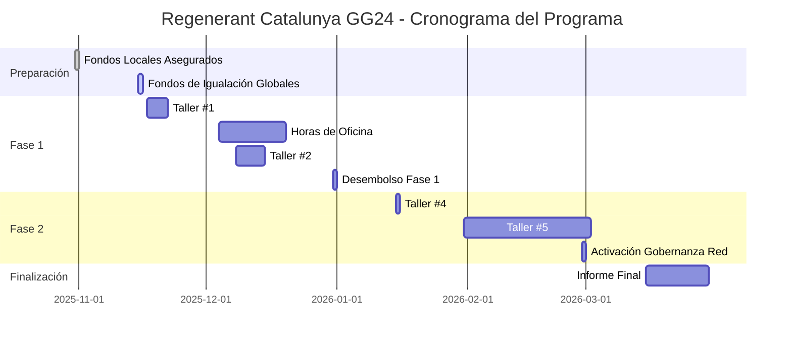
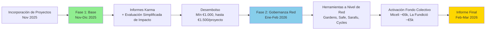

# Regenerant Catalunya - Cronograma del Programa

Cronograma completo para la ronda de financiación Regenerant Catalunya, desde la preparación del programa hasta el informe final.

---

## Visión General del Cronograma del Programa

---

## Fase 1: Preparación del Programa (octubre 2025)

### 31 de octubre de 2025 ✅
**Fondos locales (€11k) asegurados en cadena**
- Multisig de tesorería listo para recibir fondos
- Compromisos de socios locales confirmados
- **Estado:** Completado

### Mediados de noviembre de 2025
**Fondos de igualación globales asegurados en cadena**
- $20.000 del Localism Fund
- Fondos disponibles para distribución

---

## Fase 2: Inicio del Programa y Asignación Base (noviembre–diciembre 2025)

### 17-21 de noviembre de 2025
**Taller #1: Introducción a Regenerant Catalunya**
- **Formato:** En línea (1,5 horas)
- **Idioma:** Español
- **Contenido:**
  - Presentación de ReFi Barcelona
  - Por qué Web3 (abordando mitos y preocupaciones)
  - Visión a largo plazo (BioFi e Infraestructura de Finanzas Biorecionales)
  - Presentación de la ronda y los socios
  - Cronograma y actividades
  - Cómo se distribuirán los fondos
  - Configuración de cartera Web3 (con grupos de trabajo)
- **Entregable:** Abrir Cartera Web3

### 4-19 de diciembre de 2025
**Horas de Oficina para Apoyo de Proyectos**
- Apoyo según se necesite para proyectos que trabajan en presentaciones de Karma
- Asistencia técnica y resolución de problemas
- **Entregable:** Enviar actividades a Karma (al menos 3 actividades pasadas y 3 planes futuros)

### 8-14 de diciembre de 2025
**Taller #2: Documentar el Impacto**
- **Formato:** En línea
- **Idioma:** Español
- **Contenido:**
  - Cómo documentar el impacto de manera efectiva
  - La importancia de buenos datos (independientemente de cripto)
  - Establecer métricas adecuadas para la regeneración
  - Qué es Karma y por qué utilizarlo
  - Cómo registrar actividades en Karma
  - Ejemplos de proyectos que utilizan Karma efectivamente
  - Qué buscamos (3 actividades pasadas + 3 planes futuros)
- **Entregable:** Abrir cuenta en Karma

### Final de diciembre de 2025
**Desembolso de la Fase 1**
- **Mínimo €1.000 por proyecto** (vinculado a los requisitos mínimos de participación)
- **Hasta €1.500 por proyecto** (basado en evaluación simplificada de impacto)
- Fondos distribuidos a carteras Web3 de proyectos en Celo
- Apoyo de off-ramp proporcionado (sin responsabilidades legales)

**Requisitos Mínimos de Participación:**
- ✅ Participar en al menos 2 talleres
- ✅ Abrir cartera web3
- ✅ Enviar al menos 3 actividades pasadas y 3 planes futuros a Karma

---

## Fase 3: Gobernanza Colectiva a Nivel de Red (enero–febrero 2026)

### Enero de 2026
**Taller #4: Herramientas Web3 Avanzadas (por red)**
- **Formato:** En línea, sesiones separadas para cada red
- **Idioma:** Español
- **Contenido:**
  - Establecer expectativas adecuadas para gobernanza de red
  - Cómo las herramientas se pueden utilizar para gobernanza:
    - Gardens (votación por convicción)
    - Contratos multistakeholder
  - Herramientas financieras:
    - Safe (multisigs)
    - Sarafu (moneda local / agrupación de compromisos)
    - Cycles (protocolo de compensación abierto)
- **Entregables:**
  - Acordar qué mecanismos utilizar para gestionar el fondo colectivo
  - Activar la gobernanza de los fondos

### Enero/febrero de 2026
**Taller #5: BioFi y Más Allá**
- **Formato:** En línea
- **Idioma:** Español
- **Contenido:**
  - ¿Qué es BioFi?
  - Visión a largo plazo — cómo se ajusta con lo que estamos haciendo
  - Programa como piloto
  - Construir Infraestructura de Finanzas Biorecionales (BFFs)
- **Entregable:** Retroalimentación

### Final de febrero de 2026
**Las Redes Activan la Gobernanza Colectiva de los Fondos de la Fase 2**
- **Red Miceli Social:** ~€6.000 fondo colectivo activado
- **Red La Fundició / Keras Buti:** ~€5.000 fondo colectivo activado
- Las redes gobiernan colectivamente los fondos utilizando herramientas de gobernanza Web3
- Primeras decisiones colectivas tomadas

---

## Fase 4: Finalización del Programa (marzo 2026)

### Marzo de 2026
**Informe Final Publicado**
- Todos los artefactos publicados en **Catalán, Español e Inglés**
- Publicado en [regenerant.refibcn.cat](https://regenerant.refibcn.cat/)
- Incluye:
  - Informe final
  - Metodología de documentación de impacto
  - Análisis regional con visualizaciones
  - Herramienta de replicación
  - Plantillas de gobernanza de red
  - Estudios de caso e historias de proyectos

---

## Resumen de Hitos Clave

| Fecha | Hito | Estado |
|------|-----------|--------|
| **31 oct 2025** | Fondos locales (€11k) asegurados en cadena | ✅ Completado |
| **Mediados nov 2025** | Fondos de igualación globales asegurados en cadena | 🔄 En Progreso |
| **17-21 nov 2025** | Taller #1 — Inicio del programa | 📅 Próximo |
| **4-19 dic 2025** | Horas de oficina para apoyo de proyectos | 📅 Próximo |
| **8-14 dic 2025** | Taller #2 — Documentación de impacto | 📅 Próximo |
| **Final dic 2025** | Desembolso de la Fase 1 | 📅 Próximo |
| **Ene 2026** | Taller #4 — Herramientas Web3 avanzadas | 📅 Planificado |
| **Ene/feb 2026** | Taller #5 — BioFi y más allá | 📅 Planificado |
| **Final feb 2026** | Las redes activan gobernanza colectiva | 📅 Planificado |
| **Mar 2026** | Informe final publicado | 📅 Planificado |

---

## Flujo de Financiación en Dos Fases

---

## Fechas Importantes para Proyectos

### Eventos Obligatorios

- **17-21 de noviembre de 2025:** Taller #1 (requerido para participación mínima)
- **8-14 de diciembre de 2025:** Taller #2 (requerido para participación mínima)
- **4-19 de diciembre de 2025:** Horas de oficina (recomendado para apoyo de Karma)

### Opcional pero Recomendado

- **Enero de 2026:** Taller #4 (para gobernanza de red)
- **Enero/febrero de 2026:** Taller #5 (para visión a largo plazo)

### Plazos

- **Final de diciembre de 2025:** Enviar actividades de Karma (3 pasadas + 3 futuras) para calificar para la financiación de la Fase 1
- **Final de febrero de 2026:** Las redes activan la gobernanza de la Fase 2

---

## Recursos

- [Guía de Proyectos](/es/program/project-guidebook) — Guía detallada para proyectos participantes
- [Guía de Red](/es/program/network-guidebook) — Guía para la gobernanza de red de la Fase 2
- [Recursos](/es/resources) — Enlaces a toda la documentación de herramientas y materiales de apoyo
- [Documento Maestro](/es/master-document) — Documentación completa del programa

---

**¿Preguntas sobre el cronograma?** Contáctanos en hola@ReFiBCN.cat

