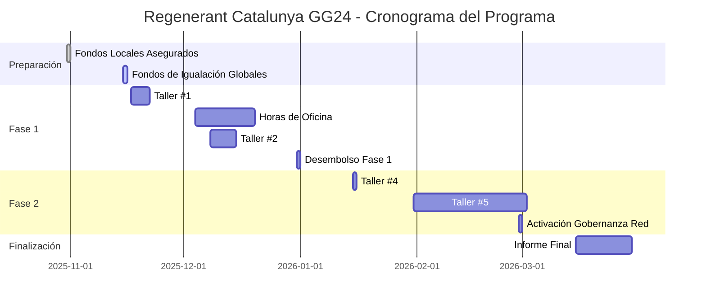
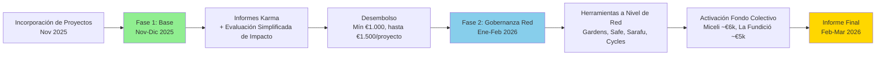

# Regenerant Catalunya - Cronograma del Programa

Cronograma completo para la ronda de financiación Regenerant Catalunya, desde la preparación del programa hasta el informe final.

---

## Visión General del Cronograma del Programa

---

## Fase 1: Preparación del Programa (octubre 2025)

### 31 de octubre de 2025 ✅

**Fondos locales (€11k) asegurados en cadena**

- Multisig de tesorería listo para recibir fondos
- Compromisos de socios locales confirmados
- **Estado:** Completado

### Final de noviembre de 2025

**Fondos de igualación globales asegurados en cadena**

- Desembolso $18.100 USD (≈ €16.380) del Localism Fund
- Financiación total del programa confirmada: €26.000 (€11.000 locales + €15.000 de igualación global)
- Fondos disponibles para distribución

---

## Fase 2: Inicio del Programa y Asignación Base (noviembre 2025–enero 2026)

### 17-21 de noviembre de 2025

**Taller #1: Introducción a Regenerant Catalunya**

- **Formato:** En línea (1,5 horas)
- **Idioma:** Español
- **Contenido:**
  - Presentación de ReFi Barcelona
  - Por qué Web3 (abordando mitos y preocupaciones)
  - Visión a largo plazo (BioFi e Infraestructura de Finanzas Biorecionales)
  - Presentación de la ronda y los socios
  - Cronograma y actividades
  - Cómo se distribuirán los fondos
  - Configuración de cartera Web3 (con grupos de trabajo)
- **Entregable:** Abrir Cartera Web3

### 5-9 de enero de 2026

**Horas de Oficina para Apoyo de Karma GAP**

- Apoyo para proyectos que trabajan en presentaciones de Karma GAP
- Asistencia técnica y resolución de problemas
- **Entregable:** Proyectos listos para enviar actividades a Karma GAP

### Talleres de documentación específicos por red (Fase 1)

Estos talleres sustituyen al antiguo “Taller #2” único y están **enfocados solo en la documentación en Google Docs** (sin configuración Web3 en estas sesiones):

- **3 de diciembre de 2025 – Red Keras Buti**
  - **Formato:** Presencial en Pomezia (L’Hospitalet)
  - **Enfoque:** Trabajar directamente en el informe de actividades en Google Docs de cada proyecto para mapear actividades, entregables y métricas.

- **11 de diciembre de 2025 – Red Miceli (en línea)**
  - **Formato:** Sesión en línea
  - **Enfoque:** Mismo objetivo, adaptado al contexto y tipos de proyectos de Miceli.

- **19 de diciembre de 2025 – Red Miceli (presencial, alrededor de la asamblea general)**
  - **Formato:** Taller corto presencial
  - **Enfoque:** Acompañar y nivelar la documentación de proyectos de Miceli para que queden en una situación similar a los proyectos de Keras Buti.

**Entregable global de estos talleres:**  
Cada proyecto tiene un **informe de actividades en Google Docs** parcial o completamente rellenado, que luego se utilizará para las presentaciones en Karma GAP.

### 12 de enero de 2026

**Fecha límite: Completar Informe de Actividades en Google Docs**

- Todos los proyectos deben completar su informe de actividades en Google Docs
- Subir materiales de apoyo a la carpeta de Google Drive
- **Entregable:** Informe de actividades completo listo para transferir a Karma GAP

### 12-16 de enero de 2026

**Enviar Actividades a Karma GAP**

- Transferir información del Google Doc a Karma GAP
- Enviar actividades con entregables y métricas
- **Entregable:** Actividades enviadas a Karma GAP

### 19 de enero de 2026

**Taller Final de Cierre de la Fase 1**

- **Formato:** Presencial (Barcelona)
- **Hora:** 10:00–11:30
- **Contenido:**
  - Revisar cualquier pregunta pendiente sobre presentaciones en Karma GAP
  - Reflexión y sentido común de la Fase 1
  - Introducción a la Fase 2 (gobernanza a nivel de red)
- **Entregable:** Finalización de la Fase 1 y orientación de la Fase 2

### Finales de enero de 2026

**Verificación de Completitud y Desembolso de la Fase 1**

- Verificación ligera de que todos los proyectos han completado los requisitos de reporte
- Notas de revisión interna para aprendizaje y comunicación con financiadores
- **La financiación es condicional a completar el reporte básico** (Google Doc + presentación en Karma GAP)
- **Distribución igualitaria** — todos los proyectos que completan los requisitos reciben la misma asignación (~€1.000 por proyecto)
- **Evaluación:** Revisión interna ligera solo para aprendizaje y comunicación con financiadores; no afecta los montos de financiación
- Fondos distribuidos a carteras Web3 de proyectos en Celo
- Apoyo de off-ramp proporcionado (sin responsabilidades legales)

**Requisitos de Participación:**

- ✅ Completar informe de actividades en Google Docs antes del 12 de enero
- ✅ Enviar actividades a Karma GAP (12-16 de enero)
- ✅ Asistir al taller final de cierre (19 de enero)

---

## Fase 3: Gobernanza Colectiva a Nivel de Red (enero–febrero 2026)

### Enero de 2026

**Taller #4: Creación de Sentido y Identificación de Necesidades de la Fase 2 (por red)**

- **Formato:** Presencial o en línea, sesiones separadas para cada red
- **Idioma:** Español
- **Contenido:**
  - **Enfoque principal:** Identificar necesidades concretas de la red antes de proponer herramientas
  - Sesión de creación de sentido para entender los desafíos actuales de gobernanza
  - Discusión de prioridades de la red y procesos de toma de decisiones
  - Exploración de cómo las herramientas Web3 podrían abordar las necesidades identificadas
  - Introducción a herramientas disponibles:
    - **Home Community** (aplicación móvil para La Fundición) — gobernanza comunitaria sin cripto visible
    - **Safe multisig** — gestión de tesorería a nivel de red (stakeholders clave como firmantes)
    - **Institutional Development Kit** — marco para identificar oportunidades de integración web3
- **Entregables:**
  - Necesidades y prioridades de la red documentadas
  - Selección inicial de herramientas basada en el contexto de la red
  - Plan para la estructura de gobernanza de la Fase 2

### Enero/febrero de 2026

**Taller #5: BioFi y Más Allá**

- **Formato:** En línea
- **Idioma:** Español
- **Contenido:**
  - ¿Qué es BioFi?
  - Visión a largo plazo — cómo se ajusta con lo que estamos haciendo
  - Programa como piloto
  - Construir Infraestructura de Finanzas Biorecionales (BFFs)
- **Entregable:** Retroalimentación

### Final de febrero de 2026

**Las Redes Activan la Gobernanza Colectiva de los Fondos de la Fase 2**

- **Financiación de la Fase 2:** €10.000 adicionales disponibles para gobernanza a nivel de red
- **Red Miceli Social:** Safe multisig activado con stakeholders clave como firmantes
- **Red La Fundició / Keras Buti:** Aplicación Home Community o Safe multisig (según preferencia de la red)
- Las redes gobiernan colectivamente los fondos utilizando herramientas Web3 seleccionadas
- Primeras decisiones colectivas tomadas
- **Nota:** La gobernanza es gestionada por stakeholders clave de la red, no necesariamente todos los participantes del proyecto

---

## Fase 4: Finalización del Programa (marzo 2026)

### Marzo de 2026

**Informe Final Publicado**

- Todos los artefactos publicados en **Catalán, Español e Inglés**
- Publicado en [regenerant.refibcn.cat](https://regenerant.refibcn.cat/)
- Incluye:
  - Informe final
  - Metodología de documentación de impacto
  - Análisis regional con visualizaciones
  - Herramienta de replicación
  - Plantillas de gobernanza de red
  - Estudios de caso e historias de proyectos

---

## Resumen de Hitos Clave

| Fecha                 | Hito                                               | Estado         |
| --------------------- | -------------------------------------------------- | -------------- |
| **31 oct 2025**       | Fondos locales (€11k) asegurados en cadena         | ✅ Completado  |
| **Mediados nov 2025** | Fondos de igualación globales asegurados en cadena | 🔄 En Progreso |
| **19 nov 2025**       | Taller #1 — Inicio del programa                    | ✅ Completado  |
| **3, 11, 19 dic 2025** | Talleres de documentación (por red)              | ✅ Completado  |
| **5-9 ene 2026**      | Horas de oficina para apoyo de Karma GAP          | 📅 Próximo     |
| **12 ene 2026**       | Fecha límite: Completar Google Doc                | 📅 Próximo     |
| **12-16 ene 2026**    | Enviar actividades a Karma GAP                     | 📅 Próximo     |
| **19 ene 2026**       | Taller final de cierre (Barcelona)                | 📅 Próximo     |
| **Finales ene 2026**  | Verificación y desembolso de la Fase 1            | 📅 Próximo     |
| **Ene 2026**          | Taller #4 — Herramientas Web3 avanzadas            | 📅 Planificado |
| **Ene/feb 2026**      | Taller #5 — BioFi y más allá                       | 📅 Planificado |
| **Final feb 2026**    | Las redes activan gobernanza colectiva             | 📅 Planificado |
| **Mar 2026**          | Informe final publicado                            | 📅 Planificado |

---

## Flujo de Financiación en Dos Fases

---

## Fechas Importantes para Proyectos

### Eventos Obligatorios

- **19 de noviembre de 2025:** Taller #1 (inicio del programa) ✅ Completado
- **3, 11 o 19 de diciembre de 2025:** Talleres de documentación (por red) ✅ Completado
- **19 de enero de 2026:** Taller final de cierre (requerido para completar la Fase 1)

### Plazos Importantes

- **12 de enero de 2026:** Completar informe de actividades en Google Docs
- **12-16 de enero de 2026:** Enviar actividades a Karma GAP
- **Finales de enero de 2026:** Desembolso de la Fase 1 (condicional a completar requisitos)

### Opcional pero Recomendado

- **5-9 de enero de 2026:** Horas de oficina para apoyo de Karma GAP
- **Enero de 2026:** Taller #4 (para gobernanza de red)
- **Enero/febrero de 2026:** Taller #5 (para visión a largo plazo)

---

## Apoyo Continuo e Infraestructura

A lo largo del programa, los proyectos tienen acceso a:

**Apoyo Técnico:**
- Horas de oficina semanales para preguntas técnicas y resolución de problemas
- Apoyo bajo demanda para problemas críticos y emergencias
- Actualizaciones de plataforma e introducción de nuevas funcionalidades
- Orientación sobre seguridad y mejores prácticas

**Programa de Mentoría:**
- Sesiones mensuales mentor-proyecto con expertos Web3 globales
- Oportunidades de aprendizaje entre pares y colaboración entre proyectos
- Apoyo ad-hoc para desafíos y oportunidades específicas

**Construcción de Comunidad:**
- Reuniones regulares de cohorte y compartir de progreso
- Facilitación de colaboración entre proyectos
- Construcción de red y desarrollo de relaciones

---

## Recursos

- [Guía de Proyectos](/es/programa/project-guidebook) — Guía detallada para proyectos participantes
- [Guía de Red](/es/programa/network-guidebook) — Guía para la gobernanza de red de la Fase 2
- [Recursos](/es/recursos) — Enlaces a toda la documentación de herramientas y materiales de apoyo
- [Programa](/es/programa) — Información completa del programa

---

**¿Preguntas sobre el cronograma?** Contáctanos en hola@ReFiBCN.cat
