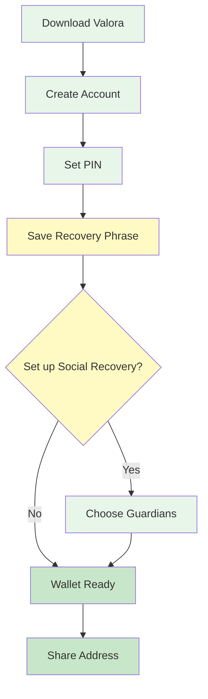

# Guía Completa de Onboarding a Valora

Esta guía te ayudará a configurar tu billetera Valora desde cero, activar la recuperación social y conectarla con herramientas como Karma GAP usando WalletConnect.

---

## Tabla de Contenidos

1. [Introducción a Valora](#introducción-a-valora)
2. [Instalación de la Aplicación](#instalación-de-la-aplicación)
3. [Configuración Básica](#configuración-básica)
4. [Configuración de Recuperación Social](#configuración-de-recuperación-social)
5. [Conectar Valora con Karma GAP usando WalletConnect](#conectar-valora-con-karma-gap-usando-walletconnect)
6. [Mejores Prácticas de Seguridad](#mejores-prácticas-de-seguridad)

---

## Introducción a Valora

Valora es una billetera móvil diseñada específicamente para la red Celo. Es una aplicación fácil de usar que permite enviar, recibir y almacenar criptomonedas de manera sencilla y segura. Una de sus características más destacadas es la **recuperación social**, que te permite recuperar el acceso a tu billetera a través de contactos de confianza.

### Características Principales

- **Diseño móvil-first**: Optimizada para dispositivos móviles
- **Recuperación social**: Recupera tu billetera a través de contactos de confianza
- **Soporte para stablecoins de Celo**: Celo Dollar (cUSD) y Celo Euro (cEUR)
- **Interfaz intuitiva**: Fácil de usar incluso para principiantes
- **WalletConnect**: Compatible con aplicaciones descentralizadas (dApps)

---

## Instalación de la Aplicación

[-> [Descargar Valora](https://www.valora.xyz/) <-]

### Enlaces Directos

- **Android**: [Google Play Store](https://play.google.com/store/apps/details?id=co.clabs.valora)
- **iOS**: [App Store](https://apps.apple.com/app/valora-mobile-wallet/id1520414263)
- **Sitio Web**: [valoraapp.com](https://www.valora.xyz/)

---

## Configuración Básica

**Visual Process:** Step-by-step wallet setup flow:

### Paso 1: Crear una Nueva Billetera

> [!info] Pasos para crear tu billetera
> 1. Abre la aplicación Valora en tu dispositivo
> 2. En la pantalla de bienvenida (como se muestra en la captura de pantalla a continuación), toca el botón **"Comenzar"** o **"Crear una nueva cuenta"**
> 3. Lee y acepta los términos de servicio y la política de privacidad

### Paso 2: Configurar un PIN de Seguridad

> [!tip] Configuración del PIN
> 1. Crea un **PIN de 6 dígitos** que utilizarás para acceder a la aplicación (ver captura de pantalla a continuación)
> 2. Confirma tu PIN ingresándolo nuevamente en la siguiente pantalla
> 3. **Importante**: Elige un PIN que sea memorable pero no fácil de adivinar. Este PIN será necesario para cada transacción

### Paso 3: Iniciar sesión con el email

> [!info] Configuración de email
> 1. Inicia sesión con tu correo electrónico para configurarlo como copia de seguridad de tu billetera. Se te pedirá que inicies sesión de nuevo si pierdes tu wallet.
> 2. Activa esta función para mayor seguridad y comodidad

### Paso 4: Guardar tu Frase de Recuperación

> [!warning] ⚠️ CRÍTICO: Este es el paso más importante
> 1. Valora te mostrará primero una advertencia sobre la importancia de guardar tu frase de recuperación (ver primera captura de pantalla)
> 2. Luego te mostrará una **Frase de Recuperación de 12 palabras** (en algunas versiones puede ser de 24 palabras) - como se ve en la segunda captura
> 3. **Anota esta frase en un lugar seguro** y nunca la compartas con nadie
> 4. Esta frase es esencial para recuperar tu cuenta en caso de pérdida o cambio de dispositivo
> 5. Deberás verificar que has guardado la frase correctamente seleccionando las palabras en el orden correcto (tercera captura)
> 6. Finalmente, confirma que has completado el proceso (cuarta captura)

**Consejos para guardar tu frase de recuperación:**

- Escríbela en papel y guárdala en un lugar seguro
- Considera hacer múltiples copias y guardarlas en lugares diferentes
- Nunca la guardes en tu dispositivo móvil o en la nube
- No la compartas con nadie, ni siquiera con el soporte de Valora

### Paso 5: Conectar un Número de Teléfono (Opcional)

> [!tip] Configuración opcional de teléfono
> 1. Ingresa tu número de teléfono cuando se te solicite (ver primera captura de pantalla)
> 2. Verifica el número mediante el código que recibirás por SMS (segunda captura)
> 3. Una vez verificado, recibirás una confirmación (tercera captura)
> 4. Conectar tu número de teléfono permite enviar y recibir fondos directamente a números de teléfono de amigos y familiares en Valora

---

## Recursos Adicionales

### Soporte Oficial de Valora

- **Centro de Ayuda**: [support.valoraapp.com](https://support.valoraapp.com/)
- **Centro de Ayuda en Español**: [support.valoraapp.com/hc/es](https://support.valoraapp.com/hc/es)
- **Artículo sobre configuración**: [Cómo configurar Valora](https://support.valoraapp.com/hc/es/articles/360061350131-C%C3%B3mo-configurar-Valora)
- **Artículo sobre WalletConnect**: [Cómo conectar a una dApp](https://support.valoraapp.com/hc/en-us/articles/4430786943757-How-to-connect-to-a-dapp)

### Recursos del Programa Regenerant Catalunya

- **Guía del Proyecto**: [Project Guidebook](/es/program/project-guidebook)
- **Recursos del Programa**: [Program Resources](/es/resources)
- **Contacto**: hola@ReFiBCN.cat

Si tienes preguntas o necesitas ayuda adicional, no dudes en contactar al equipo de Regenerant Catalunya en el grupo de WhatsApp o escribirnos un correo a hola@ReFiBCN.cat.
