# REGENERANT CATALUNYA GG24 - PROGRAM DESIGN

**Version:** 1.0 | **Date:** September 28, 2025  
**Status:** Final Design | **Phase:** Pre-Launch (Phase 2)

---

## 🎯 Executive Summary

**Regenerant Catalunya** is a pioneering participatory funding round that demonstrates how local knowledge integrates with global Web3 infrastructure to create a replicable model for bioregional regeneration. Through collaboration between established Catalan partners ([Miceli Social](https://miceli.social/), [La Fundició](https://lafundicio.net/)/[Keras Buti](https://kerasbuti.org/)) and global Web3 funders (Gitcoin, Celo, Ethereum Foundation), we're channeling **€30,000 into 10-12 carefully curated regenerative projects** across Catalonia.

**Launch Window:** October 14-28, 2025 (Gitcoin Grants Round 24)

---

## 📋 Table of Contents

1. [Program Foundations](#program-foundations)
2. [Theory of Change](#theory-of-change)
3. [Stakeholder Ecosystem](#stakeholder-ecosystem)
4. [Project Cohort & Selection](#project-cohort--selection)
5. [Funding Architecture](#funding-architecture)
6. [Technology Stack](#technology-stack)
7. [Impact Measurement Framework](#impact-measurement-framework)
8. [Capacity Building Program](#capacity-building-program)
9. [Risk Management](#risk-management)
10. [Success Metrics](#success-metrics)

---

## 1. Program Foundations

### 1.1 Vision Statement
To create a replicable model for bioregional regenerative finance that bridges local community needs with global Web3 infrastructure, demonstrating that blockchain technology can serve real regenerative work rather than speculation.

### 1.2 Core Principles

**🌱 Network-Driven Approach**
- Build within existing trusted ecosystems rather than imposing external solutions
- Leverage established relationships through Miceli Social (rural) and La Fundició/Keras Buti (urban)
- Enable organic spread through well-established social infrastructures

**🔗 Cosmo-Local Integration**
- Global resources and technology meet local knowledge and action
- Combine traditional cooperative values with cutting-edge Web3 tools
- Create templates for global adaptation while serving immediate local needs

**🎯 Depth Over Breadth**
- Focus on 10-12 carefully curated projects rather than casting a wide net
- Provide comprehensive support: funding + capacity building + mentorship
- Generate visible success stories that inspire wider adoption

### 1.3 Unique Value Proposition

**For Local Projects:**
- Access to amplified funding through quadratic funding mechanisms
- Capacity building in Web3 tools and impact measurement
- Connection to global regenerative finance networks
- On-chain reputation building for future funding opportunities

**For Global Partners:**
- Real-world testing ground for Web3 tools in regenerative contexts
- Connection to established European cooperative networks
- Measurable impact data and learnings for ecosystem development
- Bridge to traditional regenerative communities

**For the Movement:**
- Open-source methodology and templates for bioregional funding
- Proof of concept for Ethereum Localism initiatives
- Comprehensive impact data for policy and funding advocacy
- Model for permanent bioregional finance infrastructure

---

## 2. Theory of Change

### 2.1 Core Hypothesis
By empowering a **small group of exemplary projects** with **funding, technology, connections and knowledge**, we generate **visible success stories** that inspire wider adoption of regenerative finance (ReFi) and Web3 mechanisms in Catalonia and beyond.

### 2.2 Logic Model

**INPUTS** → **ACTIVITIES** → **OUTPUTS** → **OUTCOMES** → **IMPACT**

**Inputs:**
- €11,000 local contributions (Miceli Social + La Fundició)
- ~$20,000 global matching funds
- ReFi Barcelona coordination capacity
- Global partner technical expertise
- Established local networks and trust relationships

**Activities:**
- Curated project selection through trusted partners
- Quadratic funding round during GG24
- Capacity-building workshops (Web3, impact measurement, governance)
- Technical mentorship and tool implementation
- On-chain impact reporting through Karma GAP

**Outputs:**
- 10-12 projects funded (minimum €1,000 each)
- All projects onboarded to Web3 tools (Karma GAP, Celo wallets)
- Educational workshops delivered
- On-chain impact records created
- Open-source knowledge products published

**Outcomes (6-12 months):**
- Projects successfully integrate Web3 tools into operations
- Measurable regenerative impact across ecological and social domains
- Strengthened connections between local and global regenerative networks
- Increased capacity for accessing future funding streams
- Replicable methodology documented and shared

**Long-term Impact (1-3 years):**
- Permanent bioregional finance infrastructure in Catalonia
- Model replicated in other bioregions globally
- Mainstream adoption of regenerative finance mechanisms
- Strengthened resilience of Catalan regenerative ecosystem

### 2.3 Assumptions & Dependencies

**Key Assumptions:**
- Local projects are ready and willing to experiment with Web3 tools
- Quadratic funding mechanisms effectively amplify community voice
- On-chain reputation building creates value for future funding access
- Global Web3 community will engage with local Catalan projects

**Critical Dependencies:**
- Successful launch of Gitcoin Grants Round 24
- Continued commitment from local partners (Miceli Social, La Fundició)
- Technical stability of chosen Web3 platforms (Karma GAP, Celo)
- Regulatory environment remains favorable for crypto-to-euro conversions

---

## 3. Stakeholder Ecosystem

### 3.1 Stakeholder Ecosystem Map

```mermaid
graph TD
    A[ReFi Barcelona<br/>Lead Coordinator] --> B[Local Partners]
    A --> C[Global Partners]
    A --> D[Project Cohort]
    A --> E[Advisory Council]
    
    B --> B1[Miceli Social<br/>€6k + Rural Network]
    B --> B2[La Fundició/Keras Buti<br/>€5k + Urban Network]
    
    C --> C1[Regen Coordination<br/>Methodology]
    C --> C2[Celo Public Goods<br/>Funding + Tech]
    C --> C3[Gitcoin<br/>Platform + Matching]
    C --> C4[Ethereum Foundation<br/>Localism Support]
    
    D --> D1[6 Rural/Environmental<br/>Projects]
    D --> D2[5 Urban/Social<br/>Projects]
    D --> D3[1 Cross-cutting<br/>Project]
    
    E --> E1[Oriol - Miceli<br/>Rural Expertise]
    E --> E2[Mariló - La Fundició<br/>Urban Cooperative]
    E --> E3[Additional Advisors<br/>TBD]
    
    B1 --> D1
    B2 --> D2
    A --> D3
```

### 3.2 Core Partners

**🏛️ Lead Coordinator: ReFi Barcelona**
- **Role:** Program design, execution, and coordination
- **Capacity:** Cooperative in formation, housed at Bloc4BCN
- **Key Personnel:**
  - Luiz Fernando Segala Gomes (Strategy & Operations)
  - Giulio Quarta (Partnerships & Community)
  - Andrea Farias (Program Design & Communications)

**🌾 Local Anchor: Miceli Social**
- **Contribution:** €6,000 + project curation + rural network access
- **Network:** 100+ municipalities across Catalonia
- **Focus:** Rural resilience, municipal collaboration, agroecology
- **Projects Contributed:** 6 rural/environmental initiatives

**🏙️ Urban Anchor: La Fundició / Keras Buti**
- **Contribution:** €5,000 + project curation + urban cooperative network
- **Network:** Xarxa d'Ateneus Cooperatius, L'Hospitalet ecosystem
- **Focus:** Urban cooperative economics, cultural innovation, social inclusion
- **Projects Contributed:** 5 urban/social initiatives

### 3.2 Global Partners

**🌍 Strategic Partner: Regen Coordination**
- **Role:** Methodology support, evaluation framework, global network access
- **Track Record:** $370,000+ distributed across multiple programs in 2024
- **Contribution:** Proven evaluation methodology from GG23

**💰 Funding Partners:**
- **Celo Public Goods:** Blockchain ecosystem for climate action and financial inclusion
- **Gitcoin:** Leading Web3 public goods funding platform ($60M+ distributed)
- **Ethereum Foundation:** Supporting Ethereum Localism experiments

**🔧 Technical Partners:**
- **Karma GAP:** On-chain impact reporting and reputation building
- **Optional Tool Providers:** Silvi, Hypercerts, Gainforest, Sarafu Network, Kokonut Network

### 3.3 Advisory Structure

**Program Council Formation:**
- **Local Advisors** (invited by partners):
  - ✅ **Oriol** (Miceli Social) - Rural resilience expertise
  - ✅ **Mariló** (La Fundició/Keras Buti) - Urban cooperative economics
  - ❓ **Oscar/Erika** - Role and confirmation pending
  - ❓ **Clara Gromaches** - Role and confirmation pending
  - ❓ **Representative from Arran de Terra** - Selection pending

**Advisory Functions:**
- Evaluation criteria development
- Project assessment and scoring
- Distribution methodology refinement
- Cultural alignment and values integration

---

## 4. Project Cohort & Selection

### 4.1 Selection Methodology

**Network-Driven Curation:**
- Projects invited by trusted local partners rather than open application
- Focus on proven regenerative commitment and openness to learning
- Emphasis on community-centric, cooperative, and public-good orientations
- Explicit exclusion of profit-driven businesses and speculation-oriented projects

**Selection Criteria:**
- **Regenerative Impact:** Ecological restoration, social innovation, cultural regeneration
- **Community Rootedness:** Embedded in local networks and serving community needs
- **Learning Readiness:** Openness to experimenting with Web3 tools and methodologies
- **Cooperative Values:** Alignment with solidarity economy principles
- **Implementation Capacity:** Ability to deliver concrete outcomes with funding

### 4.2 Confirmed Project Portfolio

**Projects from Miceli Social Network (Rural/Environmental Focus):**

1. **Regeneració.XYZ** - Creative agency for regenerative narratives
   - *Focus:* Art, regeneration, rural storytelling
   - *Innovation:* Bioregional community governance through creative expression

2. **[Resilience Earth](https://resilience.earth/) & Simbiosi Fluvial** - Bioregional governance cooperative
   - *Focus:* Digital river stewardship, municipal collaboration
   - *Innovation:* Blockchain + AI for environmental monitoring and governance

3. **[De Bat a Bat](http://www.debatabat.org/)** - Community health initiative
   - *Focus:* Holistic rural healthcare rooted in nature
   - *Innovation:* Therapeutic leisure programs and nature-based healing

4. **[Chapter#2](https://chapter2.cat/)** - Education and art project
   - *Focus:* Regenerative storytelling in schools
   - *Innovation:* Place-based narrative and community healing through education

5. **[Anigami](https://www.anigami.cat/)** - Regenerative tourism enterprise
   - *Focus:* Tourism models that actively regenerate rural areas
   - *Innovation:* Training programs and knowledge sharing via Balkar.Earth

6. **[Mixité](https://www.mixite.cat/)** - Rural housing initiative
   - *Focus:* Sustainable housing policies and community land stewardship
   - *Innovation:* Open-source rural housing playbook and policy influence

**Projects from La Fundició/Keras Buti Network (Urban/Social Focus):**

7. **[Laurel 31](https://www.instagram.com/laurel31_economiassilvestres/?hl=es)** - Textile sustainability space
   - *Focus:* Environmental sustainability and political thought in textile production
   - *Innovation:* Neighborhood creativity and sustainable production models

8. **La Marmita** - Community food systems
   - *Focus:* Low-cost, healthy, ecological meals using thermopol technology
   - *Innovation:* Cooperative food production and community health

9. **[Les Juntes](https://www.lesjuntes.coop/)** - Cooperative housing project
   - *Focus:* Use-right housing model resisting commodification
   - *Innovation:* Collective ownership structures for housing sovereignty

10. **[La Suculenta](https://www.instagram.com/suculentalh/?hl=es)** - Community dining initiative
    - *Focus:* Food sovereignty and social inclusion
    - *Innovation:* Training and employment for rights-violated individuals

11. **La Granja del Tilo** - Agroecology cooperative
    - *Focus:* Organic farming and generational renewal
    - *Innovation:* Supporting young farmers and preserving agricultural land

**Projects from ReFi Barcelona Network (TBD - 1 slot remaining):**
12. **Pending Selection** - Options include:
    - Fundació Emprius (rural commons network)
    - Arran de Terra (regenerative agriculture)
    - Decolonizing Permaculture (decolonization and land stewardship)

### 4.3 Portfolio Balance

**Geographic Distribution:**
- Rural/Environmental: 6 projects (50%)
- Urban/Social: 5 projects (42%)
- Cross-cutting: 1 project (8%)

**Thematic Areas:**
- Ecosystem restoration & environmental stewardship: 3 projects
- Community health & social inclusion: 3 projects
- Education & cultural regeneration: 2 projects
- Housing & cooperative economics: 2 projects
- Sustainable production & innovation: 2 projects

**Innovation Readiness:**
- High tech integration potential: 4 projects
- Medium tech integration potential: 5 projects
- Focus on social/cultural innovation: 3 projects

---

## 5. Funding Architecture

### 5.1 Funding Structure

**Total Matching Pool: ~€30,000**
- **Local Contributions:** €11,000 (37%)
  - Miceli Social: €6,000
  - La Fundició/Keras Buti: €5,000
- **Global Matching:** ~$20,000 (63%)
  - Celo Public Goods
  - Gitcoin matching pool
  - Ethereum Foundation
  - Additional Regen Coordination partners

### 5.2 Distribution Methodology

```mermaid
graph TD
    A[Total Pool €30k] --> B[Local Contributions<br/>€11k - 37%]
    A --> C[Global Matching<br/>~$20k - 63%]
    
    B --> B1[Miceli Social<br/>€6k]
    B --> B2[La Fundició<br/>€5k]
    
    C --> C1[Celo Public Goods]
    C --> C2[Gitcoin Matching]
    C --> C3[Ethereum Foundation]
    C --> C4[Regen Coordination]
    
    A --> D[Quadratic Funding<br/>Distribution]
    
    D --> E[Phase 1: Initial<br/>~50% - €15k]
    D --> F[Phase 2: Follow-up<br/>~50% - €15k]
    
    E --> G[10-12 Projects<br/>Min €1k each]
    F --> H[Continued Engagement<br/>+ Tool Adoption]
    
    G --> I[Immediate Impact<br/>Activities]
    H --> J[Long-term Capacity<br/>Building]
```

**Quadratic Funding Mechanism:**
- Community donations amplified through matching pool
- Broad grassroots support weighted more heavily than large individual donations
- Minimum funding threshold: €1,000 per project
- Maximum realistic allocation: €5,000 per project (based on pool size)

**Two-Phase Distribution (Under Development):**

**Phase 1: Initial Distribution (~50% of total)**
- Based on impact evaluation scores from initial project reports
- Immediate funding for project activities
- Support provided for secure off-ramping to euros

**Phase 2: Follow-up Distribution (~50% of total)**
- Rewards for continued Web3 tool adoption and engagement
- Additional incentives for implementing optional tools
- Potential streaming mechanisms using Octant V2, Flowstate, or Gardens
- Performance-based allocation over 3-6 month period

### 5.3 Operational Sustainability

**Fee Structure:**
- Following Gitcoin's "Fair Fee" model
- Small percentage of matching funds covers operational costs
- Acknowledges that local coordination requires real resources
- Ensures model remains replicable without pure volunteerism

**Co-Investment Alignment:**
- Local community: funds + time + network access
- Global sponsors: funds + technology + expertise
- ReFi Barcelona: coordination labor + relationship building
- Projects: implementation capacity + learning commitment

---

## 6. Technology Stack

### 6.1 Technology Stack Architecture

### 6.2 Core Infrastructure

**Required Tools (All Projects):**

**Karma GAP - Impact Reporting & Reputation**
- On-chain progress updates and milestone publishing
- Transparent track records building on blockchain
- Public "project resume" accessible for audit and learning
- Integration with Common Approach to Impact Measurement frameworks

**Celo Web3 Wallets - Fund Management**
- Secure cryptocurrency receiving and management
- Options: Valora, Minipay, Prosperity Pass, Metamask, Zerion, Rainbow
- Comprehensive onboarding support and secure handling instruction
- Euro off-ramping support without legal liability

**Safe Multisig - Treasury Management**
- Transparent and secure fund management for program operations
- Multi-signature requirements for fund distribution
- Public transparency for all financial flows

### 6.2 Program Management Tools

**Notion Workspace - Collective Dashboard**
- Aggregated updates from all projects
- Social media and on-chain activity integration
- Public transparency and stakeholder communication
- Project portfolio overview and progress tracking

**WhatsApp Groups - Informal Communication**
- Participant coordination and progress sharing
- Rapid communication between projects and organizers
- Community building and peer support facilitation

### 6.3 Optional Innovation Stack

**Available for Interested Projects (Additional Incentives):**

**Silvi** - Ecosystem Restoration Tracking
- Web3-native platform for transparent tree planting and restoration
- Fractional funding and incremental verification
- Robust MRV (Measurement, Reporting, Verification) stack

**Hypercerts & Ecocerts** - Impact Certification
- Verifiable impact certificates for regenerative work
- Standardized impact measurement and verification
- Potential for future impact trading and financing

**Gainforest** - AI-Powered Forest Monitoring
- Advanced forest monitoring and restoration verification
- Integration of satellite data with ground-truth verification
- Automated impact measurement for forest projects

**Sarafu Network** - Local Currency & Commitment Pooling
- Community currency experimentation
- Commitment pooling for collective action
- Local economic circulation strengthening

**Kokonut Network** - Agroforestry Infrastructure
- Decentralized ecosystem for syntropic agroforestry
- Web3 infrastructure for farm design and deployment
- Blended funding optimization (grants, DAOs, cooperatives, investors)

### 6.4 Integration Support

**Technical Mentorship Program:**
- Global partner expert connections (Celo, Ethereum Foundation, ReFi ecosystem)
- Hands-on support for tool implementation
- Troubleshooting and optimization assistance
- Best practices sharing across project cohort

**Capacity Building Workshops:**
- Web3 fundamentals and practical applications
- Impact measurement and on-chain reporting
- Collaborative governance models and decentralized coordination
- Future funding strategy and on-chain reputation building

---

## 7. Impact Measurement Framework

### 7.1 Impact Measurement Flow

### 7.2 Evaluation Methodology

**Adapted from Regen Coordination GG23 Success:**
- Proven methodology that successfully allocated $96,000 to 50 projects
- Human-centered evaluation combined with structured reporting
- Bioregional context adaptation with local partner input

**Three-Tier Evaluation Process:**

**Tier 1: Structured Reporting (Projects)**
- Regular activity and impact reports through Karma GAP
- Common Approach to Impact Measurement framework integration
- Standardized metrics with local context adaptation
- Milestone-based progress tracking

**Tier 2: Council Evaluation (Advisors)**
- Human reviewers with relevant expertise
- Systematic report review and project scoring
- Criteria adapted for Catalan bioregional context
- Cultural alignment and values integration assessment

**Tier 3: Allocation Determination (Program Team)**
- Evaluation scores inform funding distribution decisions
- Balance between impact demonstration and project needs
- Transparency in allocation methodology and rationale
- Community feedback integration and adjustment mechanisms

### 7.2 Evaluation Criteria

**Collaboratively Defined with Local Partners:**

**Ecological Impact (25%)**
- Measurable environmental restoration and protection
- Biodiversity enhancement and ecosystem health
- Climate adaptation and mitigation contributions
- Resource efficiency and circular economy principles

**Social Impact (25%)**
- Community empowerment and capacity building
- Social inclusion and equity advancement
- Cultural preservation and regeneration
- Democratic participation and cooperative governance

**Economic Impact (20%)**
- Local economic circulation and resilience
- Sustainable livelihoods and employment creation
- Resource efficiency relative to funding received
- Innovation in cooperative and solidarity economy models

**Network Effects (15%)**
- Collaboration and knowledge sharing with other projects
- Contribution to broader regenerative movement
- Replicability and scalability of approaches
- Connection building between local and global networks

**Web3 Integration (15%)**
- Successful adoption and utilization of required tools
- Innovation in applying Web3 tools to regenerative work
- Contribution to ReFi ecosystem learning and development
- On-chain reputation building and transparency demonstration

### 7.3 Data Collection & Analysis

**Regional On-Chain Impact Analysis:**
- New Web3 wallets created in Catalonia region
- Local vs. external fund flow analysis
- Environmental indicators and community engagement tracking
- Web3 tool adoption and retention rates across projects

**Comprehensive Impact Dashboard:**
- Real-time project progress and milestone tracking
- Aggregated regional impact metrics and visualizations
- Comparative analysis with similar programs globally
- Template creation for future funding round attraction

**Knowledge Product Development:**
- Open-source methodology documentation
- Case studies and best practices compilation
- Lessons learned and recommendations synthesis
- Replication toolkit for other bioregional contexts

---

## 8. Capacity Building Program

### 8.1 Educational Workshop Series

**Workshop 1: Web3 Fundamentals for Regenerative Projects**
- Introduction to blockchain technology and decentralized systems
- Understanding cryptocurrency, wallets, and secure fund management
- Overview of Web3 tools landscape and regenerative finance applications
- Hands-on wallet setup and basic transaction practice

**Workshop 2: Impact Measurement & On-Chain Reporting**
- Introduction to Karma GAP platform and impact reporting
- Common Approach to Impact Measurement framework application
- Creating compelling impact narratives for diverse audiences
- Building transparent and verifiable project track records

**Workshop 3: Collaborative Governance & Decentralized Coordination**
- Principles of decentralized autonomous organization (DAO) governance
- Cooperative decision-making in digital environments
- Tools for community coordination and resource allocation
- Integration with traditional cooperative governance models

**Workshop 4: Future Funding Strategies & Network Building**
- Leveraging on-chain reputation for future funding opportunities
- Connecting with global regenerative finance networks
- Grant writing and funding strategy for Web3-enabled projects
- Building long-term sustainability through diversified funding

### 8.2 Mentorship Program

**Global Expert Network:**
- Celo Public Goods technical specialists
- Ethereum Foundation localism initiative leaders
- ReFi ecosystem contributors and project veterans
- Regen Coordination methodology and evaluation experts

**Mentorship Structure:**
- Initial matching based on project needs and mentor expertise
- Monthly one-on-one sessions throughout program duration
- Group mentorship sessions for cross-project learning
- Technical support and troubleshooting as needed

**Peer Learning Networks:**
- Cross-project collaboration and knowledge sharing
- Regular cohort check-ins and progress sharing
- Problem-solving workshops and collective intelligence
- Community building and mutual support facilitation

### 8.3 Knowledge Creation & Sharing

**Documentation & Templates:**
- Step-by-step guides for Web3 tool integration
- Impact measurement templates adapted for regenerative projects
- Governance model examples and implementation guides
- Financial management and treasury operation procedures

**Case Study Development:**
- Individual project success stories and lessons learned
- Cross-project collaboration examples and outcomes
- Innovation in Web3 tool application for regenerative work
- Challenges overcome and solutions developed

**Open Source Contribution:**
- All educational materials released under Creative Commons
- Templates and methodologies available for global adaptation
- Technical integrations and innovations shared with broader ecosystem
- Contribution to global regenerative finance knowledge commons

---

## 9. Risk Management

### 9.1 Technical Risks

**Risk: Web3 Tool Complexity Overwhelming Projects**
- *Mitigation:* Comprehensive onboarding support and simplified interfaces
- *Contingency:* Alternative tools and manual processes as backup
- *Monitoring:* Regular check-ins and user experience feedback

**Risk: Cryptocurrency Volatility Affecting Fund Value**
- *Mitigation:* Rapid conversion to euros upon receipt when possible
- *Contingency:* Stable coin usage and hedging strategies
- *Monitoring:* Daily market monitoring and conversion timing optimization

**Risk: Platform Technical Failures or Downtime**
- *Mitigation:* Multiple platform options and backup systems
- *Contingency:* Manual processes and alternative distribution methods
- *Monitoring:* Platform status monitoring and communication protocols

### 9.2 Financial Risks

**Risk: Funding Shortfalls from Global Partners**
- *Mitigation:* Confirmed commitments and diversified funding sources
- *Contingency:* Reduced project cohort or funding levels
- *Monitoring:* Regular partner communication and commitment tracking

**Risk: Regulatory Changes Affecting Crypto Operations**
- *Mitigation:* Legal compliance monitoring and advisory support
- *Contingency:* Alternative funding and distribution mechanisms
- *Monitoring:* Regulatory environment tracking and legal consultation

**Risk: Project Fund Mismanagement or Loss**
- *Mitigation:* Security training and best practices education
- *Contingency:* Insurance options and emergency fund access
- *Monitoring:* Regular financial reporting and audit procedures

### 9.3 Operational Risks

**Risk: Project Dropout or Non-Engagement**
- *Mitigation:* Careful selection process and engagement incentives
- *Contingency:* Replacement projects and fund reallocation
- *Monitoring:* Regular engagement tracking and early warning systems

**Risk: Partner Relationship Breakdown**
- *Mitigation:* Clear agreements and regular communication protocols
- *Contingency:* Alternative partnership arrangements and mediation
- *Monitoring:* Relationship health assessment and conflict resolution

**Risk: Insufficient Community Engagement in QF Round**
- *Mitigation:* Comprehensive marketing and outreach strategy
- *Contingency:* Extended donation periods and alternative promotion
- *Monitoring:* Real-time donation tracking and engagement metrics

### 9.4 Reputational Risks

**Risk: Project Failures Reflecting Poorly on Program**
- *Mitigation:* Thorough due diligence and ongoing support
- *Contingency:* Clear communication about learning and iteration
- *Monitoring:* Project performance tracking and early intervention

**Risk: Association with Cryptocurrency Speculation Concerns**
- *Mitigation:* Clear messaging about regenerative focus and real impact
- *Contingency:* Emphasis on traditional cooperative values and outcomes
- *Monitoring:* Public perception tracking and messaging adjustment

---

## 10. Success Metrics

### 10.1 Quantitative Success Indicators

**Funding Success:**
- Target: €30,000 total matching pool achieved
- Target: 10-12 projects funded with minimum €1,000 each
- Target: 100+ individual donors participating in QF round
- Target: 3:1 matching ratio of global to local funding

**Technical Adoption:**
- Target: 100% of projects successfully onboarded to Karma GAP
- Target: 100% of projects successfully managing Celo wallets
- Target: 50%+ of projects adopting at least one optional tool
- Target: 90%+ project retention throughout program duration

**Impact Measurement:**
- Target: 100% of projects submitting regular impact reports
- Target: Measurable regenerative outcomes across all thematic areas
- Target: 10+ new Web3 wallets created in Catalonia region
- Target: €25,000+ in direct regenerative impact generated

**Knowledge Creation:**
- Target: 4 educational workshops delivered to 100% project participation
- Target: 12 individual project case studies documented
- Target: 1 comprehensive methodology report published
- Target: 5+ replication inquiries from other bioregions

### 10.2 Qualitative Success Indicators

**Network Strengthening:**
- Enhanced collaboration between participating projects
- Stronger connections between local and global regenerative networks
- Increased capacity for future funding and partnership development
- Greater visibility and recognition for Catalan regenerative work

**Capacity Building:**
- Projects demonstrate increased confidence with Web3 tools
- Improved impact measurement and reporting capabilities
- Enhanced understanding of decentralized governance principles
- Greater connection to global regenerative finance movement

**Innovation & Learning:**
- Novel applications of Web3 tools to regenerative work
- Creative solutions to technical and operational challenges
- Cross-project collaboration and knowledge sharing
- Contributions to global regenerative finance methodology

**Movement Building:**
- Increased awareness of regenerative finance in Catalonia
- Greater interest from potential funders and partners
- Enhanced reputation for cooperative and solidarity economy innovation
- Foundation laid for permanent bioregional finance infrastructure

### 10.3 Long-term Success Vision

**Year 1 (2026):**
- Regenerant Catalunya Round 2 launched with expanded participation
- 50% of original projects accessing follow-up funding through Web3 networks
- Methodology replicated in 2+ other bioregions globally
- Permanent advisory council established for ongoing program governance

**Year 3 (2028):**
- Bioregional Finance Infrastructure operational in Catalonia
- 100+ projects funded through ongoing regenerative finance mechanisms
- Catalonia recognized as leading example of Web3-enabled cooperative economy
- Template and methodology adopted across 10+ bioregions globally

**Year 5 (2030):**
- Self-sustaining regenerative finance ecosystem in Catalonia
- Integration with municipal and regional government funding mechanisms
- Measurable bioregional regeneration outcomes across ecological and social indicators
- Global network of bioregional finance infrastructures operating collaboratively

---

## 📚 Appendices

### Appendix A: Detailed Project Profiles
*[To be completed with individual project descriptions, contact information, and specific innovation plans]*

### Appendix B: Technical Integration Guides
*[Step-by-step guides for each Web3 tool in the stack]*

### Appendix C: Evaluation Rubrics
*[Detailed scoring criteria and evaluation frameworks]*

### Appendix D: Risk Register & Mitigation Plans
*[Comprehensive risk assessment and response strategies]*

### Appendix E: Communication & Marketing Strategy
*[Outreach plans for QF round and ongoing engagement]*

---

**Document Status:** Final Design v1.0  
**Next Update:** Post-launch analysis (December 2025)  
**Contact:** ReFi Barcelona Program Team  
**License:** Creative Commons Attribution-ShareAlike 4.0 International

---

*This Program Design document serves as the comprehensive blueprint for Regenerant Catalunya GG24, integrating learnings from the master document with current project developments and stakeholder commitments. It provides the foundation for operational execution while maintaining flexibility for iteration and improvement based on real-world implementation experience.*
