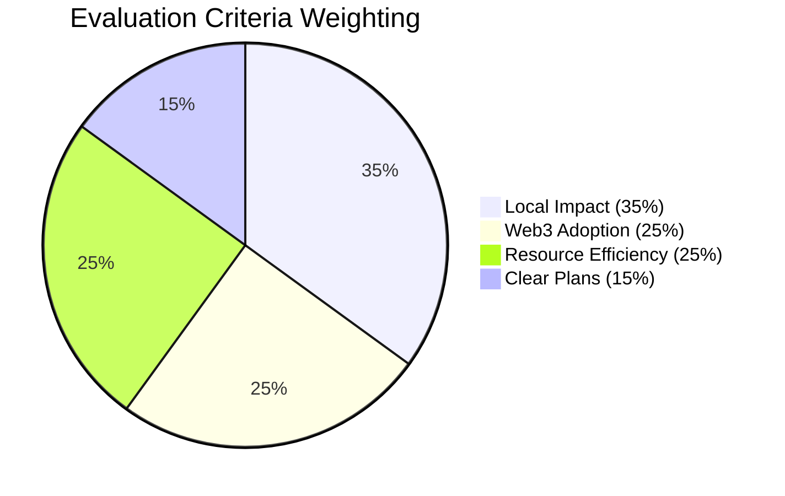

# Evaluation Criteria | Regenerant Catalunya

> **AIM**: _Transparent, evidence-based evaluation prioritizing local impact while building Web3 capacity in Catalan bioregional context._

---

## 1. Overview

**Methodology:** Adapted from [Regen Coordination GG23](https://gov.gitcoin.co/t/ai-impactqf-regen-coordination-global-gg23-retrospective/20385) ($96k allocated to 50 projects)

**Evaluation Process:**

1. Projects submit reports via [Karma GAP](https://gap.karmahq.xyz/) (Common Approach framework)
2. Council members (ReFi BCN + Miceli Social + La Fundició advisors) score independently
3. Scores averaged across minimum 3 evaluators
4. Allocations determined for Phase 1 (Baseline) and Phase 2 (Adoption)

**Collaborative Definition:** Criteria and weighting collaboratively defined with [Miceli Social](https://miceli.social/) and [La Fundició/Keras Buti](https://lafundicio.net/) to reflect Catalan regenerative values.

---

## 2. Understanding Evaluation Criteria

**How Projects Are Evaluated:**

Your project will be evaluated based on **4 criteria** that reflect Catalan regenerative values. Understanding these criteria helps you align your documentation and maximize your impact.

**Visual Breakdown:** Evaluation criteria weighting:



**The 4 Evaluation Criteria Overview:**

1. **Local Ecological, Social & Economic Impact (35%)**
   - Direct impact in Catalan communities (ecological, social, economic)
   - Examples: Ecosystem restoration, community health, cooperative models, food sovereignty
   - What evaluators look for: Measurable outcomes, strong documentation, network integration

2. **ReFi/Web3 Awareness, Adoption & Development (25%)**
   - Contribution to Web3 ecosystem through tool adoption and on-chain activity
   - Examples: Wallet setup, Karma GAP usage, tool integration, education
   - What evaluators look for: Regular updates, consistent reporting, tool adoption

3. **Resource Efficiency & Project Maturity (25%)**
   - Impact relative to resources and project maturity
   - Examples: Efficient use of funding, strong performance for project size, accountability
   - What evaluators look for: Efficiency, transparency, results relative to resources

4. **Active Goals, Plans & Milestones (15%)**
   - Clarity and feasibility of project roadmap
   - Examples: Specific goals, realistic milestones, alignment with bioregional regeneration
   - What evaluators look for: Clear planning, detailed milestones, alignment with values

**How to Align Your Reporting:**

- **Document measurable impact** — Quantify where possible (participants, hectares, etc.)
- **Show Web3 engagement** — Document wallet setup, Karma usage, tool adoption
- **Demonstrate efficiency** — Show impact relative to resources
- **Present clear plans** — Specific goals, timelines, expected outcomes

**Self-Assessment:** Use the project data collection document (Google Doc) to assess your alignment with criteria before submitting to Karma GAP.

**Reference for Workshop #2:** This evaluation framework will be covered in detail during Workshop #2: Documenting Impact (December 8-14, 2025).

---

## 3. Evaluation Principles

1. **Evidence Over Intention** - Reward documented action and impact, not alignment alone
2. **Transparency** - Evaluations based on verifiable data and public Karma GAP documentation
3. **Mission Alignment** - Contribute to bioregional regeneration, cooperative values, SSE integration
4. **Equity** - Value diverse regenerative efforts across rural-urban spectrum
5. **Learning** - Living framework refined after Round 1 based on learnings

---

## 4. Scoring System

- **Scale:** 1-10 per criterion (1-3: Limited | 4-6: Moderate | 7-8: Strong | 9-10: Exceptional)
- **Weighting:** Recent work (post-program) weighted 70-80%; historical context 20-30%
- **Scoring:** Conservative, evidence-based; 8-10 scores are rare
- **Final Score:** Weighted average of 4 criteria

```
Final Score = (Criterion 1 × 0.35) + (Criterion 2 × 0.25) + (Criterion 3 × 0.25) + (Criterion 4 × 0.15)
```

---

## 5. Core Criteria

### **Criterion 1: Local Ecological, Social & Economic Impact (35%)**

**What:** Direct or catalytic impact in Catalan communities across ecological, social, economic domains.

**Key Dimensions:**

- **Ecological:** Ecosystem restoration, biodiversity, river stewardship, agroecology
- **Social:** Community health, housing, food sovereignty, education, cultural regeneration
- **Economic:** Cooperative models, SSE integration, circular economies, community-owned assets
- **Catalytic:** Multiplying impact through networks (Miceli Social, La Fundició)

**Scoring Guide:**

- **1-3:** No/minimal impact; vague claims; no documentation
- **4-6:** Multiple activities; quantified benefits; alignment with Catalan priorities visible
- **7-8:** Measurable outcomes; strong documentation; SSE network integration
- **9-10:** Transformational systemic change; multi-dimensional impact; replication potential

**Guidance:** Recognize small-scale, well-executed initiatives with strong local grounding and cooperative values.

---

### **Criterion 2: ReFi/Web3 Awareness, Adoption & Development (25%)**

**What:** Contribution to ReFi Web3 ecosystem through tool adoption, on-chain activity, reputation building.

**Key Dimensions:**

- **Awareness:** Education, workshops, campaigns promoting ReFi/Web3 tools
- **Adoption:** Wallet creation, Karma GAP usage, dApp integration, DAO participation
- **Development:** Building tools, training developers, infrastructure contributions
- **Financial Activity:** On-chain transactions, local economies, value retention in Web3

**Scoring Guide:**

- **1-3:** No engagement; minimal tool usage; no Karma GAP profile
- **4-6:** Regular Karma GAP updates; wallet setup; some tool adoption; 10-50 participants
- **7-8:** Consistent reporting; optional tool integration (Silvi, Hypercerts, etc.); strong local traction
- **9-10:** Ecosystem catalyst; hundreds of participants; multiple tool integrations; influence beyond local

**Guidance:** Prioritize substance over scale. Value gradual adoption for Web3 newcomers.

---

### **Criterion 3: Resource Efficiency & Project Maturity (25%)**

**What:** Impact relative to resources, maturity, and past funding. Rewards efficiency, especially for small cooperatives.

**Key Dimensions:**

- **Funding Efficiency:** Impact relative to funding received; lean resource use
- **Maturity Alignment:** Results impressive for project size/age; early-stage excellence
- **Team Capacity:** Small teams/collectives generating broad outputs; volunteer-driven success
- **Accountability:** Transparent fund documentation; conversion of resources to impact

**Scoring Guide:**

- **1-3:** High resourcing/low return; under-delivery relative to support
- **4-6:** Performance matches expectations; average output for maturity level
- **7-8:** Efficient and effective; small team/early-stage delivering high quality
- **9-10:** Outstanding efficiency; multiplier effect; exemplary cooperative performance

**Guidance:** Don't penalize early-stage initiatives; reward strong performance relative to resources.

---

### **Criterion 4: Active Goals, Plans & Milestones (15%)**

**What:** Clarity, feasibility, and alignment of project roadmap with bioregional regeneration goals.

**Key Dimensions:**

- **Clarity:** Specific, measurable goals; public visibility
- **Feasibility:** Realistic relative to team/resourcing; cooperative governance awareness
- **Alignment:** Ecosystem-wide objectives; bioregional regeneration; SSE integration
- **Tracking:** Defined milestones; regular updates; Karma GAP progress demonstration

**Scoring Guide:**

- **1-3:** No clear goals; vague intentions; no milestones
- **4-6:** Basic planning; reasonable milestones; some alignment visible
- **7-8:** Strong planning; detailed milestones; clear alignment with Catalan values
- **9-10:** Strategic roadmap; trackable milestones; model transparency; long-term thinking

**Guidance:** Value clarity and feasibility within cooperative governance frameworks.

---

## 6. Evaluation Process

### Reporting Structure

- **Karma GAP reports:** Activities, Outputs, Outcomes, Impact
- **Phase 1:** Report due December 2025
- **Phase 2:** Report due February 2026 (emphasizing tool adoption)

### Council Workflow

1. Projects submit Karma GAP reports
2. Council reviews and scores independently (min 3 evaluators)
3. Scores averaged
4. Allocations determined

### Timeline

- **November 2025:** Onboarding, Karma GAP setup
- **December 2025:** Phase 1 evaluation → Baseline Allocation (50%)
- **January-February 2026:** Phase 2 evaluation → Adoption Allocation (50%, optional)

---

## 7. Council

**Composition:**

- ReFi Barcelona team (Luiz Fernando, Giulio Quarta, Andrea Farias)
- **Oriol** (Miceli Social) - Rural resilience expertise
- **Mariló** (La Fundició/Keras Buti) - Urban cooperative economics
- Additional advisors as needed

**Approach:** Human-centered evaluation (no AI baseline) ensuring nuanced understanding of Catalan context and cooperative values.

---

## 8. Allocation & Distribution

### Two-Phase Model

**Phase 1: Baseline Allocation (50%)**

- **Formula:** `(Criterion 1 × 0.50) + (Criterion 3 × 0.50)`
- **Minimum:** €1,000 per project
- **Purpose:** Support ongoing work, initial Web3 adoption

**Phase 2: Adoption Allocation (50%, optional)**

- **Formula:** `(Criterion 1 × 0.25) + (Criterion 2 × 0.40) + (Criterion 3 × 0.20) + (Criterion 4 × 0.15)`
- **Eligibility:** Score ≥4.0; high-quality reporting; meaningful tool adoption
- **Purpose:** Reward continued engagement, deeper Web3 experimentation

**Distribution:**

```
Phase Allocation = (Project Score / Sum of All Scores) × Total Phase Pool
```

**Transparency:** All allocations documented on-chain (Safe multisig), communicated with score breakdowns, tracked via Karma GAP.

---

## 9. References

**Methodology:**

- [Regen Coordination Evaluation Methodology](https://www.regencoordination.xyz/project-evaluation-methodology)
- [Regen Coordination GG23 Retrospective](https://gov.gitcoin.co/t/ai-impactqf-regen-coordination-global-gg23-retrospective/20385)
- [Localism Fund Round 01 Rubric](https://www.localism.fund/round-01-public-documentation)

**Program Docs:**

- [Program Overview](/program) — Complete program information

**Tools:**

- [Karma GAP](https://gap.karmahq.xyz/) | [Common Approach](https://www.commonapproach.org/)

**Partners:**

- [Miceli Social](https://miceli.social/) | [La Fundició/Keras Buti](https://lafundicio.net/)

---

**Version 2.0** - Streamlined for practical use. Will be refined after Round 1 (March 2026) based on learnings and partner feedback.

_For questions: ReFi Barcelona team_
