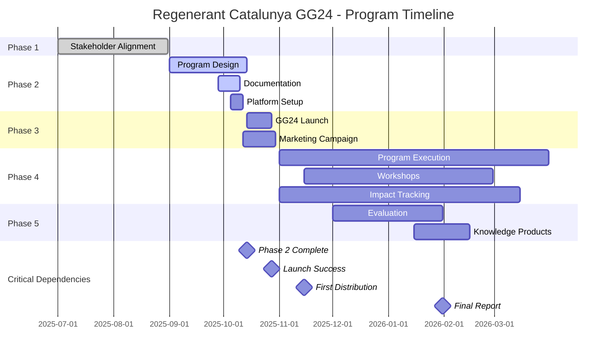
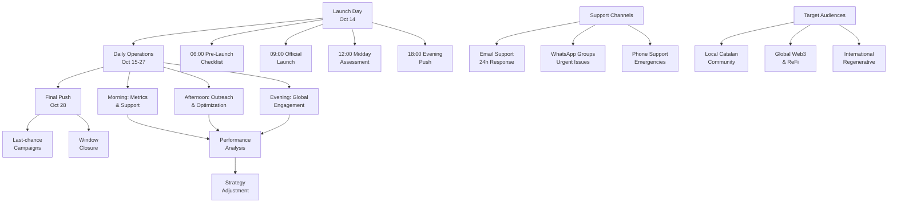
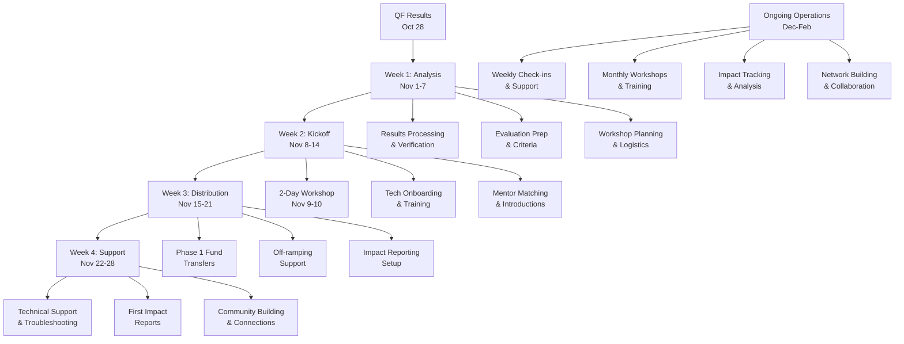
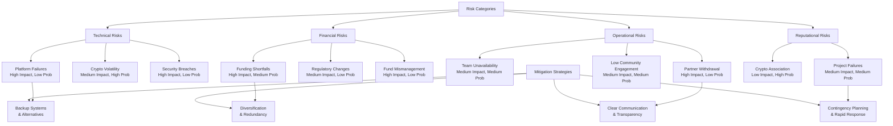

# REGENERANT CATALUNYA GG24 - PROGRAM EXECUTION PLAN

**Version:** 1.0 | **Date:** September 28, 2025  
**Status:** Operational Framework | **Current Phase:** Phase 2 - Program Design (In Progress)

---

## 🎯 Executive Summary

This Program Execution Plan provides the detailed operational framework for implementing **Regenerant Catalunya GG24**, translating the strategic Program Design into concrete actions, timelines, and deliverables. The plan covers the complete program lifecycle from current pre-launch preparations through post-program evaluation and knowledge synthesis.

**Current Status:** Phase 2 in progress, preparing for October 14-28 launch during Gitcoin Grants Round 24.

---

## 📋 Table of Contents

1. [Program Phases Overview](#program-phases-overview)
2. [Current Phase: Program Design](#current-phase-program-design)
3. [Phase 3: Round Launch & Donations](#phase-3-round-launch--donations)
4. [Phase 4: Program Execution](#phase-4-program-execution)
5. [Phase 5: Evaluation & Synthesis](#phase-5-evaluation--synthesis)
6. [Operational Infrastructure](#operational-infrastructure)
7. [Team Roles & Responsibilities](#team-roles--responsibilities)
8. [Communication & Coordination](#communication--coordination)
9. [Quality Assurance](#quality-assurance)
10. [Contingency Planning](#contingency-planning)

---

## 1. Program Phases Overview

### 1.1 Five-Phase Implementation Model

**Phase 1: Stakeholder Alignment** ✅ *COMPLETED*
- *Duration:* July - August 2025
- *Status:* Accomplished - local partners and projects on board, initial funding pool secured

**Phase 2: Program Design** 🏗️ *IN PROGRESS*
- *Duration:* September - October 14, 2025
- *Status:* Finalizing program structure, documentation, and financial setup

**Phase 3: Round Launch & Donations** 🚀 *UPCOMING*
- *Duration:* October 14-28, 2025
- *Status:* Launch preparations underway

**Phase 4: Program Execution** 🎯 *PLANNED*
- *Duration:* November 2025 - March 2026
- *Status:* Detailed execution framework prepared

**Phase 5: Evaluation & Synthesis** 📊 *PLANNED*
- *Duration:* December 2025 - January 2026
- *Status:* Methodology and framework established

### 1.2 Program Timeline & Critical Path

---

## 2. Current Phase: Program Design
*September - October 14, 2025*

### 2.1 Phase Objectives
- Finalize all program documentation and operational procedures
- Complete financial setup and fund transfers
- Register projects on Gitcoin platform
- Prepare marketing and communication materials
- Establish technical infrastructure and support systems

### 2.2 Current Week Priorities (September 28 - October 4)

**🔥 HIGH PRIORITY - Week 1**

**Documentation Completion:**
- [ ] **Finalize advisor list** with confirmed participants
  - ✅ Oriol (Miceli Social) - Confirmed
  - ✅ Mariló (La Fundició/Keras Buti) - Confirmed  
  - ❓ Oscar/Erika - Awaiting confirmation
  - ❓ Clara Gromaches - Awaiting confirmation
  - ❓ Arran de Terra representative - Selection pending

- [ ] **Complete ReFi Barcelona project descriptions** (3 projects)
  - Fundació Emprius - Description and onboarding
  - Arran de Terra - Description and onboarding
  - Decolonizing Permaculture - Description and onboarding

- [ ] **Update Safe Multisig details** (currently marked as "TBD")
  - Set up multi-signature wallet for treasury management
  - Define signing authorities and procedures
  - Test transaction processes and security protocols

**Financial Infrastructure:**
- [ ] **Formalize signed commitments** from all partners
  - Miceli Social: €6,000 commitment documentation
  - La Fundició/Keras Buti: €5,000 commitment documentation
  - Global partners: Matching fund confirmations

- [ ] **Establish fund transfer mechanisms**
  - Local partner fund collection procedures
  - Global partner fund coordination
  - Multi-sig wallet setup and testing

### 2.3 Week 2 Priorities (October 5-11)

**Platform Preparation:**
- [ ] **Register projects on Gitcoin platform**
  - Create project profiles for all 12 participants
  - Upload project descriptions, images, and funding goals
  - Test donation flows and technical integration

- [ ] **Technical infrastructure setup**
  - Notion workspace configuration for public transparency
  - WhatsApp group creation and participant onboarding
  - Karma GAP preparation and account setup guidance

**Marketing & Communications:**
- [ ] **Launch marketing materials**
  - Social media campaign preparation
  - Press releases and media outreach
  - Community engagement strategy activation

### 2.4 Week 3 Priorities (October 12-14)

**Final Launch Preparation:**
- [ ] **Pre-launch testing and validation**
  - End-to-end donation flow testing
  - Technical support procedures verification
  - Emergency response protocols confirmation

- [ ] **Stakeholder final alignment**
  - All projects briefed on launch procedures
  - Partners confirmed and ready for promotion
  - Advisory council activated for evaluation support

### 2.5 Phase 2 Deliverables

**Documentation:**
- ✅ Program Design document (comprehensive strategic framework)
- ✅ Program Execution Plan (this document)
- [ ] Project onboarding guide and technical tutorials
- [ ] Marketing and communication materials
- [ ] Evaluation criteria and scoring rubrics

**Infrastructure:**
- [ ] Safe Multisig treasury wallet operational
- [ ] Gitcoin platform project registrations complete
- [ ] Notion public dashboard configured
- [ ] Communication channels established

**Partnerships:**
- [ ] All funding commitments formalized and documented
- [ ] Advisory council confirmed and oriented
- [ ] Technical partner integrations tested
- [ ] Project cohort fully onboarded and prepared

---

## 3. Phase 3: Round Launch & Donations
*October 14-28, 2025*

### 3.1 Phase Objectives
- Successfully launch Regenerant Catalunya as featured local round in GG24
- Maximize community engagement and donation participation
- Support projects in presenting their work effectively
- Achieve funding targets through quadratic funding mechanism

### 3.2 Launch Day (October 14) - Hour by Hour

**06:00 - Pre-Launch Checklist**
- [ ] All project profiles live and functional on Gitcoin
- [ ] Matching pool funds confirmed and allocated
- [ ] Technical support team on standby
- [ ] Social media campaigns scheduled and ready

**09:00 - Official Launch**
- [ ] Public announcement across all channels
- [ ] Press release distribution
- [ ] Partner promotion coordination
- [ ] First wave of community outreach

**12:00 - Midday Momentum**
- [ ] Launch metrics assessment
- [ ] Project support check-ins
- [ ] Community engagement monitoring
- [ ] Technical issue resolution

**18:00 - Evening Push**
- [ ] European audience engagement
- [ ] Social media amplification
- [ ] Influencer and partner outreach
- [ ] Day 1 performance analysis

### 3.3 Launch Operations Flow

### 3.4 Daily Operations During Donation Window

**Daily Routine (October 15-27):**

**Morning (09:00-12:00):**
- Donation metrics review and analysis
- Project support and troubleshooting
- Social media engagement and content sharing
- Technical issue monitoring and resolution

**Afternoon (12:00-18:00):**
- Community outreach and donor engagement
- Media interviews and content creation
- Partner coordination and promotion
- Real-time campaign optimization

**Evening (18:00-21:00):**
- Global audience engagement (US timezones)
- Performance analysis and strategy adjustment
- Next-day planning and content preparation
- Team coordination and issue resolution

**Weekly Milestones:**
- **Week 1 (Oct 14-20):** Launch momentum and initial engagement
- **Week 2 (Oct 21-27):** Sustained engagement and final push
- **Final Day (Oct 28):** Last-chance campaigns and donation window closure

### 3.4 Marketing & Outreach Strategy

**Target Audiences:**
1. **Local Catalan Community** (Primary)
   - Cooperative networks and solidarity economy actors
   - Environmental and social justice organizations
   - Municipal governments and civic groups
   - Academic and research institutions

2. **Global Web3 & ReFi Community** (Secondary)
   - ReFi DAO and Regen Coordination networks
   - Gitcoin and Celo community members
   - Ethereum Localism movement participants
   - Regenerative finance enthusiasts

3. **International Regenerative Movement** (Tertiary)
   - Bioregionalism and localism advocates
   - Climate action and environmental organizations
   - Cooperative and commons movement actors
   - Impact investors and philanthropists

**Communication Channels:**
- **Social Media:** Twitter/X, LinkedIn, Instagram, Mastodon
- **Community Platforms:** Discord, Telegram, specialized forums
- **Traditional Media:** Local and international press, podcasts, blogs
- **Direct Outreach:** Email campaigns, personal networks, partner promotion

**Content Strategy:**
- **Project Spotlights:** Individual project stories and impact potential
- **Behind-the-Scenes:** Program development and team insights
- **Educational Content:** Web3 tools explanation and regenerative finance education
- **Community Stories:** Donor testimonials and participation encouragement

### 3.5 Technical Support Operations

**24/7 Support Coverage:**
- **Primary Support:** ReFi Barcelona team during EU business hours
- **Secondary Support:** Global partner network for extended coverage
- **Emergency Protocols:** Critical issue escalation and resolution procedures

**Common Support Scenarios:**
- Donation process assistance and troubleshooting
- Project information clarification and guidance
- Technical platform issues and bug reports
- General program questions and information requests

**Support Channels:**
- **Primary:** Dedicated support email and response protocols
- **Secondary:** WhatsApp groups for participant coordination
- **Emergency:** Direct phone contact for critical issues

### 3.6 Phase 3 Success Metrics

**Quantitative Targets:**
- Total donations: €5,000+ from community (before matching)
- Unique donors: 100+ individual contributors
- Project engagement: All 12 projects actively promoting
- Media coverage: 10+ articles/mentions in relevant publications

**Qualitative Indicators:**
- High-quality community engagement and meaningful participation
- Positive feedback from projects and participants
- Successful technical platform performance
- Strong partner collaboration and mutual promotion

---

## 4. Phase 4: Program Execution
*November 2025 - March 2026*

### 4.1 Phase Objectives
- Distribute funds to projects based on evaluation methodology
- Execute comprehensive capacity-building program
- Support projects in Web3 tool adoption and impact reporting
- Build ongoing relationships and network effects
- Document learnings and prepare for program synthesis

### 4.2 Program Execution Workflow

### 4.3 Month 1: Program Launch to Projects (November 2025)

**Week 1 (November 1-7): Results Analysis & Distribution Planning**

**Monday-Tuesday: QF Results Processing**
- [ ] Final donation data compilation and verification
- [ ] Quadratic funding calculation and allocation determination
- [ ] Initial distribution amounts calculation (Phase 1: ~50% of total)
- [ ] Results communication to all stakeholders

**Wednesday-Thursday: Evaluation Preparation**
- [ ] Advisory council convening for evaluation criteria finalization
- [ ] Project reporting guidelines distribution
- [ ] Karma GAP onboarding preparation and account setup
- [ ] Technical mentor matching and introduction coordination

**Friday: Kick-off Workshop Preparation**
- [ ] Workshop agenda finalization and materials preparation
- [ ] Venue booking and logistics coordination (hybrid format)
- [ ] Participant confirmation and technical requirements assessment
- [ ] Support materials and resources compilation

**Week 2 (November 8-14): Kick-off Workshop & Initial Distribution**

**November 9-10: Comprehensive Kick-off Workshop (2 Days)**

*Day 1: Program Overview & Technical Onboarding*
- **09:00-10:30:** Welcome, introductions, and program overview
- **10:45-12:15:** Funding distribution methodology and timeline
- **13:30-15:00:** Karma GAP platform training and account setup
- **15:15-16:45:** Celo wallet setup and fund management training
- **17:00-18:00:** Q&A, troubleshooting, and individual support

*Day 2: Capacity Building & Network Formation*
- **09:00-10:30:** Web3 fundamentals for regenerative projects
- **10:45-12:15:** Impact measurement and reporting frameworks
- **13:30-15:00:** Project presentations and collaboration opportunities
- **15:15-16:45:** Mentor introductions and matching sessions
- **17:00-18:00:** Next steps planning and commitment setting

**Week 3 (November 15-21): Initial Fund Distribution**
- [ ] Phase 1 fund transfers to project wallets
- [ ] Off-ramping support and euro conversion assistance
- [ ] Initial impact reporting requirements communication
- [ ] Individual project check-ins and support needs assessment

**Week 4 (November 22-28): Implementation Support**
- [ ] Technical support for wallet management and fund access
- [ ] First impact reports submission and feedback
- [ ] Mentor-project relationship establishment and first sessions
- [ ] Community building and peer connection facilitation

### 4.3 Month 2-3: Active Implementation (December 2025 - January 2026)

**Ongoing Weekly Operations:**

**Mondays: Project Check-ins & Support**
- Individual project progress calls and support needs assessment
- Technical troubleshooting and platform assistance
- Mentor coordination and relationship management
- Issue escalation and problem-solving facilitation

**Tuesdays: Impact Tracking & Reporting**
- Karma GAP report review and feedback provision
- Impact measurement guidance and methodology support
- Data compilation for regional analysis and dashboard updates
- Quality assurance and reporting standard maintenance

**Wednesdays: Capacity Building Activities**
- Monthly educational workshops and skill-building sessions
- Peer learning facilitation and cross-project collaboration
- Technical training and advanced tool introduction
- Governance and coordination skill development

**Thursdays: Network Building & External Engagement**
- Global partner coordination and relationship management
- External stakeholder communication and updates
- Media engagement and story development
- Future funding opportunity identification and preparation

**Fridays: Documentation & Analysis**
- Weekly progress documentation and analysis
- Lessons learned compilation and synthesis
- Knowledge product development and content creation
- Program optimization and iteration planning

**Monthly Workshops Schedule:**

**December Workshop: Advanced Impact Measurement**
- Deep dive into impact measurement methodologies
- Advanced Karma GAP features and optimization
- Cross-project impact comparison and learning
- Regional impact analysis and aggregation

**January Workshop: Collaborative Governance & Future Planning**
- Decentralized governance principles and tools
- Cooperative decision-making in digital environments
- Future funding strategies and sustainability planning
- Network building and long-term collaboration

**February Workshop: Innovation Showcase & Knowledge Sharing**
- Project innovation presentations and peer learning
- Web3 tool experimentation results sharing
- Cross-project collaboration outcomes demonstration
- Future opportunity identification and planning

### 4.4 Month 4: Program Completion & Transition (March 2026)

**Week 1-2: Final Evaluations & Phase 2 Distribution**
- [ ] Comprehensive impact evaluation and scoring
- [ ] Phase 2 fund distribution based on continued engagement
- [ ] Advanced tool adoption assessment and additional incentives
- [ ] Final project deliverables collection and verification

**Week 3: Program Wrap-up & Celebration**
- [ ] Final project presentations and impact showcase
- [ ] Program completion celebration and recognition
- [ ] Participant feedback collection and program evaluation
- [ ] Transition planning for ongoing relationships and support

**Week 4: Documentation & Handover**
- [ ] Final project reports compilation and synthesis
- [ ] Program documentation completion and archiving
- [ ] Ongoing relationship management transition
- [ ] Phase 5 preparation and evaluation team handover

### 4.5 Ongoing Support & Relationship Management

**Technical Support:**
- Weekly office hours for technical questions and troubleshooting
- On-demand support for critical issues and emergencies
- Platform updates and new feature introduction
- Security and best practices guidance and updates

**Mentorship Program:**
- Monthly mentor-project sessions with global experts
- Quarterly group mentorship sessions and peer learning
- Ad-hoc support for specific challenges and opportunities
- Mentor network expansion and relationship building

**Community Building:**
- Monthly cohort check-ins and progress sharing
- Quarterly social events and relationship building
- Annual reunion planning and ongoing connection maintenance
- Alumni network development for future program iterations

---

## 5. Phase 5: Evaluation & Synthesis
*December 2025 - January 2026*

### 5.1 Phase Objectives
- Conduct comprehensive program evaluation and impact assessment
- Synthesize learnings and develop replicable methodology
- Create knowledge products for global sharing and adaptation
- Plan future iterations and permanent infrastructure development

### 5.2 Evaluation Framework Implementation

**Multi-Stakeholder Evaluation Process:**

**Project Self-Assessment (December 1-15)**
- [ ] Comprehensive self-evaluation surveys and interviews
- [ ] Impact documentation and evidence compilation
- [ ] Learning outcomes assessment and reflection
- [ ] Future planning and sustainability strategy development

**Stakeholder Feedback Collection (December 15-31)**
- [ ] Partner organization interviews and feedback sessions
- [ ] Advisory council evaluation and recommendations
- [ ] Global partner assessment and learning synthesis
- [ ] Community participant surveys and testimonials

**External Evaluation (January 1-15)**
- [ ] Independent evaluation by Regen Coordination methodology experts
- [ ] Comparative analysis with similar programs globally
- [ ] Impact verification and third-party validation
- [ ] Methodology effectiveness assessment and optimization

### 5.3 Knowledge Product Development

**Comprehensive Program Report (January 15-31)**

**Executive Summary & Key Findings**
- Program overview and achievement summary
- Key learnings and breakthrough insights
- Challenges overcome and solutions developed
- Recommendations for future iterations and adaptations

**Methodology Documentation**
- Step-by-step program design and implementation guide
- Evaluation framework and criteria documentation
- Technical integration procedures and best practices
- Stakeholder engagement and relationship management protocols

**Project Case Studies**
- Individual project success stories and impact documentation
- Innovation in Web3 tool application examples
- Cross-project collaboration outcomes and benefits
- Challenge resolution and problem-solving case studies

**Regional Impact Analysis**
- Aggregated impact metrics and regional footprint assessment
- Economic, social, and environmental outcome measurement
- Network effects and relationship building outcomes
- Long-term sustainability and continuation planning

**Replication Toolkit**
- Adaptable templates and frameworks for other bioregions
- Technical setup guides and platform recommendations
- Partnership development and stakeholder engagement strategies
- Financial modeling and funding structure optimization

### 5.4 Knowledge Sharing & Dissemination

**Academic & Research Community:**
- Peer-reviewed publication development and submission
- Conference presentations and academic network engagement
- Research collaboration opportunities and future studies
- Methodology validation and scientific rigor enhancement

**Practitioner & Movement Networks:**
- ReFi ecosystem knowledge sharing and methodology contribution
- Cooperative and solidarity economy network dissemination
- Bioregionalism and localism movement resource sharing
- Municipal and governmental policy recommendation development

**Open Source Community:**
- GitHub repository creation with all templates and tools
- Creative Commons licensing for maximum accessibility
- Community contribution guidelines and collaboration protocols
- Technical documentation and integration guides

**Media & Public Engagement:**
- Public report release and media engagement campaign
- Podcast interviews and speaking engagement coordination
- Social media campaign and community story sharing
- Documentary and multimedia content development

### 5.5 Future Planning & Infrastructure Development

**Regenerant Catalunya Round 2 Design (February 2026)**
- [ ] Lessons learned integration and program optimization
- [ ] Expanded participant cohort and geographic scope
- [ ] Enhanced technology stack and tool integration
- [ ] Sustainable funding model development and implementation

**Bioregional Finance Infrastructure Planning**
- [ ] Permanent infrastructure feasibility assessment
- [ ] Municipal and regional government engagement strategy
- [ ] Cooperative and solidarity economy integration planning
- [ ] Technical platform and governance model development

**Global Network Development**
- [ ] International replication support and partnership development
- [ ] Global bioregional finance network coordination
- [ ] Methodology standardization and quality assurance
- [ ] Cross-regional learning and collaboration facilitation

---

## 6. Operational Infrastructure

### 6.1 Project Management Systems

**Primary Platform: Notion Workspace**
- **Master Dashboard:** Real-time program overview and status tracking
- **Project Database:** Individual project profiles, progress, and metrics
- **Task Management:** Phase-specific tasks, deadlines, and accountability
- **Document Library:** All program documentation, templates, and resources
- **Communication Hub:** Meeting notes, decisions, and stakeholder updates

**Secondary Systems:**
- **GitHub Repository:** Technical documentation, templates, and open-source resources
- **Google Workspace:** Email, calendar, file sharing, and collaboration tools
- **Zoom/Meet:** Video conferencing for workshops, meetings, and support sessions
- **Slack/Discord:** Real-time team communication and coordination

### 6.2 Financial Management Infrastructure

**Treasury Management:**
- **Safe Multisig Wallet:** Secure fund storage and distribution
- **Accounting System:** Transparent financial tracking and reporting
- **Compliance Monitoring:** Regulatory requirement tracking and adherence
- **Audit Trail:** Complete transaction history and documentation

**Fund Distribution Mechanisms:**
- **Primary:** Direct crypto transfers to project Celo wallets
- **Secondary:** Euro conversion support and traditional banking integration
- **Emergency:** Alternative distribution methods for technical failures
- **Reporting:** Real-time financial dashboard and stakeholder transparency

### 6.3 Technical Support Infrastructure

**Support Channels:**
- **Tier 1:** Email support with 24-hour response commitment
- **Tier 2:** WhatsApp groups for urgent issues and peer support
- **Tier 3:** Direct phone support for critical emergencies
- **Documentation:** Comprehensive self-service knowledge base

**Technical Monitoring:**
- **Platform Status:** Real-time monitoring of all integrated platforms
- **Performance Metrics:** User experience and system reliability tracking
- **Security Monitoring:** Threat detection and prevention systems
- **Backup Systems:** Redundancy and disaster recovery procedures

### 6.4 Quality Assurance Systems

**Documentation Standards:**
- **Version Control:** All documents tracked with clear versioning
- **Review Process:** Multi-stakeholder review and approval procedures
- **Template Library:** Standardized formats and consistent branding
- **Archive System:** Historical documentation and decision tracking

**Communication Protocols:**
- **Regular Updates:** Weekly stakeholder updates and progress reports
- **Escalation Procedures:** Clear protocols for issue resolution
- **Feedback Loops:** Systematic collection and integration of stakeholder input
- **Transparency Standards:** Public reporting and accountability measures

---

## 7. Team Roles & Responsibilities

### 7.1 Team Structure & Communication Flow

```mermaid
graph TD
    A[ReFi Barcelona<br/>Core Team] --> B[Luiz Fernando<br/>Strategy Lead]
    A --> C[Giulio Quarta<br/>Operations Lead]
    A --> D[Andrea Farias<br/>Communications Lead]
    
    B --> B1[20h/week<br/>Strategy & Finance]
    B --> B2[Global Partners<br/>Coordination]
    B --> B3[Treasury<br/>Management]
    
    C --> C1[25h/week<br/>Operations & Support]
    C --> C2[Local Partners<br/>Relations]
    C --> C3[Project Support<br/>& Community]
    
    D --> D1[20h/week<br/>Program Design]
    D --> D2[Communications<br/>& Marketing]
    D --> D3[Knowledge Products<br/>& Documentation]
    
    E[Advisory Council] --> E1[Oriol<br/>Miceli - Rural]
    E --> E2[Mariló<br/>La Fundició - Urban]
    E --> E3[Additional Advisors<br/>TBD]
    
    F[Extended Network] --> F1[Global Mentors<br/>Technical Experts]
    F --> F2[Local Partners<br/>Representatives]
    F --> F3[Municipal/Regional<br/>Government]
    
    A --> E
    A --> F
    
    G[Decision Making] --> G1[Daily Ops: Giulio]
    G --> G2[Technical: Luiz + Mentors]
    G --> G3[Financial: Luiz + Multisig]
    G --> G4[Strategic: Full Team + Advisory]
```

### 7.2 Core Team Structure

**Luiz Fernando Segala Gomes - Founder & Strategy Lead**
*Primary Responsibilities:*
- Overall program strategy and vision alignment
- Global partner relationship management and coordination
- Financial oversight and treasury management
- Strategic decision-making and problem resolution

*Weekly Commitments:*
- 20 hours/week program coordination and management
- Daily availability for critical issues and decisions
- Weekly stakeholder meetings and progress reviews
- Monthly strategic planning and optimization sessions

**Giulio Quarta - Operations, Partnerships & Community Lead**
*Primary Responsibilities:*
- Day-to-day operational management and coordination
- Local partner relationship management and support
- Community building and participant engagement
- Project support and troubleshooting coordination

*Weekly Commitments:*
- 25 hours/week operational management and support
- Daily project check-ins and issue resolution
- Weekly partner coordination and relationship management
- Monthly community events and engagement activities

**Andrea Farias - Program Design & Communications Lead**
*Primary Responsibilities:*
- Program methodology development and optimization
- External communications and marketing coordination
- Educational content creation and workshop facilitation
- Knowledge product development and documentation

*Weekly Commitments:*
- 20 hours/week program design and communication work
- Daily content creation and communication management
- Weekly workshop preparation and facilitation
- Monthly knowledge product development and synthesis

### 7.2 Advisory Council Roles

**Local Advisors:**
- **Oriol (Miceli Social):** Rural resilience and municipal collaboration expertise
- **Mariló (La Fundició/Keras Buti):** Urban cooperative economics and cultural innovation
- **Additional Advisors (TBD):** Specialized expertise in evaluation and governance

*Responsibilities:*
- Monthly advisory council meetings and strategic guidance
- Project evaluation and scoring participation
- Cultural alignment and values integration oversight
- Future planning and sustainability strategy development

### 7.3 Extended Team & Support Network

**Global Mentors & Technical Experts:**
- Celo Public Goods technical specialists
- Ethereum Foundation localism initiative leaders
- ReFi ecosystem contributors and methodology experts
- Regen Coordination evaluation and impact measurement specialists

**Local Partner Representatives:**
- Miceli Social project coordination and rural network liaison
- La Fundició/Keras Buti urban network coordination and cultural guidance
- Municipal and regional government relationship management
- Cooperative and solidarity economy movement coordination

### 7.4 Escalation & Decision-Making Procedures

**Daily Operations:** Giulio (Operations Lead) primary authority
**Technical Issues:** Luiz (Strategy Lead) and relevant technical mentors
**Financial Decisions:** Luiz (Strategy Lead) with multi-sig wallet co-signers
**Strategic Changes:** Full core team consensus with advisory council input
**Emergency Situations:** Any core team member can escalate to full team

**Decision Documentation:**
- All significant decisions documented in Notion workspace
- Rationale and context provided for future reference
- Stakeholder communication of decisions within 24 hours
- Regular decision review and optimization processes

---

## 8. Communication & Coordination

### 8.1 Internal Communication Protocols

**Daily Coordination:**
- **Morning Stand-ups:** 15-minute team sync every weekday at 09:00 CET
- **Slack/Discord:** Real-time coordination and quick issue resolution
- **Shared Calendar:** All meetings, deadlines, and commitments visible
- **Status Updates:** Daily progress updates in shared workspace

**Weekly Coordination:**
- **Team Meetings:** 90-minute comprehensive review every Monday at 10:00 CET
- **Partner Check-ins:** Scheduled calls with Miceli Social and La Fundició
- **Project Support:** Individual project support calls as needed
- **Progress Reporting:** Weekly stakeholder updates and metrics review

**Monthly Coordination:**
- **Advisory Council:** Monthly strategic guidance and evaluation sessions
- **Global Partners:** Quarterly coordination with Celo, Gitcoin, Ethereum Foundation
- **Community Events:** Monthly participant gatherings and relationship building
- **Strategic Planning:** Monthly program optimization and future planning

### 8.2 External Communication Strategy

**Stakeholder Communication:**
- **Projects:** Weekly check-ins and monthly progress reports
- **Local Partners:** Bi-weekly coordination and relationship management
- **Global Partners:** Monthly updates and quarterly comprehensive reviews
- **Community:** Weekly social media updates and monthly newsletters

**Public Communication:**
- **Social Media:** Daily content sharing and community engagement
- **Website/Blog:** Weekly articles and program updates
- **Media Relations:** Monthly press outreach and interview coordination
- **Conference/Events:** Quarterly speaking engagements and presentations

### 8.3 Documentation & Knowledge Management

**Document Hierarchy:**
1. **Strategic Documents:** Program Design, Execution Plan, Evaluation Framework
2. **Operational Documents:** Procedures, templates, guidelines, protocols
3. **Project Documents:** Individual profiles, reports, case studies
4. **Communication Documents:** Marketing materials, presentations, updates

**Version Control & Access:**
- **Master Documents:** Version-controlled with clear approval processes
- **Working Documents:** Real-time collaboration with edit tracking
- **Archive System:** Historical versions and decision documentation
- **Access Management:** Role-based permissions and security protocols

**Knowledge Sharing:**
- **Internal Wiki:** Comprehensive knowledge base for team and partners
- **Public Resources:** Open-access templates, guides, and methodologies
- **Community Forum:** Participant discussion and peer support platform
- **External Publications:** Academic papers, blog posts, conference presentations

---

## 9. Quality Assurance

### 9.1 Program Quality Standards

**Delivery Excellence:**
- All workshops and educational content meet pedagogical best practices
- Technical support maintains 95%+ satisfaction rating from participants
- Financial management maintains complete transparency and accuracy
- Communication maintains clarity, timeliness, and cultural sensitivity

**Impact Measurement:**
- All impact claims supported by verifiable evidence and methodology
- Evaluation processes maintain independence and objectivity
- Data collection follows ethical research standards and privacy protection
- Results reporting maintains scientific rigor and honest assessment

**Relationship Management:**
- All stakeholder relationships maintained with respect, transparency, and mutual benefit
- Conflict resolution processes fair, timely, and effective
- Cultural sensitivity maintained in all cross-cultural interactions
- Long-term relationship building prioritized over short-term gains

### 9.2 Continuous Improvement Processes

**Weekly Reviews:**
- Team performance and coordination effectiveness assessment
- Participant feedback collection and response integration
- Technical system performance and user experience optimization
- Process refinement and efficiency improvement identification

**Monthly Assessments:**
- Comprehensive program progress against objectives evaluation
- Stakeholder satisfaction and relationship health assessment
- Financial performance and resource allocation optimization
- Strategic alignment and course correction planning

**Quarterly Evaluations:**
- External perspective integration through advisory council and mentors
- Comparative analysis with similar programs and industry standards
- Innovation opportunity identification and implementation planning
- Long-term sustainability and scalability assessment

### 9.3 Risk Monitoring & Mitigation

**Daily Risk Monitoring:**
- Technical platform status and performance tracking
- Financial security and transaction monitoring
- Participant engagement and satisfaction tracking
- External environment and regulatory change monitoring

**Weekly Risk Assessment:**
- Comprehensive risk register review and update
- Mitigation strategy effectiveness evaluation
- New risk identification and assessment
- Contingency plan activation readiness verification

**Monthly Risk Management:**
- Strategic risk assessment and long-term threat analysis
- Insurance and protection mechanism evaluation
- Crisis communication plan testing and optimization
- Stakeholder risk tolerance and expectation alignment

---

## 10. Contingency Planning

### 10.1 Risk Management Matrix

### 10.2 Technical Failure Scenarios

**Scenario 1: Gitcoin Platform Failure During Donation Window**

*Immediate Response (0-2 hours):*
- [ ] Activate backup donation platform (Giveth or direct wallet donations)
- [ ] Communicate platform change to all stakeholders and community
- [ ] Redirect marketing and outreach to alternative donation methods
- [ ] Document all issues and maintain donor communication

*Short-term Response (2-24 hours):*
- [ ] Assess impact on donation timeline and consider extension request
- [ ] Coordinate with Gitcoin technical team for resolution timeline
- [ ] Implement manual tracking for alternative donation methods
- [ ] Maintain daily communication with participants and stakeholders

*Long-term Response (1-7 days):*
- [ ] Evaluate overall impact on program objectives and adjust expectations
- [ ] Implement lessons learned for future platform resilience
- [ ] Document incident for knowledge sharing and methodology improvement

**Scenario 2: Karma GAP Platform Issues**

*Alternative Solutions:*
- Manual impact reporting through Google Forms and Notion database
- Alternative on-chain reporting through Hypercerts or direct blockchain logging
- Traditional reporting methods with future migration to Web3 tools
- Partnership with alternative impact measurement platforms

### 10.2 Financial Risk Scenarios

**Scenario 1: Significant Cryptocurrency Value Fluctuation**

*Immediate Response:*
- [ ] Assess impact on total funding pool and project allocations
- [ ] Communicate transparently with projects about potential changes
- [ ] Implement rapid conversion to stable currencies where possible
- [ ] Activate contingency funding sources if available

*Mitigation Strategies:*
- Maintain 10% contingency reserve for volatility management
- Implement rapid conversion protocols for received donations
- Diversify funding sources to reduce single-currency exposure
- Establish relationships with stable coin providers for future rounds

**Scenario 2: Regulatory Changes Affecting Crypto Operations**

*Response Framework:*
- [ ] Immediate legal consultation and compliance assessment
- [ ] Communication with all stakeholders about regulatory changes
- [ ] Implementation of alternative funding and distribution methods
- [ ] Documentation of regulatory challenges for future advocacy

### 10.3 Operational Risk Scenarios

**Scenario 1: Key Team Member Unavailability**

*Succession Planning:*
- **Luiz (Strategy Lead):** Giulio assumes strategic coordination with advisory council support
- **Giulio (Operations Lead):** Andrea assumes operational coordination with partner support
- **Andrea (Communications Lead):** Luiz assumes communications with external contractor support

*Knowledge Transfer Protocols:*
- All critical processes documented with step-by-step procedures
- Regular cross-training and knowledge sharing sessions
- External contractor relationships established for emergency support
- Advisory council activated for strategic guidance and decision-making

**Scenario 2: Major Partner Withdrawal**

*Response Strategies:*
- **Local Partner Withdrawal:** Activate alternative local networks and relationships
- **Global Partner Withdrawal:** Diversify funding sources and reduce dependency
- **Project Withdrawal:** Maintain reserve project list for rapid replacement
- **Technical Partner Issues:** Maintain alternative platform relationships and options

### 10.4 Crisis Communication Protocols

**Crisis Communication Team:**
- **Primary Spokesperson:** Luiz Fernando Segala Gomes
- **Internal Coordination:** Giulio Quarta
- **External Communications:** Andrea Farias
- **Advisory Support:** Available advisory council members

**Communication Channels Priority:**
1. **Internal Team:** Immediate notification and coordination
2. **Direct Stakeholders:** Projects, partners, advisory council
3. **Community:** Participants, donors, supporters
4. **Public:** Media, social media, broader community

**Message Framework:**
- **Transparency:** Honest assessment of situation and impacts
- **Accountability:** Clear ownership and responsibility for resolution
- **Action Plan:** Specific steps being taken and timeline for resolution
- **Support:** Resources available for affected stakeholders
- **Learning:** Commitment to improvement and prevention

---

## 📊 Appendices

### Appendix A: Detailed Task Lists & Checklists
*[Comprehensive task breakdowns for each phase and activity]*

### Appendix B: Template Library
*[All operational templates, forms, and standardized documents]*

### Appendix C: Communication Templates
*[Email templates, social media content, press releases, stakeholder updates]*

### Appendix D: Technical Procedures
*[Step-by-step guides for all technical processes and integrations]*

### Appendix E: Emergency Contact Lists
*[Complete contact information for all stakeholders, partners, and support resources]*

### Appendix F: Budget & Financial Tracking
*[Detailed budget breakdowns, expense tracking, and financial reporting templates]*

---

**Document Status:** Operational Framework v1.0  
**Next Review:** Weekly during active phases, monthly during planning phases  
**Approval Authority:** ReFi Barcelona Core Team with Advisory Council input  
**Distribution:** Core team, advisory council, key partners (confidential operational details)

---

*This Program Execution Plan serves as the comprehensive operational guide for implementing Regenerant Catalunya GG24, providing detailed procedures, timelines, and contingencies to ensure successful program delivery while maintaining flexibility for real-world adaptation and continuous improvement.*
