# Program Funding & Distribution

## Program Funding Overview

### Confirmed Local Co-Funding: **€11,000** (≈ **$12,100**)

- **Miceli Social:** **€6,000** (≈ **$6,600**) — commitment letter signed; funds secured on-chain ✅
- **La Fundició / Keras Buti:** **€5,000** (≈ **$5,500**) — commitment letter signed; funds secured on-chain ✅

### Global Matching: **$18,100 USD** (≈ **€16,380**)

Secured through the [**Localism Fund**](https://www.localism.fund/) — a grants program supporting credible local networks building practical models of political, economic, cultural, and ecological localism using Ethereum infrastructure.

### Total Funding Confirmed: **€26,000** (€11,000 local + €15,000 from global matching)

### Timeline for Funds Availability

- **Commitment letters** signed by both partners ✅
- **Treasury multisig** opened and ready to receive funds ✅
- **Local funds transferred/on-ramped and secured on multisig** ✅ (Oct 31, 2025)
- **Global matching funds** secured on-chain by end of November 2025

---

## Program Budget Breakdown

### Confirmed Program Budget: €26,000 (includes Localism Fund matching)

### ALLOCATION

1. **DIRECT GRANTS TO PROJECTS — ~85% (€22,000)**
   - **11 projects** participating in the round
   - **Phase 1: Baseline Allocation (Nov 2025–Jan 2026):**
     - **Equal distribution: ~€1,000 per project** (conditional on completing basic reporting requirements)
     - **Minimum participation requirements** (required for funding):
       - Participate in at least 2 workshops
       - Open web3 wallet
       - Complete Google Doc activities report by January 12, 2026
       - Submit activities to Karma GAP (January 12–16, 2026)
       - Attend final closeout workshop (January 19, 2026)
     - **Evaluation:** Lightweight internal review for learning and funder communication only; **does not affect funding amounts**
     - All projects completing requirements receive equal allocation
   - **Phase 2: Network-Level Collective Governance (Jan–Feb 2026):** €10,000 additional for network-level pools
     - Networks collectively govern funds using selected Web3 tools
     - Distribution method to be determined collaboratively with networks
2. **PROGRAM OPERATIONS & COORDINATION — ~15% (€4,000)**
   - **Round coordination & project support** — ReFi BCN team time: Workshops planning & execution • Ongoing project mentorship and technical support • Partner coordination • Communications and community engagement • Karma onboarding and training for all projects • Production of documentation & reports
   - **Impact evaluation process** — ReFi BCN team + advisors' review time (simplified evaluation)
   - Plus additional expenses

### OPERATIONAL DETAILS

- 20% is a maximum operational cap; all remaining funds flow to projects
- Exact percentages are being validated with Miceli Social and La Fundició — subject to minor adjustments
- Smaller rounds carry higher fixed costs; this allocation ensures quality, accountability, and knowledge generation
- Where possible, operational funds may also support lightweight pilots/experiments, aiming to improve project delivery

---

## Two-Phase Funding Mechanism

Projects receive funding through a **two-phase distribution** tied to completion of requirements and impact evaluation:

### Phase 1 — Baseline Allocation (Nov 2025–Jan 2026)

- **Equal distribution: ~€1,000 per project** (conditional on completing basic reporting requirements)
- **Minimum participation requirements** (required for funding):
  - Participate in at least 2 workshops
  - Open web3 wallet
  - Complete Google Doc activities report by January 12, 2026
  - Submit activities to Karma GAP (January 12–16, 2026)
  - Attend final closeout workshop (January 19, 2026)
- **Evaluation:** Lightweight internal review for learning and funder communication only; **does not affect funding amounts**
- All projects completing requirements receive equal allocation

### Phase 2 — Network-Level Collective Governance (Jan–Feb 2026)

**€10,000 additional** allocated for network-level governance:

- Networks collectively govern funds using selected Web3 tools
- **Primary tools:**
  - **Safe multisig** — network-level treasury management (key stakeholders as signers)
  - **Home Community** — mobile app for La Fundición (hides crypto complexity)
  - **Institutional Development Kit** — framework for identifying web3 integration opportunities
- Distribution method to be determined collaboratively with networks through sense-making workshops

```mermaid
graph LR
    A[Project Onboarding<br/>Nov 2025] --> B[Phase 1: Baseline<br/>Nov-Dec 2025]
    B --> C[Karma Reports<br/>+ Simplified Impact Evaluation]
    C --> D[Disbursement<br/>Equal allocation ~€1,000/project]
    D --> E[Phase 2: Network Governance<br/>Jan-Feb 2026]
    E --> F[Network-Level Tools<br/>Gardens, Safe, Sarafu, Cycles]
    F --> G[Collective Pool Activation<br/>€10k additional for networks]
    G --> H[Final Reporting<br/>Feb-Mar 2026]

    style B fill:#90EE90
    style E fill:#87CEEB
    style H fill:#FFD700
```

This phased approach:

- **Rewards completion of minimum participation requirements** with equal Phase 1 allocation (~€1k per project)
- **Evaluation for learning only** — does not affect funding amounts
- Empowers networks to collectively govern Phase 2 funds using Web3 tools selected through sense-making process
- Creates natural checkpoints for learning and adjustment
- Reduces risk for both projects and funders

---

## Financial Infrastructure

### Treasury Management

- **Multi-signature Safe (Gnosis Safe) on Celo** for transparent treasury management
- **Safe address:** `0x91889ea97FeD05180fb5A70cB9570630f3C0Be77`
- **Signers:** ReFi Barcelona team (2-of-3 initially; expanding to include partner advisors, to be onboarded)
- All disbursements publicly documented via on-chain records + Karma updates

### Fund Distribution & Support

- **Funds management & distribution:** Safe multisig on Celo
- **Support:** Wallet security guidance and **off-ramping** support (without legal liabilities)
- **Transparent Treasury:** All funds are managed through the Safe multisig with public on-chain records

---

## Learn More

- [Program Overview](/program) - Complete program information
- [Program Timeline](/program/timeline) - Detailed timeline and milestones
- [Project Guidebook](/program/project-guidebook) - Guide for participating projects
- [Network Guidebook](/program/network-guidebook) - Network-level governance guide

---

**Questions about funding?** Contact us at [hola@refibcn.cat](mailto:hola@refibcn.cat)

