# Program Funding & Distribution

## Program Funding Overview

### Confirmed Local Co-Funding: **€11,000** (≈ **$12,100**)

- **Miceli Social:** **€6,000** (≈ **$6,600**) — commitment letter signed; funds secured on-chain ✅
- **La Fundició / Keras Buti:** **€5,000** (≈ **$5,500**) — commitment letter signed; funds secured on-chain ✅

### Global Matching: **Estimated Disbursement $18,000** (≈ **€16,380**)

Secured through the [**Localism Fund**](https://www.localism.fund/) — a grants program supporting credible local networks building practical models of political, economic, cultural, and ecological localism using Ethereum infrastructure.

### Total Funding Target: **~€27,380** (≈ **$30,120**)

### Timeline for Funds Availability

- **Commitment letters** signed by both partners ✅
- **Treasury multisig** opened and ready to receive funds ✅
- **Local funds transferred/on-ramped and secured on multisig** ✅ (Oct 31, 2025)
- **Global matching funds** secured on-chain by end of November 2025

---

## Program Budget Breakdown

### Target Program Budget: €27,380 (includes Localism Fund matching)

### ALLOCATION

1. **DIRECT GRANTS TO PROJECTS — 80% (€21,904)**
   - **11 projects** participating in the round
   - **Phase 1: Baseline Allocation (Nov–Dec 2025):**
     - **Minimum €1,000 per project** (tied to minimum participation requirements)
     - **Up to €1,500 per project** based on simplified impact evaluation
     - **Minimum participation requirements** (required for €1k minimum):
       - Participate in at least 2 workshops
       - Open web3 wallet
       - Submit at least 3 past activities and 3 future plans to Karma
     - **Impact evaluation:** Simplified evaluation continues but won't dictate distribution much since the 50% split with €1k minimum leaves limited variance
     - Projects can receive less than €1k if they don't meet minimum participation requirements
   - **Phase 2: Network-Level Collective Governance (Jan–Feb 2026):** €1,000 per project allocated to network-level pools
     - **Miceli Social network:** ~€6,000 collective pool
     - **La Fundició / Keras Buti network:** ~€5,000 collective pool
2. **PROGRAM OPERATIONS & COORDINATION — 20% (€5,476)**
   - **Round coordination & project support** — ReFi BCN team time: Workshops planning & execution • Ongoing project mentorship and technical support • Partner coordination • Communications and community engagement • Karma onboarding and training for all projects • Production of documentation & reports
   - **Impact evaluation process** — ReFi BCN team + advisors' review time (simplified evaluation)
   - Plus additional expenses

### OPERATIONAL DETAILS

- 20% is a maximum operational cap; all remaining funds flow to projects
- Exact percentages are being validated with Miceli Social and La Fundició — subject to minor adjustments
- Smaller rounds carry higher fixed costs; this allocation ensures quality, accountability, and knowledge generation
- Where possible, operational funds may also support lightweight pilots/experiments, aiming to improve project delivery

---

## Two-Phase Funding Mechanism

Projects receive funding through a **two-phase distribution** tied to completion of requirements and impact evaluation:

### Phase 1 — Baseline Allocation (Nov–Dec 2025)

- **Minimum €1,000 per project** (tied to minimum participation requirements)
- **Up to €1,500 per project** based on simplified impact evaluation
- **Minimum participation requirements** (required for €1k minimum):
  - Participate in at least 2 workshops
  - Open web3 wallet
  - Submit at least 3 past activities and 3 future plans to **Karma**
- **Impact evaluation:** Simplified evaluation continues but won't dictate distribution much since the 50% split with €1k minimum leaves limited variance for allocation differences
- Projects can receive less than €1k if they don't meet minimum participation requirements

### Phase 2 — Network-Level Collective Governance (Jan–Feb 2026)

**€1,000 per project** allocated to network-level pools:

- **Miceli Social network:** ~€6,000 collective pool
- **La Fundició / Keras Buti network:** ~€5,000 collective pool
- Networks collectively govern funds using Web3 governance tools (Gardens, multistakeholder contracts, Safe multisigs, Sarafu, Cycles)

```mermaid
graph LR
    A[Project Onboarding<br/>Nov 2025] --> B[Phase 1: Baseline<br/>Nov-Dec 2025]
    B --> C[Karma Reports<br/>+ Simplified Impact Evaluation]
    C --> D[Disbursement<br/>Min €1,000, up to €1,500/project]
    D --> E[Phase 2: Network Governance<br/>Jan-Feb 2026]
    E --> F[Network-Level Tools<br/>Gardens, Safe, Sarafu, Cycles]
    F --> G[Collective Pool Activation<br/>Miceli ~€6k, La Fundició ~€5k]
    G --> H[Final Reporting<br/>Feb-Mar 2026]

    style B fill:#90EE90
    style E fill:#87CEEB
    style H fill:#FFD700
```

This phased approach:

- **Rewards completion of minimum participation requirements** (Phase 1 minimum €1k) while allowing **simplified impact evaluation** to determine allocation up to €1,500
- Empowers networks to collectively govern Phase 2 funds using Web3 tools
- Creates natural checkpoints for learning and adjustment
- Reduces risk for both projects and funders

---

## Financial Infrastructure

### Treasury Management

- **Multi-signature Safe (Gnosis Safe) on Celo** for transparent treasury management
- **Safe address:** `0x91889ea97FeD05180fb5A70cB9570630f3C0Be77`
- **Signers:** ReFi Barcelona team (2-of-3 initially; expanding to include partner advisors, to be onboarded)
- All disbursements publicly documented via on-chain records + Karma updates

### Fund Distribution & Support

- **Funds management & distribution:** Safe multisig on Celo
- **Support:** Wallet security guidance and **off-ramping** support (without legal liabilities)
- **Transparent Treasury:** All funds are managed through the Safe multisig with public on-chain records

---

## Learn More

- [Program Overview](/program) - Complete program information
- [Program Timeline](/program/timeline) - Detailed timeline and milestones
- [Project Guidebook](/program/project-guidebook) - Guide for participating projects
- [Network Guidebook](/program/network-guidebook) - Network-level governance guide

---

**Questions about funding?** Contact us at [hola@refibcn.cat](mailto:hola@refibcn.cat)

