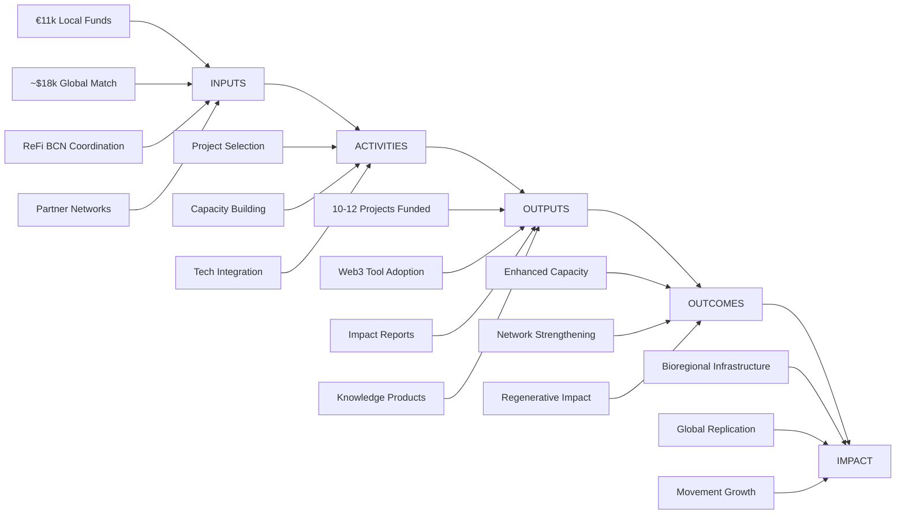

# Regenerant Catalunya

**Regenerant Catalunya** is a pioneering participatory funding round that demonstrates how **local knowledge can integrate with global Web3 infrastructure** to create a replicable model for bioregional regeneration. Launched in late October 2025, the program channels **€27,380 into 11 confirmed regenerative projects** (10-12 total) across Catalonia through collaboration between established Catalan partners ([Miceli Social](https://miceli.social/), [La Fundició](https://lafundicio.net/)/[Keras Buti](https://kerasbuti.org/)) and global Web3 funders via the Localism Fund.

---

## Program Foundations

### Vision Statement

To create a replicable model for bioregional regenerative finance that bridges local community needs with global Web3 infrastructure, demonstrating that blockchain technology can serve real regenerative work rather than speculation.

### Core Principles

**🌱 Network-Driven Approach**

- Build within existing trusted ecosystems rather than imposing external solutions
- Leverage established relationships through Miceli Social (rural) and La Fundició/Keras Buti (urban)
- Enable organic spread through well-established social infrastructures

**🔗 Cosmo-Local Integration**

- Global resources and technology meet local knowledge and action
- Combine traditional cooperative values with cutting-edge Web3 tools
- Create templates for global adaptation while serving immediate local needs

**🎯 Depth Over Breadth**

- Focus on 10-12 carefully curated projects rather than casting a wide net
- Provide comprehensive support: funding + capacity building + mentorship
- Generate visible success stories that inspire wider adoption

### Unique Value Proposition

**For Local Projects:**

- Access to amplified funding through quadratic funding mechanisms
- Capacity building in Web3 tools and impact measurement
- Connection to global regenerative finance networks
- On-chain reputation building for future funding opportunities

**For Global Partners:**

- Real-world testing ground for Web3 tools in regenerative contexts
- Connection to established European cooperative networks
- Measurable impact data and learnings for ecosystem development
- Bridge to traditional regenerative communities

**For the Movement:**

- Open-source methodology and templates for bioregional funding
- Proof of concept for Ethereum Localism initiatives
- Comprehensive impact data for policy and funding advocacy
- Model for permanent bioregional finance infrastructure

---

## Theory of Change

### Core Hypothesis

By empowering a **small group of exemplary projects** with **funding, technology, connections and knowledge**, we generate **visible success stories** that inspire wider adoption of regenerative finance (ReFi) and Web3 mechanisms in Catalonia and beyond.

### Logic Model

**Inputs:** €11,000 local contributions + ~$18,000 global matching funds + ReFi Barcelona coordination + partner networks

**Activities:** Curated project selection + capacity-building workshops + technical mentorship + on-chain impact reporting

**Outputs:** 10-12 projects funded + Web3 tool adoption + educational workshops + on-chain impact records + open-source knowledge products

**Outcomes (6-12 months):** Projects integrate Web3 tools + measurable regenerative impact + strengthened local-global connections + increased funding capacity

**Long-term Impact (1-3 years):** Permanent bioregional finance infrastructure + model replicated globally + mainstream ReFi adoption + strengthened ecosystem resilience

### Key Assumptions

- Local projects are ready and willing to experiment with Web3 tools
- On-chain reputation building creates value for future funding access
- Global Web3 community will engage with local Catalan projects
- Technical stability of chosen Web3 platforms (Karma GAP, Celo)

---

## What Makes It Unique

Rather than imposing external blockchain solutions, we **build within trusted ecosystems**, empowering exemplary projects to generate visible success stories that inspire wider adoption of regenerative finance mechanisms. Each project receives funding plus capacity-building in Web3 tools, creating ongoing infrastructure for bioregional regeneration.

---

## Timeline

**Launch:** Late October 2025 ✅ — Program launched with local funds (€11k) secured on-chain on October 31, 2025. Currently in Phase 1 with comprehensive capacity-building and impact measurement through proven methodologies adapted from Regen Coordination's successful GG23 round.

**Program Phases:**

- **Phase 1 (Nov-Dec 2025):** Baseline Allocation — Currently in progress. Minimum €1,000 per project (tied to minimum participation requirements), up to €1,500 per project (based on simplified impact evaluation)
- **Phase 2 (Jan-Feb 2026):** Network-Level Collective Governance — €1,000 per project allocated to network-level pools (~€6k Miceli Social network, ~€5k La Fundició/Keras Buti network) for collective governance using Web3 tools

See [Program Timeline](/program/timeline) for complete details.

---

## How It Works

### Two-Phase Funding Mechanism

Projects receive funding through a **two-phase distribution** tied to completion of requirements and impact evaluation:

1. **Phase 1 — Baseline Allocation (Nov–Dec 2025):**
   - **Minimum €1,000 per project** (tied to minimum participation requirements)
   - **Up to €1,500 per project** based on simplified impact evaluation
   - **Minimum participation requirements:** Participate in at least 2 workshops, open web3 wallet, submit at least 3 past activities and 3 future plans to Karma

2. **Phase 2 — Network-Level Collective Governance (Jan–Feb 2026):**
   - **€1,000 per project** allocated to network-level pools
   - Networks collectively govern funds using Web3 governance tools (Gardens, Safe, Sarafu, Cycles)

See [Program Funding](/program/funding) for detailed funding architecture and budget breakdown.

### Technology Stack

**Required Tools (Phase 1):**

- **Karma** — On-chain activity and impact reporting (living public "project resume")
- **Web3 wallet on Celo** — Secure fund management (Valora, Minipay, MetaMask, etc.)

**Network-Level Tools (Phase 2):**

- **Governance:** Gardens (conviction voting), multistakeholder contracts
- **Finance:** Safe (multisigs), Sarafu (local currency / commitment pooling), Cycles (open clearing protocol)

See [Tools & Technology](/program/tools) for complete technology stack details.

### Impact Measurement

Our approach combines **impact documentation training** with **simplified impact evaluation**:

- **Structured reporting** through Karma following Common Approach frameworks
- **Impact documentation training** in Workshop #2 covering how to document impact effectively
- **Simplified impact evaluation** informs allocation up to €1,500 per project

See [Evaluation Criteria](/program/evaluation-criteria) for detailed evaluation framework.

---

## Vision

This isn't just about funding projects—it's about **building the infrastructure for ongoing bioregional regeneration** while creating open-source knowledge products that can be adapted globally. The combination of traditional cooperative values with cutting-edge Web3 tools positions Regenerant Catalunya as a **bridge between worlds**, proving blockchain technology can serve real community needs rather than speculation.

### Looking Ahead

If successful, 2026 may see:

- **Regenerant Catalunya Round 2** — expanded cohort, refined mechanisms, deeper tool integration
- **Permanent Bioregional Finance Infrastructure** for Catalonia — continuous resource channeling to regenerative work
- **Replication in other bioregions** — using our open-source toolkit
- **Integration with municipal and institutional funding** (like Zazelenimo)

---

## Risk Management

### Technical Risks

**Web3 Tool Complexity Overwhelming Projects**
- _Mitigation:_ Comprehensive onboarding support and simplified interfaces
- _Contingency:_ Alternative tools and manual processes as backup

**Cryptocurrency Volatility Affecting Fund Value**
- _Mitigation:_ Rapid conversion to euros upon receipt when possible
- _Contingency:_ Stable coin usage and hedging strategies

**Platform Technical Failures or Downtime**
- _Mitigation:_ Multiple platform options and backup systems
- _Contingency:_ Manual processes and alternative distribution methods

### Financial Risks

**Funding Shortfalls from Global Partners**
- _Mitigation:_ Confirmed commitments and diversified funding sources
- _Contingency:_ Reduced project cohort or funding levels

**Regulatory Changes Affecting Crypto Operations**
- _Mitigation:_ Legal compliance monitoring and advisory support
- _Contingency:_ Alternative funding and distribution mechanisms

**Project Fund Mismanagement or Loss**
- _Mitigation:_ Security training and best practices education
- _Contingency:_ Insurance options and emergency fund access

### Operational Risks

**Project Dropout or Non-Engagement**
- _Mitigation:_ Careful selection process and engagement incentives
- _Contingency:_ Replacement projects and fund reallocation

**Partner Relationship Breakdown**
- _Mitigation:_ Clear agreements and regular communication protocols
- _Contingency:_ Alternative partnership arrangements and mediation

### Reputational Risks

**Project Failures Reflecting Poorly on Program**
- _Mitigation:_ Thorough due diligence and ongoing support
- _Contingency:_ Clear communication about learning and iteration

**Association with Cryptocurrency Speculation Concerns**
- _Mitigation:_ Clear messaging about regenerative focus and real impact
- _Contingency:_ Emphasis on traditional cooperative values and outcomes

---

## Success Metrics

### Quantitative Success Indicators

**Funding Success:**
- Target: €27,380 total matching pool achieved ✅
- Target: 10-12 projects funded with minimum €1,000 each
- Target: 11 projects confirmed

**Technical Adoption:**
- Target: 100% of projects successfully onboarded to Karma GAP
- Target: 100% of projects successfully managing Celo wallets
- Target: 50%+ of projects adopting at least one optional tool
- Target: 90%+ project retention throughout program duration

**Impact Measurement:**
- Target: 100% of projects submitting regular impact reports
- Target: Measurable regenerative outcomes across all thematic areas
- Target: 10+ new Web3 wallets created in Catalonia region

**Knowledge Creation:**
- Target: 4+ educational workshops delivered to 100% project participation
- Target: 12 individual project case studies documented
- Target: 1 comprehensive methodology report published
- Target: 5+ replication inquiries from other bioregions

### Qualitative Success Indicators

**Network Strengthening:**
- Enhanced collaboration between participating projects
- Stronger connections between local and global regenerative networks
- Increased capacity for future funding and partnership development
- Greater visibility and recognition for Catalan regenerative work

**Capacity Building:**
- Projects demonstrate increased confidence with Web3 tools
- Improved impact measurement and reporting capabilities
- Enhanced understanding of decentralized governance principles
- Greater connection to global regenerative finance movement

**Innovation & Learning:**
- Novel applications of Web3 tools to regenerative work
- Creative solutions to technical and operational challenges
- Cross-project collaboration and knowledge sharing
- Contributions to global regenerative finance methodology

**Movement Building:**
- Increased awareness of regenerative finance in Catalonia
- Greater interest from potential funders and partners
- Enhanced reputation for cooperative and solidarity economy innovation
- Foundation laid for permanent bioregional finance infrastructure

### Long-term Success Vision

**Year 1 (2026):**
- Regenerant Catalunya Round 2 launched with expanded participation
- 50% of original projects accessing follow-up funding through Web3 networks
- Methodology replicated in 2+ other bioregions globally

**Year 3 (2028):**
- Bioregional Finance Infrastructure operational in Catalonia
- 100+ projects funded through ongoing regenerative finance mechanisms
- Catalonia recognized as leading example of Web3-enabled cooperative economy

**Year 5 (2030):**
- Self-sustaining regenerative finance ecosystem in Catalonia
- Integration with municipal and regional government funding mechanisms
- Measurable bioregional regeneration outcomes across ecological and social indicators
- Global network of bioregional finance infrastructures operating collaboratively

---

## A Participatory Funding Round for Regeneration in Catalonia

_Ronda de Finançament Participatiu Bioregional a Catalunya_

**Regenerant Catalunya** is a participatory funding round launched in late October 2025, dedicated to channeling resources into projects that are regenerating life in the Catalan bioregion. From conserving and restoring natural ecosystems like the Fluvià River basin to developing community infrastructure in L'Hospitalet de Llobregat — Catalonia's second most populous municipality and one of Europe's most densely populated cities — this initiative **supports on-the-ground regenerative work** across the region.

The program is led by **ReFi Barcelona** as a bridge between local needs and global support, providing selected local projects with funding **matched by global Web3 partners**. In return, these projects **experiment with novel technologies and financial tools** (e.g. blockchain-based community funding, digital impact tracking) that could open new income streams and improve their long-term impact.

Both the funding pool _and_ the activities of Regenerant Catalunya emerged through a mediation of local and global interests. Established Catalan regenerative networks like **Miceli Social** and **La Fundició** have together committed **€11,000**, which is being matched with an estimated disbursement of $18,000 **by global sponsors through the Localism Fund** – bringing the total pool to **€27,380**, which is being used to directly support 11 confirmed regenerative projects (10-12 total) in Catalonia.

---

## Get Involved

_If you are a funder or technical partner interested in supporting the regeneration of the Catalan bioregion, we invite you to **reach out** to explore how you can contribute to the matching pool or support the educational and technical activities. This round is only the beginning — the first of many initiatives to empower bioregional regeneration in Catalonia — and we look forward to collaborating with all those aligned on this long-term journey._

**Contact:** [hola@refibcn.cat](mailto:hola@refibcn.cat)

---

## Learn More

### Program Pages

- [Partners & Projects](/program/partners-projects) - Partners and participating projects
- [Program Timeline](/program/timeline) - Complete timeline with key milestones and workshop schedule
- [Program Funding](/program/funding) - Funding architecture, budget breakdown, and treasury management
- [Tools & Technology](/program/tools) - Complete technology stack and tool documentation
- [Evaluation Criteria](/program/evaluation-criteria) - Impact measurement framework and evaluation methodology
 - [Impact Documentation & Activities Reporting](/program/impact-documentation) - Background guide on activities, deliverables, and metrics used in this round

### Guidebooks

- [Project Guidebook](/program/project-guidebook) - Comprehensive guide for participating projects covering Phase 1 requirements, Karma setup, wallet guide, and workshop schedule
- [Network Guidebook](/program/network-guidebook) - Guide for network-level governance covering Phase 2 funding structure, Web3 governance tools, and collective decision-making processes

### Resources

- [Resources](/resources) - Links to all guidebooks, tool documentation, workshop materials, and support channels
