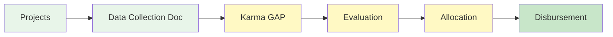

# Phase 1: Baseline Allocation Overview

**Timeline:** November–December 2025  
**Funding Range:** €1,000–€1,500 per project  
**Focus:** Impact documentation and activities reporting as preparation for later Web3 wallet and Karma GAP onboarding

---

## Phase 1 Journey

Complete visual flow of your Phase 1 journey from program kickoff to fund disbursement:

```mermaid
flowchart TD
    A[Kickoff / Intro Workshop] --> B[Documentation Workshops<br/>per network]
    B --> C[Prepare Activities Report<br/>Google Doc per project]
    C --> D[Hands-on Web3 & Karma GAP<br/>(later workshop)]
    D --> E[Optional Support Session]
    E --> F[Evaluation]
    F --> G[Disbursement<br/>End Dec]
    
    style A fill:#e8f5e9
    style B fill:#e8f5e9
    style C fill:#e8f5e9
    style D fill:#e8f5e9
    style E fill:#e8f5e9
    style F fill:#fff9c4
    style G fill:#fff9c4
    style H fill:#c8e6c9
```

**Key Steps:**
1. **Kickoff / Intro Workshop** — Program introduction and overview of impact documentation
2. **Documentation Workshops (by network)** — Separate sessions for Miceli and La Fundició / Keras Buti networks to map activities, deliverables, and metrics in a Google Doc activities report (e.g. Dec 3 in-person at Pomezia for Keras Buti; Dec 11 online + Dec 19 in-person session around Miceli’s general assembly)
3. **Prepare Activities Report (Google Doc per project)** — Organize your key activities, outputs (deliverables) and metrics with links to evidence
4. **Hands-on Web3 & Karma GAP Workshop (later in Phase 1)** — Use your Google Doc to open wallets (if still needed) and post activities to Karma GAP
5. **Optional Support Session** — Additional help if needed
6. **Evaluation** — Projects evaluated based on 4 criteria
7. **Disbursement** — Receive funding (€1,000–€1,500) at end of December

---

## Information Flow

How information flows through the Phase 1 system from projects to disbursement:



**What it shows:**
- Information collection (Data Collection Document/Google Doc)
- Public documentation (Karma GAP)
- Evaluation process
- Allocation calculation
- Final disbursement

---

## Phase 1 Timeline

Visual timeline of all Phase 1 milestones and touchpoints:

```mermaid
gantt
    title Phase 1 Timeline - November to December 2025
    dateFormat YYYY-MM-DD
    section Workshops
    Workshop 1: Kickoff          :done, w1, 2025-11-19, 1d
    Workshop 2: Impact Docs      :w2, 2025-12-08, 7d
    section Support
    Wallet Setup Support         :ws, 2025-11-20, 14d
    Office Hours                 :oh, 2025-12-04, 16d
    section Deliverables
    Wallet Opened                :wallet, 2025-12-07, 1d
    Karma Account Created        :karma-acc, 2025-12-14, 1d
    Activities Submitted         :karma-sub, 2025-12-31, 1d
    section Outcomes
    Evaluation Process           :eval, 2025-12-20, 11d
    Phase 1 Disbursement         :disburse, 2025-12-31, 1d
```

---

## Minimum Participation Requirements

To receive the **minimum €1,000 funding**, projects must:

- ✅ Participate in at least **2 workshops** (Workshop 1 + Workshop 2)
- ✅ Open a **Web3 wallet** on Celo (Valora, Minipay, or other supported wallet)
- ✅ Submit at least **3 past activities** and **3 future plans** to [[Karma GAP]]

**Important:** Projects can receive less than €1,000 if they don't meet minimum participation requirements.

---

## Funding Allocation

**Range:** €1,000–€1,500 per project

**Determined by:**
- Meeting minimum participation requirements (€1,000 base)
- Simplified impact evaluation (up to €1,500)
- Evaluation based on 4 criteria:
  - Local Impact (35%)
  - Web3 Adoption (25%)
  - Resource Efficiency (25%)
  - Clear Plans (15%)

**See:** [[Evaluation Criteria]] for complete details

---

## Key Resources

### Essential Guides

- **[[Project Guidebook]]** — Complete guide for Phase 1 participation
- **[[Project Page Preparation]]** — Prepare your project page and documentation
- **[[Guía Completa de Onboarding a Valora]]** — Step-by-step wallet setup with screenshots
- **[[Evaluation Criteria]]** — Understanding what evaluators look for

### Detailed Documentation

- **[[Guía Completa de Onboarding a Valora]]** — Step-by-step wallet setup with screenshots
- **[[Workshop 1 Documentation]]** — Kickoff workshop notes and recording
- **[[Program Timeline]]** — Complete program timeline with all phases

---

## What to Expect

### November 2025

- **Workshop 1** — Program introduction, Web3 basics, wallet setup
- **Wallet Setup** — Individual support to open your Web3 wallet
- **Preparation** — Gather documentation for impact reporting

### December 2025

- **Workshop 2** — Learn to document impact using Karma GAP
- **Office Hours** — Intensive support for Karma submissions
- **Karma Submission** — Submit your activities and plans
- **Evaluation** — Projects evaluated based on criteria
- **Disbursement** — Receive Phase 1 funding

---

## Support Available

### Communication Channels

- **WhatsApp Groups** — Informal progress sharing and quick questions
- **Office Hours** — December 4–19, 2025 for intensive support
- **Email** — hola@ReFiBCN.cat for questions and support

### Resources

- **[[Program Resources]]** — Complete hub of all guides and documentation
- **[[Project Guidebook]]** — Comprehensive reference guide
- **Process Diagrams** — Visual guides for all key processes

---

## Next Steps

1. **Review the [[Project Guidebook]]** — Understand all Phase 1 requirements
2. **Open your wallet** — Follow the [[Guía Completa de Onboarding a Valora]] guide
3. **Prepare your project page** — Use the [[Project Page Preparation]] guide
4. **Gather documentation** — Collect reports, photos, and metrics about your impact
5. **Attend Workshop 2** — Learn to use Karma GAP for impact reporting
6. **Submit to Karma** — Document your activities and plans
7. **Receive funding** — Phase 1 disbursement at end of December

---

## Questions?

- **Email:** hola@ReFiBCN.cat
- **Office Hours:** December 4–19, 2025
- **WhatsApp:** Join the project group for quick questions

---

**Welcome to Phase 1!** We're here to support you every step of the way. If you have any questions, don't hesitate to reach out.

