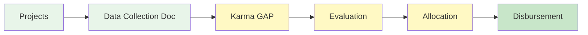

# Phase 1: Baseline Allocation Overview

**Timeline:** November 2025–January 2026  
**Funding:** Conditional on completing basic reporting requirements  
**Focus:** Impact documentation and activities reporting as preparation for later Web3 wallet and Karma GAP onboarding

---

## Phase 1 Journey

Complete visual flow of your Phase 1 journey from program kickoff to fund disbursement:

```mermaid
flowchart TD
    A[Kickoff / Intro Workshop] --> B[Documentation Workshops<br/>per network]
    B --> C[Prepare Activities Report<br/>Google Doc per project]
    C --> D[Hands-on Web3 & Karma GAP<br/>(later workshop)]
    D --> E[Optional Support Session]
    E --> F[Completion Check]
    F --> G[Disbursement<br/>Jan 2026]
    
    style A fill:#e8f5e9
    style B fill:#e8f5e9
    style C fill:#e8f5e9
    style D fill:#e8f5e9
    style E fill:#e8f5e9
    style F fill:#fff9c4
    style G fill:#fff9c4
    style H fill:#c8e6c9
```

**Key Steps:**
1. **Kickoff / Intro Workshop** — Program introduction and overview of impact documentation
2. **Documentation Workshops (by network)** — Separate sessions for Miceli and La Fundició / Keras Buti networks to map activities, deliverables, and metrics in a Google Doc activities report (e.g. Dec 3 in-person at Pomezia for Keras Buti; Dec 11 online + Dec 19 in-person session around Miceli’s general assembly)
3. **Prepare Activities Report (Google Doc per project)** — Organize your key activities, outputs (deliverables) and metrics with links to evidence
4. **Hands-on Web3 & Karma GAP Workshop (later in Phase 1)** — Use your Google Doc to open wallets (if still needed) and post activities to Karma GAP
5. **Optional Support Session** — Additional help if needed
6. **Completion Check** — Lightweight verification that reporting requirements are met
7. **Disbursement** — Receive funding in January 2026 (conditional on completing Google Doc + Karma GAP submission)

---

## Information Flow

How information flows through the Phase 1 system from projects to disbursement:



**What it shows:**
- Information collection (Data Collection Document/Google Doc)
- Public documentation (Karma GAP)
- Evaluation process
- Allocation calculation
- Final disbursement

---

## Phase 1 Timeline

Visual timeline of all Phase 1 milestones and touchpoints:

```mermaid
gantt
    title Phase 1 Timeline - November 2025 to January 2026
    dateFormat YYYY-MM-DD
    section Workshops
    Workshop 1: Kickoff          :done, w1, 2025-11-19, 1d
    Documentation Workshops      :w2, 2025-12-03, 16d
    Final Closeout Workshop      :w3, 2026-01-19, 1d
    section Support
    Wallet Setup Support         :ws, 2025-11-20, 14d
    Office Hours                 :oh, 2026-01-05, 5d
    section Deliverables
    Google Docs Complete         :docs, 2026-01-12, 1d
    Karma GAP Submissions        :karma-sub, 2026-01-12, 5d
    section Outcomes
    Completion Check             :check, 2026-01-16, 3d
    Phase 1 Disbursement         :disburse, 2026-01-20, 1d
```

---

## Participation Requirements

To receive Phase 1 funding, projects must complete:

- ✅ Participate in documentation workshops (by network)
- ✅ Complete **Google Doc activities report** by **January 12, 2026**
- ✅ Submit activities to **Karma GAP** during **January 12–16, 2026**
- ✅ Attend final closeout workshop on **January 19, 2026** (10:00–11:30, Barcelona)

**Funding is conditional on completing these basic reporting requirements.** A lightweight completion check ensures all projects have submitted their documentation; this does not affect the funding amount.

---

## Funding Allocation

**Funding is conditional on completing basic reporting requirements:**
- Complete Google Doc activities report
- Submit activities to Karma GAP
- Attend final closeout workshop

**Evaluation approach:**
- Lightweight completion check to verify reporting requirements are met
- Internal review notes for learning and funder communication
- **Evaluation does not affect funding amount** — all projects completing requirements receive the same base allocation

---

## Key Resources

### Essential Guides

- **[[Project Guidebook]]** — Complete guide for Phase 1 participation
- **[[Project Page Preparation]]** — Prepare your project page and documentation
- **[[Guía Completa de Onboarding a Valora]]** — Step-by-step wallet setup with screenshots
- **[[Evaluation Criteria]]** — Understanding what evaluators look for

### Detailed Documentation

- **[[Guía Completa de Onboarding a Valora]]** — Step-by-step wallet setup with screenshots
- **[[Workshop 1 Documentation]]** — Kickoff workshop notes and recording
- **[[Program Timeline]]** — Complete program timeline with all phases

---

## What to Expect

### November 2025

- **Workshop 1** — Program introduction, Web3 basics, wallet setup
- **Wallet Setup** — Individual support to open your Web3 wallet
- **Preparation** — Gather documentation for impact reporting

### December 2025–January 2026

- **Documentation Workshops** — Complete Google Doc activities reports (by network)
- **January 5–9** — Office hours for Karma GAP support
- **January 12** — Deadline: Complete Google Doc activities report
- **January 12–16** — Submit activities to Karma GAP
- **January 19** — Final closeout workshop (10:00–11:30, Barcelona)
- **Late January** — Completion check and Phase 1 disbursement

---

## Support Available

### Communication Channels

- **Email** — hola@ReFiBCN.cat (primary channel for questions and support)
- **Office Hours** — January 5–9, 2026 for intensive Karma GAP support
- **WhatsApp** — Optional group available for informal progress sharing (not required)

### Resources

- **[[Program Resources]]** — Complete hub of all guides and documentation
- **[[Project Guidebook]]** — Comprehensive reference guide
- **Process Diagrams** — Visual guides for all key processes

---

## Next Steps

1. **Review the [[Project Guidebook]]** — Understand all Phase 1 requirements
2. **Open your wallet** — Follow the [[Guía Completa de Onboarding a Valora]] guide
3. **Prepare your project page** — Use the [[Project Page Preparation]] guide
4. **Gather documentation** — Collect reports, photos, and metrics about your impact
5. **Complete Google Doc** — Finish your activities report by January 12, 2026
6. **Submit to Karma GAP** — Transfer your activities to Karma GAP (January 12–16)
7. **Attend closeout workshop** — Join us January 19 in Barcelona
8. **Receive funding** — Phase 1 disbursement in late January 2026

---

## Questions?

- **Email:** hola@ReFiBCN.cat (primary support channel)
- **Office Hours:** January 5–9, 2026
- **WhatsApp:** Optional group available (not required for participation)

---

**Welcome to Phase 1!** We're here to support you every step of the way. If you have any questions, don't hesitate to reach out.

