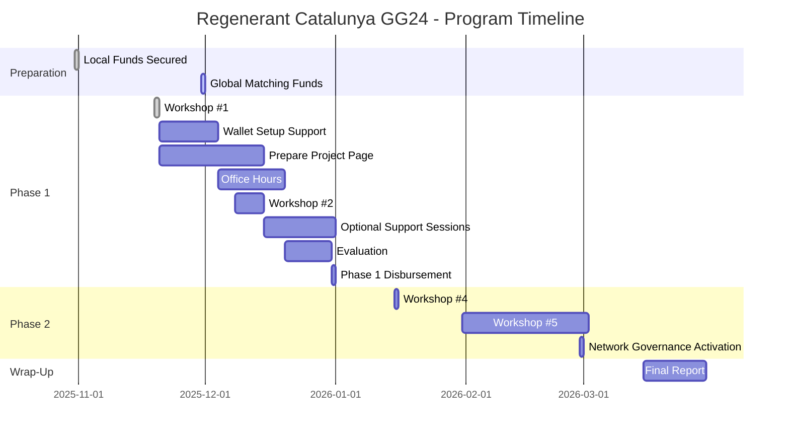

# Regenerant Catalunya - Program Timeline

Complete timeline for the Regenerant Catalunya funding round, from program preparation through final reporting.

---

## Program Timeline Overview



---

## Phase 1: Program Preparation (October 2025)

### October 31, 2025 ✅

**Local funds (€11k) secured on-chain**

- Treasury multisig ready to receive funds
- Local partner commitments confirmed
- **Status:** Completed

### End of November 2025

**Global matching funds secured on-chain**

- Estimated Disbursement $18,000 (≈ €16,380) from Localism Fund
- Funds available for distribution

---

## Phase 2: Program Kickoff & Baseline Allocation (November–December 2025)

### November 19, 2025 ✅

**Workshop #1: Introducing Regenerant Catalunya**

- **Format:** Online (1.5 hours)
- **Language:** Spanish
- **Content:**
  - Introduction of ReFi Barcelona
  - Why Web3 (addressing myths and concerns)
  - Long-term vision (BioFi and Bioregional Finance Infrastructure)
  - Introduction of the round and partners
  - Timeline and activities
  - How funds will be distributed
  - Web3 wallet setup (with breakout groups)
- **Deliverable:** Understand program structure and begin wallet setup

### November 20 - December 7, 2025

**Wallet Setup Support**

- Individual support for opening Web3 wallets
- Troubleshooting assistance
- Security guidance
- **Deliverable:** Web3 wallet ready

### November 20 - December 2025

**Prepare Activities Report (Google Doc)**

- Organize project information and documentation in your project’s activities report Google Doc
- Gather materials (reports, photos, presentations, data) that can serve as evidence
- Identify and describe key activities, deliverables, and metrics
- **Deliverable:** Activities report in Google Docs started and ready to be refined in documentation workshops

### December 4-19, 2025

**Office Hours for Project Support**

- Support as needed for projects working on Karma submissions
- Technical assistance and troubleshooting
- **Deliverable:** Submit activities on Karma (at least 3 past activities and 3 future plans)

### Networks & Workshop Paths (Phase 1)

Regenerant Catalunya is organized around **two networks** that follow **parallel, converging workshop paths**:

- **Miceli Social network:** Rural projects connected through Miceli Social  
- **La Fundició / Keras Buti network:** Urban/cooperative projects connected through La Fundició and Keras Buti

For **Phase 1**, workshops are intentionally structured in **two waves**:

- **Wave 1 – Documentation Workshops (now):**  
  - Separate sessions for each network (e.g. second Keras Buti workshop in-person at Pomezia on **Dec 3**, Miceli workshop online on **Dec 11** plus a short in‑person session around Miceli’s general assembly on **Dec 19**).  
  - **Focus:** Help projects **compile and structure their activities, outputs and metrics** in a shared **Google Doc activities report**, using simple language and concrete examples.  
  - **Important:** In these first workshops we **do not ask projects to open wallets or use KarmaGAP/Web3 tools**. The goal is to leave documentation ready.

- **Wave 2 – Hands-on Web3 & KarmaGAP (later in Phase 1):**  
  - Follow‑up workshops where projects will **open wallets (if still needed)** and **translate their Google Doc activities report into KarmaGAP “Project Activity” updates**.  
  - These sessions will build directly on the Google Docs prepared in Wave 1 and will be scheduled **after** documentation is in place.

Across both networks, the **shared requirement** is that each project prepares a concise **activities report** (activities → deliverables → metrics with proof/evidence) that can later be copied into KarmaGAP.

### December 8-31, 2025

**Submit Activities to Karma GAP**

- Submit at least 3 past activities
- Submit at least 3 future plans
- Transfer information from Google Doc to Karma GAP
- **Deliverable:** Activities submitted to Karma GAP

### December 15-31, 2025

**Optional Support Sessions**

- Individual or small group sessions for Karma GAP submission help
- Scheduled as needed
- **Deliverable:** Additional support for projects needing help

### December 20-31, 2025

**Evaluation Process**

- Council members review Karma GAP submissions
- Projects scored independently based on 4 criteria
- Scores averaged across evaluators
- Allocation determined (€1,000-€1,500)

### End of December 2025

**Phase 1 Disbursement**

- **Minimum €1,000 per project** (tied to minimum participation requirements)
- **Up to €1,500 per project** (based on simplified impact evaluation)
- Funds distributed to project Web3 wallets on Celo
- Off-ramp support provided (without legal liabilities)

**Minimum Participation Requirements:**

- ✅ Participate in at least 2 workshops
- ✅ Open web3 wallet
- ✅ Submit at least 3 past activities and 3 future plans to Karma

---

## Phase 3: Network-Level Collective Governance (January–February 2026)

### January 2026

**Workshop #4: Advanced Web3 Tools (per network)**

- **Format:** Online, separate sessions for each network
- **Language:** Spanish
- **Content:**
  - Set appropriate expectations for network governance
  - How tools can be used for governance:
    - Gardens (conviction voting)
    - Multistakeholder contracts
  - Finance tools:
    - Safe (multisigs)
    - Sarafu (local currency / commitment pooling)
    - Cycles (open clearing protocol)
- **Deliverables:**
  - Agree on which mechanisms to use to manage collective pool
  - Activate governance of funds

### January/February 2026

**Workshop #5: BioFi and Beyond**

- **Format:** Online
- **Language:** Spanish
- **Content:**
  - What is BioFi?
  - Long-term vision — how does it fit with what we are doing
  - Program as pilot
  - Building Bioregional Finance Infrastructure (BFFs)
- **Deliverable:** Feedback

### End of February 2026

**Networks Activate Collective Governance of Phase 2 Funds**

- **Miceli Social network:** ~€6,000 collective pool activated
- **La Fundició / Keras Buti network:** ~€5,000 collective pool activated
- Networks collectively govern funds using Web3 governance tools
- First collective decisions made

---

## Phase 4: Program Wrap-Up (March 2026)

### March 2026

**Final Report Published**

- All artifacts published in **Catalan, Spanish, and English**
- Published at [regenerant.refibcn.cat](https://regenerant.refibcn.cat/)
- Includes:
  - Final report
  - Impact documentation methodology
  - Regional analysis with visualizations
  - Replication toolkit
  - Network governance templates
  - Case studies and project stories

---

## Key Milestones Summary

| Date                | Milestone                               | Status         |
| ------------------- | --------------------------------------- | -------------- |
| **Oct 31, 2025**    | Local funds (€11k) secured on-chain     | ✅ Completed   |
| **End Nov 2025**    | Global matching funds secured on-chain  | 🔄 In Progress |
| **Nov 19, 2025**     | Workshop #1 — Program kickoff           | ✅ Completed   |
| **Nov 20-Dec 7**     | Wallet setup support                     | 📅 Upcoming    |
| **Nov 20-Dec 14**    | Prepare project page (Google Doc)        | 📅 Upcoming    |
| **Dec 4-19, 2025**   | Office hours for project support        | 📅 Upcoming    |
| **Dec 8-14, 2025**   | Workshop #2 — Impact documentation      | 📅 Upcoming    |
| **Dec 8-31, 2025**   | Submit activities to Karma GAP          | 📅 Upcoming    |
| **Dec 15-31, 2025**  | Optional support sessions               | 📅 Upcoming    |
| **Dec 20-31, 2025**  | Evaluation process                      | 📅 Upcoming    |
| **End Dec 2025**     | Phase 1 disbursement                    | 📅 Upcoming    |
| **Jan 2026**        | Workshop #4 — Advanced Web3 tools       | 📅 Planned     |
| **Jan/Feb 2026**    | Workshop #5 — BioFi and beyond          | 📅 Planned     |
| **End Feb 2026**    | Networks activate collective governance | 📅 Planned     |
| **Mar 2026**        | Final report published                  | 📅 Planned     |

---

## Two-Phase Funding Flow

```mermaid
graph LR
    A[Project Onboarding<br/>Nov 2025] --> B[Phase 1: Baseline<br/>Nov-Dec 2025]
    B --> C[Karma Reports<br/>+ Simplified Impact Evaluation]
    C --> D[Disbursement<br/>Min €1,000, up to €1,500/project]
    D --> E[Phase 2: Network Governance<br/>Jan-Feb 2026]
    E --> F[Network-Level Tools<br/>Gardens, Safe, Sarafu, Cycles]
    F --> G[Collective Pool Activation<br/>Miceli ~€6k, La Fundició ~€5k]
    G --> H[Final Reporting<br/>Feb-Mar 2026]

    style B fill:#90EE90
    style E fill:#87CEEB
    style H fill:#FFD700
```



---

## Important Dates for Projects

### Must-Attend Events

- **November 19, 2025:** Workshop #1 (required for minimum participation) ✅ Completed
- **December 8-14, 2025:** Workshop #2 (required for minimum participation)
- **December 4-19, 2025:** Office hours (recommended for Karma support)

### Optional but Recommended

- **January 2026:** Workshop #4 (for network governance)
- **January/February 2026:** Workshop #5 (for long-term vision)

### Deadlines

- **End of December 2025:** Submit Karma activities (3 past + 3 future) to qualify for Phase 1 funding
- **End of February 2026:** Networks activate Phase 2 governance

---

## Phase 1 Touchpoints Timeline

Complete timeline of all Phase 1 touchpoints, workshops, and milestones:

```mermaid
gantt
    title Phase 1 Touchpoints Timeline
    dateFormat YYYY-MM-DD
    section Workshops
    Workshop 1: Kickoff          :done, w1, 2025-11-19, 1d
    Workshop 2: Impact Docs      :w2, 2025-12-08, 7d
    section Support
    Wallet Setup Support         :ws, 2025-11-20, 14d
    Office Hours                 :oh, 2025-12-04, 16d
    Optional Support Sessions    :support, 2025-12-15, 17d
    section Deliverables
    Wallet Opened                :wallet, 2025-12-07, 1d
    Project Page Prepared        :prep, 2025-12-14, 1d
    Karma Account Created        :karma-acc, 2025-12-14, 1d
    Activities Submitted         :karma-sub, 2025-12-31, 1d
    section Outcomes
    Evaluation Process           :eval, 2025-12-20, 11d
    Phase 1 Disbursement         :disburse, 2025-12-31, 1d
```

---

## Ongoing Support & Infrastructure

Throughout the program, projects have access to:

**Technical Support:**
- Weekly office hours for technical questions and troubleshooting
- On-demand support for critical issues and emergencies
- Platform updates and new feature introduction
- Security and best practices guidance

**Mentorship Program:**
- Monthly mentor-project sessions with global Web3 experts
- Peer learning and cross-project collaboration opportunities
- Ad-hoc support for specific challenges and opportunities

**Community Building:**
- Regular cohort check-ins and progress sharing
- Cross-project collaboration facilitation
- Network building and relationship development

---

## Resources

- [Project Guidebook](/program/project-guidebook) — Detailed guide for participating projects
- [Network Guidebook](/program/network-guidebook) — Guide for Phase 2 network governance
- [Resources](/resources) — Links to all tool documentation and support materials
- [Program Overview](/program) — Complete program information

---

**Questions about the timeline?** Contact us at hola@ReFiBCN.cat
