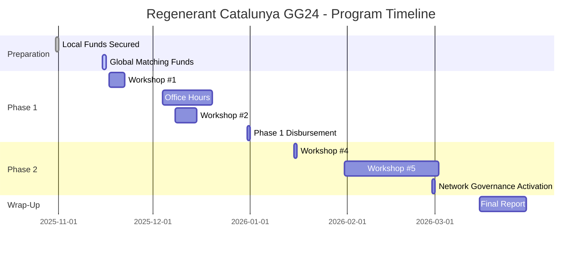

# Regenerant Catalunya - Program Timeline

Complete timeline for the Regenerant Catalunya funding round, from program preparation through final reporting.

---

## Program Timeline Overview

---

## Phase 1: Program Preparation (October 2025)

### October 31, 2025 ✅
**Local funds (€11k) secured on-chain**
- Treasury multisig ready to receive funds
- Local partner commitments confirmed
- **Status:** Completed

### Mid-November 2025
**Global matching funds secured on-chain**
- $20,000 from Localism Fund
- Funds available for distribution

---

## Phase 2: Program Kickoff & Baseline Allocation (November–December 2025)

### November 17-21, 2025
**Workshop #1: Introducing Regenerant Catalunya**
- **Format:** Online (1.5 hours)
- **Language:** Spanish
- **Content:**
  - Introduction of ReFi Barcelona
  - Why Web3 (addressing myths and concerns)
  - Long-term vision (BioFi and Bioregional Finance Infrastructure)
  - Introduction of the round and partners
  - Timeline and activities
  - How funds will be distributed
  - Web3 wallet setup (with breakout groups)
- **Deliverable:** Open Web3 Wallet

### December 4-19, 2025
**Office Hours for Project Support**
- Support as needed for projects working on Karma submissions
- Technical assistance and troubleshooting
- **Deliverable:** Submit activities on Karma (at least 3 past activities and 3 future plans)

### December 8-14, 2025
**Workshop #2: Documenting Impact**
- **Format:** Online
- **Language:** Spanish
- **Content:**
  - How to document impact effectively
  - The importance of good data (regardless of crypto)
  - Setting appropriate metrics for regeneration
  - What is Karma and why use it
  - How to log activities in Karma
  - Examples of projects using Karma effectively
  - What we're looking for (3 past activities + 3 future plans)
- **Deliverable:** Open account on Karma

### End of December 2025
**Phase 1 Disbursement**
- **Minimum €1,000 per project** (tied to minimum participation requirements)
- **Up to €1,500 per project** (based on simplified impact evaluation)
- Funds distributed to project Web3 wallets on Celo
- Off-ramp support provided (without legal liabilities)

**Minimum Participation Requirements:**
- ✅ Participate in at least 2 workshops
- ✅ Open web3 wallet
- ✅ Submit at least 3 past activities and 3 future plans to Karma

---

## Phase 3: Network-Level Collective Governance (January–February 2026)

### January 2026
**Workshop #4: Advanced Web3 Tools (per network)**
- **Format:** Online, separate sessions for each network
- **Language:** Spanish
- **Content:**
  - Set appropriate expectations for network governance
  - How tools can be used for governance:
    - Gardens (conviction voting)
    - Multistakeholder contracts
  - Finance tools:
    - Safe (multisigs)
    - Sarafu (local currency / commitment pooling)
    - Cycles (open clearing protocol)
- **Deliverables:**
  - Agree on which mechanisms to use to manage collective pool
  - Activate governance of funds

### January/February 2026
**Workshop #5: BioFi and Beyond**
- **Format:** Online
- **Language:** Spanish
- **Content:**
  - What is BioFi?
  - Long-term vision — how does it fit with what we are doing
  - Program as pilot
  - Building Bioregional Finance Infrastructure (BFFs)
- **Deliverable:** Feedback

### End of February 2026
**Networks Activate Collective Governance of Phase 2 Funds**
- **Miceli Social network:** ~€6,000 collective pool activated
- **La Fundició / Keras Buti network:** ~€5,000 collective pool activated
- Networks collectively govern funds using Web3 governance tools
- First collective decisions made

---

## Phase 4: Program Wrap-Up (March 2026)

### March 2026
**Final Report Published**
- All artifacts published in **Catalan, Spanish, and English**
- Published at [regenerant.refibcn.cat](https://regenerant.refibcn.cat/)
- Includes:
  - Final report
  - Impact documentation methodology
  - Regional analysis with visualizations
  - Replication toolkit
  - Network governance templates
  - Case studies and project stories

---

## Key Milestones Summary

| Date | Milestone | Status |
|------|-----------|--------|
| **Oct 31, 2025** | Local funds (€11k) secured on-chain | ✅ Completed |
| **Mid-Nov 2025** | Global matching funds secured on-chain | 🔄 In Progress |
| **Nov 17-21, 2025** | Workshop #1 — Program kickoff | 📅 Upcoming |
| **Dec 4-19, 2025** | Office hours for project support | 📅 Upcoming |
| **Dec 8-14, 2025** | Workshop #2 — Impact documentation | 📅 Upcoming |
| **End Dec 2025** | Phase 1 disbursement | 📅 Upcoming |
| **Jan 2026** | Workshop #4 — Advanced Web3 tools | 📅 Planned |
| **Jan/Feb 2026** | Workshop #5 — BioFi and beyond | 📅 Planned |
| **End Feb 2026** | Networks activate collective governance | 📅 Planned |
| **Mar 2026** | Final report published | 📅 Planned |

---

## Two-Phase Funding Flow

```mermaid
graph LR
    A[Project Onboarding<br/>Nov 2025] --> B[Phase 1: Baseline<br/>Nov-Dec 2025]
    B --> C[Karma Reports<br/>+ Simplified Impact Evaluation]
    C --> D[Disbursement<br/>Min €1,000, up to €1,500/project]
    D --> E[Phase 2: Network Governance<br/>Jan-Feb 2026]
    E --> F[Network-Level Tools<br/>Gardens, Safe, Sarafu, Cycles]
    F --> G[Collective Pool Activation<br/>Miceli ~€6k, La Fundició ~€5k]
    G --> H[Final Reporting<br/>Feb-Mar 2026]

    style B fill:#90EE90
    style E fill:#87CEEB
    style H fill:#FFD700
```

---

## Important Dates for Projects

### Must-Attend Events

- **November 17-21, 2025:** Workshop #1 (required for minimum participation)
- **December 8-14, 2025:** Workshop #2 (required for minimum participation)
- **December 4-19, 2025:** Office hours (recommended for Karma support)

### Optional but Recommended

- **January 2026:** Workshop #4 (for network governance)
- **January/February 2026:** Workshop #5 (for long-term vision)

### Deadlines

- **End of December 2025:** Submit Karma activities (3 past + 3 future) to qualify for Phase 1 funding
- **End of February 2026:** Networks activate Phase 2 governance

---

## Resources

- [Project Guidebook](/program/project-guidebook) — Detailed guide for participating projects
- [Network Guidebook](/program/network-guidebook) — Guide for Phase 2 network governance
- [Resources](/resources) — Links to all tool documentation and support materials
- [Master Document](/master-document) — Comprehensive program documentation

---

**Questions about the timeline?** Contact us at hola@ReFiBCN.cat

