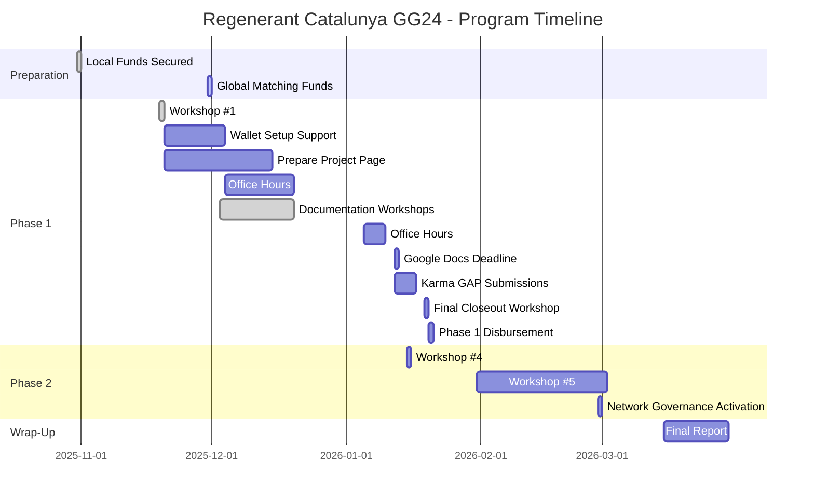

# Regenerant Catalunya - Program Timeline

Complete timeline for the Regenerant Catalunya funding round, from program preparation through final reporting.

---

## Program Timeline Overview



---

## Phase 1: Program Preparation (October 2025)

### October 31, 2025 ✅

**Local funds (€11k) secured on-chain**

- Treasury multisig ready to receive funds
- Local partner commitments confirmed
- **Status:** Completed

### End of November 2025

**Global matching funds secured on-chain**

- Disbursement $18,100 USD (≈ €16,380) from Localism Fund
- Total program funding confirmed: €26,000 (€11,000 local + €15,000 from global matching)
- Funds available for distribution

---

## Phase 2: Program Kickoff & Baseline Allocation (November 2025–January 2026)

### November 19, 2025 ✅

**Workshop #1: Introducing Regenerant Catalunya**

- **Format:** Online (1.5 hours)
- **Language:** Spanish
- **Content:**
  - Introduction of ReFi Barcelona
  - Why Web3 (addressing myths and concerns)
  - Long-term vision (BioFi and Bioregional Finance Infrastructure)
  - Introduction of the round and partners
  - Timeline and activities
  - How funds will be distributed
  - Web3 wallet setup (with breakout groups)
- **Deliverable:** Understand program structure and begin wallet setup

### November 20 - December 7, 2025

**Wallet Setup Support**

- Individual support for opening Web3 wallets
- Troubleshooting assistance
- Security guidance
- **Deliverable:** Web3 wallet ready

### November 20 - December 2025

**Prepare Activities Report (Google Doc)**

- Organize project information and documentation in your project’s activities report Google Doc
- Gather materials (reports, photos, presentations, data) that can serve as evidence
- Identify and describe key activities, deliverables, and metrics
- **Deliverable:** Activities report in Google Docs started and ready to be refined in documentation workshops

### January 5-9, 2026

**Office Hours for Karma GAP Support**

- Support for projects working on Karma GAP submissions
- Technical assistance and troubleshooting
- **Deliverable:** Projects ready to submit activities to Karma GAP

### Networks & Workshop Paths (Phase 1)

Regenerant Catalunya is organized around **two networks** that follow **parallel, converging workshop paths**:

- **Miceli Social network:** Rural projects connected through Miceli Social  
- **La Fundició / Keras Buti network:** Urban/cooperative projects connected through La Fundició and Keras Buti

For **Phase 1**, workshops are intentionally structured in **two waves**:

- **Wave 1 – Documentation Workshops (now):**  
  - Separate sessions for each network (e.g. second Keras Buti workshop in-person at Pomezia on **Dec 3**, Miceli workshop online on **Dec 11** plus a short in‑person session around Miceli’s general assembly on **Dec 19**).  
  - **Focus:** Help projects **compile and structure their activities, outputs and metrics** in a shared **Google Doc activities report**, using simple language and concrete examples.  
  - **Important:** In these first workshops we **do not ask projects to open wallets or use KarmaGAP/Web3 tools**. The goal is to leave documentation ready.

- **Wave 2 – Hands-on Web3 & KarmaGAP (later in Phase 1):**  
  - Follow‑up workshops where projects will **open wallets (if still needed)** and **translate their Google Doc activities report into KarmaGAP “Project Activity” updates**.  
  - These sessions will build directly on the Google Docs prepared in Wave 1 and will be scheduled **after** documentation is in place.

Across both networks, the **shared requirement** is that each project prepares a concise **activities report** (activities → deliverables → metrics with proof/evidence) that can later be copied into KarmaGAP.

### January 12, 2026

**Deadline: Complete Google Doc Activities Report**

- All projects must complete their Google Doc activities report
- Upload supporting materials to Google Drive folder
- **Deliverable:** Complete activities report ready for transfer to Karma GAP

### January 12-16, 2026

**Submit Activities to Karma GAP**

- Transfer information from Google Doc to Karma GAP
- Submit activities with deliverables and metrics
- **Deliverable:** Activities submitted to Karma GAP

### January 19, 2026

**Final Phase 1 Closeout Workshop**

- **Format:** In-person (Barcelona)
- **Time:** 10:00–11:30 AM
- **Content:**
  - Review any remaining questions about Karma GAP submissions
  - Phase 1 reflection and sense-making
  - Introduction to Phase 2 (network-level governance)
- **Deliverable:** Phase 1 completion and Phase 2 orientation

### Late January 2026

**Completion Check & Phase 1 Disbursement**

- Lightweight verification that all projects have completed reporting requirements
- Internal review notes for learning and funder communication
- **Funding is conditional on completing basic reporting** (Google Doc + Karma GAP submission)
- **Equal distribution** — all projects completing requirements receive the same allocation (~€1,000 per project)
- **Evaluation:** Lightweight internal review for learning and funder communication only; does not affect funding amounts
- Funds distributed to project Web3 wallets on Celo
- Off-ramp support provided (without legal liabilities)

**Participation Requirements:**

- ✅ Complete Google Doc activities report by January 12
- ✅ Submit activities to Karma GAP (January 12–16)
- ✅ Attend final closeout workshop (January 19)

---

## Phase 3: Network-Level Collective Governance (January–February 2026)

### January 2026

**Workshop #4: Phase 2 Sense-Making & Needs Identification (per network)**

- **Format:** In-person or online, separate sessions for each network
- **Language:** Spanish
- **Content:**
  - **Primary focus:** Identify concrete network needs before proposing tools
  - Sense-making session to understand current governance challenges
  - Discussion of network priorities and decision-making processes
  - Exploration of how Web3 tools might address identified needs
  - Introduction to available tools:
    - **Home Community** (mobile app for La Fundición) — community governance without visible crypto
    - **Safe multisig** — network-level treasury management
    - **Institutional Development Kit** — framework for identifying web3 integration opportunities
- **Deliverables:**
  - Documented network needs and priorities
  - Initial tool selection based on network context
  - Plan for Phase 2 governance structure

### January/February 2026

**Workshop #5: BioFi and Beyond**

- **Format:** Online
- **Language:** Spanish
- **Content:**
  - What is BioFi?
  - Long-term vision — how does it fit with what we are doing
  - Program as pilot
  - Building Bioregional Finance Infrastructure (BFFs)
- **Deliverable:** Feedback

### End of February 2026

**Networks Activate Collective Governance of Phase 2 Funds**

- **Phase 2 funding:** €10,000 additional available for network-level governance
- **Miceli Social network:** Multi-sig Safe activated with key stakeholders as signers
- **La Fundició / Keras Buti network:** Home Community app or Safe multisig (based on network preference)
- Networks collectively govern funds using selected Web3 governance tools
- First collective decisions made
- **Note:** Governance managed by key network stakeholders, not necessarily all project participants

---

## Phase 4: Program Wrap-Up (March 2026)

### March 2026

**Final Report Published**

- All artifacts published in **Catalan, Spanish, and English**
- Published at [regenerant.refibcn.cat](https://regenerant.refibcn.cat/)
- Includes:
  - Final report
  - Impact documentation methodology
  - Regional analysis with visualizations
  - Replication toolkit
  - Network governance templates
  - Case studies and project stories

---

## Key Milestones Summary

| Date                | Milestone                               | Status         |
| ------------------- | --------------------------------------- | -------------- |
| **Oct 31, 2025**    | Local funds (€11k) secured on-chain     | ✅ Completed   |
| **End Nov 2025**    | Global matching funds secured on-chain  | 🔄 In Progress |
| **Nov 19, 2025**     | Workshop #1 — Program kickoff           | ✅ Completed   |
| **Dec 3, 11, 19 2025** | Documentation workshops (by network)   | ✅ Completed   |
| **Jan 5-9, 2026**    | Office hours for Karma GAP support      | 📅 Upcoming    |
| **Jan 12, 2026**     | Deadline: Complete Google Doc          | 📅 Upcoming    |
| **Jan 12-16, 2026**  | Submit activities to Karma GAP          | 📅 Upcoming    |
| **Jan 19, 2026**     | Final closeout workshop (Barcelona, 10:00 AM) | 📅 Upcoming    |
| **Late Jan 2026**    | Completion check & Phase 1 disbursement | 📅 Upcoming    |
| **Jan 2026**        | Workshop #4 — Phase 2 sense-making & needs | 📅 Planned     |
| **Jan/Feb 2026**    | Workshop #5 — BioFi and beyond          | 📅 Planned     |
| **End Feb 2026**    | Networks activate collective governance | 📅 Planned     |
| **Mar 2026**        | Final report published                  | 📅 Planned     |

---

## Two-Phase Funding Flow

```mermaid
graph LR
    A[Project Onboarding<br/>Nov 2025] --> B[Phase 1: Baseline<br/>Nov-Dec 2025]
    B --> C[Karma Reports<br/>+ Simplified Impact Evaluation]
    C --> D[Disbursement<br/>Equal allocation ~€1,000/project]
    D --> E[Phase 2: Network Governance<br/>Jan-Feb 2026]
    E --> F[Network-Level Tools<br/>Gardens, Safe, Sarafu, Cycles]
    F --> G[Collective Pool Activation<br/>€10k additional for networks]
    G --> H[Final Reporting<br/>Feb-Mar 2026]

    style B fill:#90EE90
    style E fill:#87CEEB
    style H fill:#FFD700
```



---

## Important Dates for Projects

### Must-Attend Events

- **November 19, 2025:** Workshop #1 (program kickoff) ✅ Completed
- **December 3, 11, or 19, 2025:** Documentation workshops (by network) ✅ Completed
- **January 19, 2026:** Final closeout workshop (required for Phase 1 completion)

### Important Deadlines

- **January 12, 2026:** Complete Google Doc activities report
- **January 12-16, 2026:** Submit activities to Karma GAP
- **Late January 2026:** Phase 1 disbursement (conditional on completing requirements)

### Optional but Recommended

- **January 5-9, 2026:** Office hours for Karma GAP support
- **January 2026:** Workshop #4 (for network governance)
- **January/February 2026:** Workshop #5 (for long-term vision)

---

## Phase 1 Touchpoints Timeline

Complete timeline of all Phase 1 touchpoints, workshops, and milestones:

```mermaid
gantt
    title Phase 1 Touchpoints Timeline
    dateFormat YYYY-MM-DD
    section Workshops
    Workshop 1: Kickoff          :done, w1, 2025-11-19, 1d
    Workshop 2: Impact Docs      :w2, 2025-12-08, 7d
    section Support
    Wallet Setup Support         :ws, 2025-11-20, 14d
    Office Hours                 :oh, 2026-01-05, 5d
    section Deliverables
    Google Docs Complete         :docs, 2026-01-12, 1d
    Karma GAP Submissions        :karma-sub, 2026-01-12, 5d
    section Outcomes
    Final Closeout Workshop       :workshop3, 2026-01-19, 1d
    Completion Check             :check, 2026-01-16, 3d
    Phase 1 Disbursement         :disburse, 2026-01-20, 1d
```

---

## Ongoing Support & Infrastructure

Throughout the program, projects have access to:

**Technical Support:**
- Weekly office hours for technical questions and troubleshooting
- On-demand support for critical issues and emergencies
- Platform updates and new feature introduction
- Security and best practices guidance

**Mentorship Program:**
- Monthly mentor-project sessions with global Web3 experts
- Peer learning and cross-project collaboration opportunities
- Ad-hoc support for specific challenges and opportunities

**Community Building:**
- Regular cohort check-ins and progress sharing
- Cross-project collaboration facilitation
- Network building and relationship development

---

## Resources

- [Project Guidebook](/program/project-guidebook) — Detailed guide for participating projects
- [Network Guidebook](/program/network-guidebook) — Guide for Phase 2 network governance
- [Resources](/resources) — Links to all tool documentation and support materials
- [Program Overview](/program) — Complete program information

---

**Questions about the timeline?** Contact us at hola@ReFiBCN.cat
