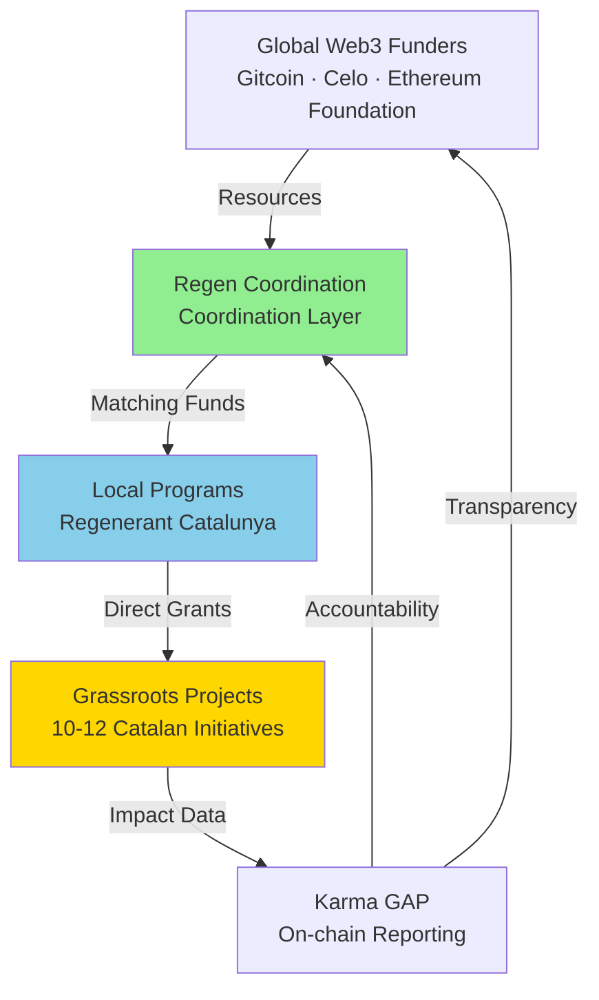
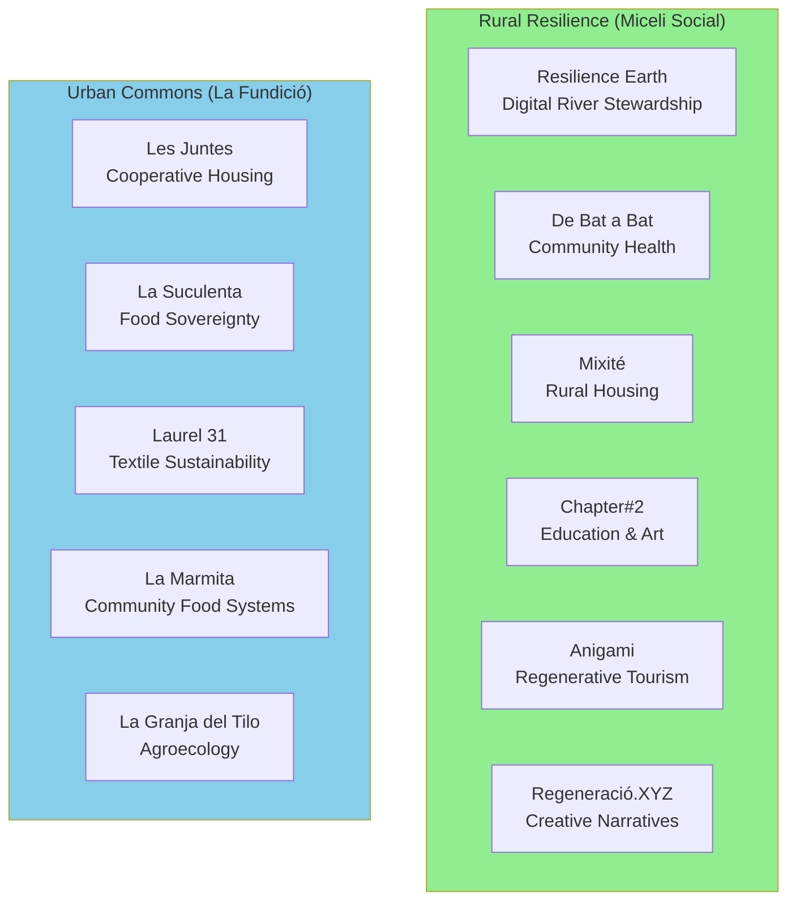

# REGENERANT CATALUNYA GG24 [MASTER DOC]

-@Commons Agency add all links when draft is ready

-Many parts have to be updated regarding what GG24 finally is, the name of the round etc etc, do a proper final check of this aspect alone when ready

<aside>

**Future Points TBD**

- [ ]  Funds allocation according to past / future work
    
    **Advisors:**
    
    - **Oriol** - Miceli Social: Rural resilience and municipal collaboration expertise
    - **Mariló** - La Fundició • Keras Buti: Urban cooperative economics and cultural innovation experience
    - Oscar/Erika?
    - Clara Gromaches?
    - Representative from Arran de Terra
</aside>

# A. Introduction

---

## **1. A Participatory Funding Round for Regeneration in Catalonia - [Introduction]**

***Ronda de Finançament Participatiu Bioregional a Catalunya***

**Regenerant Catalunya** is a participatory funding round dedicated to channeling resources into projects that are regenerating life in the Catalan bioregion. From conserving and restoring natural ecosystems like the Fluvià River basin to developing community infrastructure in L'Hospitalet de Llobregat — Catalonia's second most populous municipality and one of Europe's most densely populated cities — this initiative aims to **support on-the-ground regenerative work** across the region.

The program is led by **ReFi Barcelona** as a bridge between local needs and global support, providing selected local projects with funding **matched by global Web3 partners**. In return, these projects will **experiment with novel technologies and financial tools** (e.g. blockchain-based community funding, digital impact tracking) that could open new income streams and improve their long-term impact.

Both the funding pool *and* the activities of Regenerant Catalunya emerged through a mediation of local and global interests. Established Catalan regenerative networks like **Miceli Social** and **La Fundició** have together committed around **€11,000**, an amount that will be **matched by global sponsors** including Gitcoin, Celo, and the Ethereum Foundation – bringing the total pool to nearly **€30,000,** which will be used to directly support 10-12 regenerative projects in Catalonia.

*If you are a funder or technical partner interested in supporting the regeneration of the Catalan bioregion, we invite you to **contact us to explore how you can contribute** to the matching pool or support the educational and technical activities. This round is only the beginning — the first of many initiatives to empower bioregional regeneration in Catalonia — and we look forward to collaborating with all those aligned on this long-term journey.*

**📅 Note:** Regenerant Catalunya will launch during Gitcoin Grants Round 24 (October 14-28, 2025).

- Shortened intro for form, as requested by Luiz
    
    
    **Regenerant Catalunya** is an upcoming participatory funding round dedicated to channeling resources into projects that are regenerating life in the Catalan bioregion. From conserving and restoring natural ecosystems like the Fluvià River basin to developing community infrastructure in L'Hospitalet de Llobregat — Catalonia's second most populous municipality and one of Europe's most densely populated cities — this initiative aims to **support on-the-ground regenerative work** across the region.
    
    The program is led by **ReFi Barcelona** as a bridge between local needs and global support, providing selected local projects with funding **matched by global Web3 partners**. In return, these projects will **experiment with novel technologies and financial tools** (e.g. blockchain-based community funding, digital impact tracking) that could open new income streams and improve their long-term impact.
    
    Both the funding pool *and* the activities of Regenerant Catalunya emerged through a mediation of local and global interests. Established Catalan regenerative networks like **Miceli Social** and **La Fundició** have together committed around **€11,000**, amount to be **matched by global sponsors** of Regen Coordination’s Local Funding Programs GG24 – bringing the total pool to nearly **€30,000,** which will be used to directly support 10-12 regenerative projects in Catalonia.
    

---

## **2. Why Now? - [Contextualization]**

### **Web3, Public Goods, and Regenerative Finance (ReFi)**

Around the world, new approaches to finance are emerging that bring together transparency, decentralization, and democratic processes in service of solidarity and regeneration. **Web3** – the decentralized web powered by blockchain – enables communities to directly fund and govern projects without intermediaries, aligning incentives around shared values.

In particular, **Regenerative Finance (ReFi)** has arisen as a movement to reimagine economic systems toward restorative outcomes for people and planet. ReFi projects leverage technologies like blockchain, digital measurement (dMRV), and AI to channel resources into public goods and ecological regeneration, rather than extraction.

A big focus of the Web3 and ReFi ecosystems has been **public goods funding** - promoting the development of open-access resources that anyone can use and that benefit all, while making sure that the development of the ecosystems themselves are appropriately funded.

[Gitcoin Grants](https://grants.gitcoin.co/) is one of the most visible examples of Web3 public-goods funding programs, having distributed over $60 million to projects that create and steward shared resources. Using [quadratic funding](https://en.wikipedia.org/wiki/Quadratic_voting#Quadratic_funding) (QF).

### **Regen Coordination: A Global Movement Bridging Scales**

.png)

*Regen Coordination is a multi-layered ecosystem that connects global Web3 funding sources to local regenerative projects. In the diagram, financial resources from partners flow through **Regen Coordination** (center) to grassroots “projects & regenerators” on the ground. In parallel, data on impact and outcomes flows back via on-chain reporting tools to inform funding decisions.*

From this Web3 ecosystem, **Regen Coordination** emerged as a global alliance of organizations and networks dedicated to weaving together local experiments into a coherent movement. Founded by **ReFi DAO** and **Greenpill Network** with support from Gitcoin and Celo Public Goods, Regen Coordination spans a constellation of like-minded communities – including ReFi DAO Local Nodes, Greenpill Chapters, **Bloom Network**, **The BioFi Project**, **Ma Earth**, **AgroforestDAO**, and many others. All are united by a shared mission to drive ecological, social, and economic regeneration through open collaboration.

Some of Regen Coordination’s most relevant programs so far include:

- **Regen Coordination Global Round** in Gitcoin Grants 23 (GG23) - deployed a $96,000 matching pool to support 50 projects working at the intersection of ReFi, Ethereum, and local social-ecological impact.
- **ReFi Mediterranean GG23** – the first bioregional quadratic funding round across the Mediterranean region
- **Regen Rio de Janeiro GG23** in Brazil[gov.gitcoin.co](https://gov.gitcoin.co/t/ai-impactqf-regen-coordination-global-gg23-retrospective/20385#:~:text=This%20global%20round%20ran%20in,12%20Local%20ReFi%20Toolkit%20Funding). These localized rounds brought Web3 funding tools into specific geographic contexts, engaging many participants new to crypto. In addition, Regen Coordination launched a
- **Zazelenimo** – an urban greening initiative in Split, Croatia[gov.gitcoin.co](https://gov.gitcoin.co/t/ai-impactqf-regen-coordination-global-gg23-retrospective/20385#:~:text=One%20live%20example%20is%20our,3%3A1%20local%20municipal%20match%2C%20enabling)[gov.gitcoin.co](https://gov.gitcoin.co/t/ai-impactqf-regen-coordination-global-gg23-retrospective/20385#:~:text=One%20live%20example%20is%20our,Web3%20infrastructure%20into%20civic%20processes). Zazelenimo’s upcoming pilot will blend Ethereum-based participatory funding with a *3:1 matching contribution from the local municipal government*, enabling citizen-led tree planting through a public–private–community capital stack[gov.gitcoin.co](https://gov.gitcoin.co/t/ai-impactqf-regen-coordination-global-gg23-retrospective/20385#:~:text=One%20live%20example%20is%20our,Web3%20infrastructure%20into%20civic%20processes).

Regen Coordination convenes decentralized funding rounds, “sensemaking” processes, and shared toolkits that make grassroots efforts more legible and coordinated globally. In just its first year, this alliance raised and distributed over $370,000 to regenerative communities and local projects across multiple programs.

These experiments align closely with the growing movement of **Ethereum Localism**, which seeks to embed Web3 tools into place-based communities for practical benefit — helping neighborhoods, bioregions, and civic networks coordinate resources, measure impact, and strengthen local economies. 

These experiments are building momentum toward a **“cosmo-local”** network of grantmaking – where global resources and tech meet local knowledge and action.

### **Local Funding Programs in GG24**

Building on these successes, in the upcoming **Gitcoin Grants Round 24 (GG24), Regen Coordination**, in partnership with **Open Civics**, is leading a dedicated *Local Funding Programs* track to guide and support communities in running credible, high-impact local grant rounds. The idea is to pilot **localized funding rounds** in several regions during GG24 – one of which is Catalonia (led by ReFi Barcelona). In the Catalan pilot – dubbed **“Regenerant Catalunya”** – Web3 funding tools will be tested in a real-world community context with both global and local backing. Essentially, matching funds from global donors (via Gitcoin’s platform) will combine with contributions from local stakeholders to fund regenerative projects in the region.

Catalonia is an ideal proving ground for such an experiment, thanks to its **fertile bioregional ecosystem** and long history of cooperativism. The region boasts a vibrant Social and Solidarity Economy (SSE) with numerous organizations already working on sustainable development, commons-based initiatives, and social & ecological action. Many local projects align with ReFi values like bioregionalism, ecological restoration, **degrowth**, and community governance. 

By enabling the adoption of Web3 funding mechanisms into Catalonia’s existing ecosystem, we hope to amplify what is already working on the ground. Just as importantly, documenting the process will produce insights and open-source templates that other localities can use.

---

## 3. Introducing the Regenerant Catalunya GG24 Round

---

## *4. How is it actually going to look like?*

---

## 5. Conclusion – Funding the Ecosocial Transition in Catalunya and Beyond

In summary, **Regenerant Catalunya** is more than a one-time grant competition – it's an *experiment in how we finance the future*. By combining the trust and relationships of local communities with the open-access digital infrastructure of global networks, we are charting a new path for funding the commons. This initiative will show that **Web3 tools can directly serve the urgent needs of people and ecosystems**, not in a distant or theoretical way, but right here in Catalonia's forests, rivers, towns, and neighborhoods.

Looking ahead, the lessons from this round will inform a longer journey. 2026 may see new rounds or perhaps the birth of a **Bioregional Finance Infrastructure** for Catalonia – a more permanent system to continuously channel resources into regenerative projects. Imagine a future where Catalan cooperatives and environmental groups have access to ongoing community funding portals, where impact data flows seamlessly into funding decisions, and where local currencies and credits incentivize regenerative behaviors across society. That vision is already being seeded by various organizations in the territory (some of which are part of this round), and **ReFi Barcelona was created precisely to connect, support, and amplify these efforts**. Our role is to ensure the spark lit by Regenerant Catalunya grows into a sustained flame of *regenerative finance* powering the eco-social transition of our region.

We invite both local and global allies to join this journey. Whether you are a Catalan community member, a Web3 developer, an impact investor, or simply a concerned citizen of the world – there are ways to get involved: contribute to the funding pool, help shape the emerging tools and governance models, or volunteer expertise to the projects on the ground. **Regenerant Catalunya is an open collaboration**. By participating, you're not only helping Catalonia; you're helping prototype solutions that can be reused worldwide in the climate and social justice movement.

*And finally, if you've read this far and feel inspired:* It's not too late to **contribute funds or support** to the current round! Every additional euro or token will go directly to the frontlines of regeneration in Catalonia, and through the quadratic matching mechanism, even small donations can have a big amplified impact. Keep an eye out for the public launch in October – we'd love your support in making Regenerant Catalunya a resounding success and a model for community-driven funding of public goods. Together, let's finance the future we want to see – one bioregion at a time.

---

## 6. References

- [Ethereum Localism x Regen Coordination: Powering Regenerative Local Economies with Web3](https://blog.refidao.com/ethereum-localism-x-regen-coordination/)
- [Ethereum Localism x Regen Coordination: Powering Regenerative Lo… — ReFi DAO](https://mirror.xyz/refidao.eth/RpOe93-mSKlOorZVgeSGjGelkJ7ma3j19vbc-YW2Ujk?ref=blog.refidao.com)
- [Impact Results | Gitcoin](https://impact.gitcoin.co/)
- [Gitcoin Grants – Quadratic Funding for the World | Gitcoin Blog](https://www.gitcoin.co/blog/gitcoin-grants-quadratic-funding-for-the-world)
- [AI ImpactQF Regen Coordination Global GG23 Retrospective](https://gov.gitcoin.co/t/ai-impactqf-regen-coordination-global-gg23-retrospective/20385)
- [Miceli Social - ReFi Barcelona](https://refibcn.cat/Bioregional+Knowledge+Commons/Bioregionalisme+a+Catalunya/Projects+%26+Organizations/Miceli+Social)
- [[TEMP CHECK] Fair Fees for GG24 | Gitcoin](https://app.x23.ai/gitcoin/discussions/topic/22560/temp-check-fair-fees-for-gg24)
- [Karma GAP - Grantee Accountability and reputation protocol - Public Good Projects Discussion - Octant](https://discuss.octant.app/t/karma-gap-grantee-accountability-and-reputation-protocol/232)
- [ReFi Barcelona Bioregional Knowledge Commons](https://refibcn.cat/)

---

---

---

# **B. Round Design & Details**

## **1️⃣ Program Scope & Theory of Change**

---

### **A. Program Scope**

**Regenerant Catalunya** is an upcoming participatory funding round dedicated to channeling resources into projects that are regenerating life in the Catalan bioregion. 

This first round round of the program is intentionally scoped to **support a small, curated set of local initiatives** that have high regenerative and network potential. Rather than casting a wide net, the focus is on depth and learning: we work closely with our local partners to select and invite projects that have already been doing meaningful work on the ground. Additionally, we aim to stay close to participant projects to identify how Web3 tools could enhance their mission and provide ongoing support throughout the process.

The program includes structured **capacity-building workshops** covering:

- **Web3 fundamentals** – helping projects understand the technologies behind the funding process and how they might benefit from them.
- **Impact measurement** – introducing tools and practices to make regenerative work more visible, trackable, and fundable.
- **Collaborative governance models** – exploring decentralized and cooperative ways of decision-making and resource allocation.
- **Mentorships** connecting projects with technical experts from our global partner network (Celo, Ethereum Foundation, and ReFi ecosystem contributors).

### **B. Theory of Change:**

By empowering a **small group of exemplary projects** with **funding, technology, connections and knowledge**, we aim to generate **visible success stories** that can inspire wider adoption of regenerative finance (ReFi) and Web3 mechanisms in Catalonia and beyond. These projects will act as living laboratories — testing how digital tools for **participatory funding, transparent impact tracking, and collaborative governance** can strengthen real, place-based initiatives.

Our approach is intentionally **network-driven**: rather than asking communities to adopt unfamiliar tools from scratch, we want to introduce innovations gradually and **within trusted ecosystems**. We rely on the **rural resilience networks of Miceli Social** and the **urban cooperative fabric nurtured by La Fundició**, ensuring that new practices spread through existing relationships of trust and solidarity. This way, experiments with ReFi and Web3 do not remain isolated pilots but can flow organically through well-established social infrastructures, reaching other cooperatives, associations, and regenerative actors across the Catalan bioregion.

### **C. Who & What is being funded**

We aim to fund around **10-12 projects** spanning ecological, social, and cultural regeneration. These include grassroots NGOs, community associations, and cooperative ventures already active in the territory. Concretely, the round supports projects in **ecosystem restoration, community health, education, sustainable tourism, and housing** (detailed in section 3). Each project receives a grant (minimum €1,000) to boost ongoing work *and* pilot a Web3-related innovation – all projects will use Karma GAP to report their activities and impact on-chain, and get support from ReFi Barcelona to explore further use cases, such as on-chain registries for tracking river water quality improvements and community funds distribution for volunteers.

### **D. Who benefits:**

- **Participant projects** benefit through direct financial support and capacity-building in emerging technologies
- **Local communities and ecosystems** benefit as projects gain strength in their activities - healthier river systems, improved rural wellbeing, more vibrant cultural hubs
- **Funders and sponsors** benefit by seeing measurable impact and learning how their tools perform in real-world settings
- **Broader Web3 and ReFi ecosystem** benefits from lessons learned and open knowledge generated – successful models can be replicated elsewhere, and any open-source technology developed becomes available to all

### **E. Intended outcomes**

We seek both **tangible, measurable** short-term outcomes and **innovative** long-term methodological advances:

- **Tangible outcomes:** Educational workshops delivered, testing of web3 tools, research reports and other concrete deliverables enabled by funding which are currently being defined with the local partners, with concrete temporal windows and milestones; comprehensive set of **on-chain impact records** for each project (via Karma GAP); successful implementation of our phased funding distribution approach (design to be finalized with partners).
- **Innovative outcomes:** Proven structured evaluation methodology adapted from GG23 for bioregional contexts; improved understanding of how to run local funding rounds and embed web3 tools in cooperative environments; strengthened relationships between Catalan regenerative initiatives and global Web3 communities; open-source knowledge artifacts and replicable templates demonstrating "cosmo-local" funding approaches.

### **F. Definition of Success**

Success looks like a cohort of value-aligned projects in Catalunya that not only accomplish their immediate goals with our funding, but also feel empowered to continue using these new tools – accessing additional funding streams in the future, attracting supporters through greater transparency, and collaborating as a networked ecosystem.

---

## Program Scope & Impact

### A. Program Scope

**Regenerant Catalunya** is a participatory funding round for projects regenerating life across the Catalan bioregion. This first round is **small and curated**: we invite high-potential local initiatives and stay close to each project to identify where ReFi/Web3 adds real value.

**Local partners**

- [**Miceli Social**](https://miceli.social/): cooperative hub for rural resilience, **co-funding €6,000** and helping identify candidate projects. Their involvement grounds the round in territorial needs and ongoing ecological transition across rural **comarques** (counties).
    - **Rural context:** based in Ripoll (Girona), Miceli supports municipalities and community groups to catalyze regenerative development.
- [**La Fundició / Keras Buti**](https://lafundicio.net/): multi-stakeholder cooperative and **Xarxa d’Ateneus Cooperatius** hub, **co-funding €5,000** and inviting projects from its networks. Since 2006 they’ve linked the **urban commons** to bioregional practice through culture, education, and feminist economics.
    - **Urban context:** based in L’Hospitalet de Llobregat (Barcelona metro), Catalonia’s second most populous municipality and among the densest in Europe.
- Together, they curate invitations, co-host workshops, co-define the program with ReFi Barcelona, support due diligence and mentorship, and embed practices locally so learning spreads through trusted networks.

### B. Theory of Change

By equipping a **small cohort** with **funding, technology, connections, and know-how**, we create **visible success stories** that catalyze wider ReFi/Web3 adoption. Projects serve as **living labs** for participatory funding, transparent impact tracking, and collaborative governance, introduced **within Miceli and La Fundició’s ecosystems** so practices diffuse through existing social infrastructure.

### C. How it works

- **Impact measurement:** activities and **impact reported on-chain via Karma GAP**.
- **Capacity-building workshops & mentorships:** hands-on **workshops** in Web3 fundamentals, impact reporting, and collaborative governance — led by ReFi BCN with domain experts (including, where relevant, the Localism Fund Expert Network).
- **Two-stage funding & participation:**
    - **Phase 1 — Baseline Allocation (50%)**: onboarding and initial **Karma GAP** report; council evaluation; allocation calculation and disbursement.
    - **Phase 2 — Adoption Allocation (50%; optional)**: small pilot of a Web3/ReFi use case; may include **streamed** releases tied to reported deliverables and impact.

### D. Who & What is being funded

We will fund **10–12 projects** across **ecosystem restoration, community health, education, sustainable tourism, and housing**.

- **Phase 1 — Baseline Allocation:** each project receives **≥ €1,000** to boost ongoing work, with activity/impact **reported on-chain via Karma GAP** and supported by ReFi Barcelona (e.g., water-quality registries; community funds for volunteers), exploring how tools and methodologies best fit their domain.
- **Phase 2 — Adoption Allocation (optional):** for projects opting in to pilot a Web3/ReFi integration that can **open additional income streams** (e.g., dMRV with Silvi/Gainforest, impact credentials with Hypercerts/Ecocerts, local currency pilots with Sarafu). ReFi BCN and subject-matter experts provide hands-on support to trial how Ethereum tooling can benefit local initiatives.

### E. Intended outcomes

- **Tangible:** **workshops delivered**; targeted tool pilots; concise research notes; **complete on-chain impact records (Karma GAP)**; **two-stage disbursement (50/50)** executed against verified updates.
- **Innovative:** evaluation method adapted from GG23 for bioregional contexts; playbooks for cooperative local rounds; stronger bridges between Catalan initiatives and global Web3; open artifacts demonstrating **cosmo-local** funding.
- **Definition of success:** a value-aligned Catalan cohort that **meets near-term goals** and **continues using these tools**—accessing new funding, attracting supporters through transparency, and collaborating as a networked ecosystem.

## **✳️ Stakeholders Mapping**

The round is a collaborative effort between:

**A. ReFi Barcelona (ReFi BCN)** is the collective coordinating Regenerant Catalunya. We are a cooperative in formation, being incubated by and housed at Bloc4BCN, one of Europe's major coop hubs.

**B. Local Partners:** For Regenerant Catalunya, two Catalan organizations are anchoring the effort and co-funding the round:

- [**Miceli Social**](https://miceli.social/) – a cooperative service hub within the social economy focused on rural resilience. Based in Ripoll (Girona), Miceli catalyzes regenerative development in rural areas by supporting municipalities and community groups. They have helped identify several candidate projects for this funding round (see below) and contributed €6,000 to the matching pool. Miceli's involvement ensures the round is grounded in the needs of Catalonia's territory, tapping into ongoing efforts around ecological transition in rural comarcas (counties).
- **La Fundició / Keras Buti** – a cultural and social innovation cooperative and official hub within the Xarxa d'Ateneus Cooperatius, based in L'Hospitalet de Llobregat in Barcelona's metropolitan area (Catalonia's second most populous municipality and one of Europe's densest). La Fundició / Keras Buti has committed €5,000 to the matching pool and will invite projects from its networks—e.g., neighborhood initiatives around community spaces, cooperative housing, and cultural heritage. Their involvement brings a strong urban and peri-urban lens, linking the **urban commons** to a bioregional perspective; since 2006 they've run collective processes of knowledge-building and cultural practice, reimagining art and education as tools for feminist economics and local resilience.

**C. Global Partners & Funders:** The international sponsors backing Regenerant Catalunya represent some of the most socially-engaged communities in the blockchain space:

- **Global Partner - [Regen Coordination](https://www.regencoordination.xyz/) :** A global alliance weaving together local regenerative finance experiments into a coherent movement. It organizes decentralized funding rounds and toolkits that channel resources into ecological and community projects worldwide.
- **Global Funders:**
    - **Celo Public Goods:** Celo is a ****blockchain ecosystem designed for climate action and financial inclusion. Its Public Goods program supports regenerative initiatives that link digital finance with ecological and social impact, making money work for people and the planet.
    - **Gitcoin:** The leading Web3 funding platform for public goods, having distributed over $60M using mechanisms like quadratic funding.
    - **Ethereum Foundation:** The main steward of Ethereum’s open-source ecosystem. By sponsoring localism experiments, it supports applying Ethereum tools — from wallets to governance — in real-world contexts, proving their value for civic life and regenerative economies.

For local partners, **Regenerant Catalunya** offers not only new resources and visibility, but also a hands-on opportunity to shape how these global tools work in practice. For the global sponsors, it's a two-way street as well: a chance to learn from Catalonia's rich tradition of cooperativism and environmental activism, and to **embed their technology in real communities** striving for resilience. In sum, this collaboration bridges local and global – reflecting the cosmo-local ethos that knowledge and resources should circulate globally, but action is grounded locally.

### **✳️** Project Cohort Selection

---

Regenerant Catalunya unites a diverse cohort of local projects under one funding umbrella. Projects were scouted and invited by our partners based on proven regenerative commitment and openness to learning:

(it’s kind of a pain to put/move images inside the list and keep the format, so I just put them there for now. No photos and/or no links means they didn’t provide any URL yet. Some images are not confirmed, as ugly/low quality) 

**Projects invited by Miceli Social:**

- **Regeneració.XYZ - Communicating Regeneration**
A creative agency at the intersection of **art, regeneration, and rural narratives**. Born out of a community project in La Garrotxa, Regeneració is crafting new narratives for regeneration through artistic expression. They have been recognized by Culture Hack Labs' *Rhizome* program as a pioneer in *bioregional community governance*.

- [**Resilience Earth](https://resilience.earth/) &** [Simbiosi Fluvial](https://balkar.earth/fluvia/) **- Bioregional Governance & Digital River Stewardship

Resilience Earth** is a worker cooperative working on **bioregional governance and digital river stewardship**. [Resilience Earth](https://resilience.earth/) has been working for years with more than a hundred municipalities across Catalonia, co-designing democratic public policies rooted in **bioregional governance**. Building on this deep track record, the organization now seeks to take a step further by **experimenting with novel technologies** to enhance ecological decision-making.

Through the **Fluvià River project**, they want to apply blockchain and AI systems to **improve environmental data collection and analysis**, creating a digital infrastructure that can feed directly into governance processes for the river basin. 

- [De Bat a Bat](http://www.debatabat.org/) **- Community Health**

De Bat a Bat is developing a regenerative model of community health that is holistic, participatory, and rooted in nature, supported by Erasmus+ and LIFE funding. They collaborate with health centers, schools, and associations, and aim to expand into therapeutic leisure and holiday programs for rural patients.

- [Chapter#2](https://chapter2.cat/) **- Education & Art**

This initiative brings regenerative storytelling into schools, helping them recover their link with place and co-create artistic figures celebrating each school's identity. The process aims to heal past traumas and reveal the regenerative potential of educational communities.

- ****[Anigami](https://www.anigami.cat/) **- Regenerative Tourism**

Anigami is advancing regenerative tourism models in Catalonia, combining Erasmus+ funding with a training program in regenerative tourism to be shared with Balkar.Earth's learning community.

.png)

1. [Mixité](https://www.mixite.cat/) **- Rural Housing**

This initiative is designing new policies and strategies for rural housing, offering support services for municipalities and community groups. They plan to publish a manual documenting their process to make it available to the wider ecosystem.

.png)

**Projects invited by Keras Buti:**

- [**Laurel 31](https://www.instagram.com/laurel31_economiassilvestres/?hl=es) - Textile sustainability & neighboorood creativity**

Laurel 31 is a space for textile creation and production guided by principles of environmental sustainability and political thought.

- **La Marmita - Community food systems & cooperative health**

La Marmita, based in the La Florida neighborhood, seeks to implement a system for producing low-cost, healthy, and ecological meals using **thermopol** cooking technology. La Marmita is managed by the consumer cooperative **Keras Buti**.

- [**Les Juntes](https://www.lesjuntes.coop/) - Cooperative Housing and Urban Regeneration**

Les Juntes is a **cooperative housing** project under a “use-right” model (cesión de uso in spanish, not perfectly translatable). Its aim is to recover housing currently held by investment funds in the northern area of L’Hospitalet de Llobregat, in order to guarantee the right to secure housing through collective and shared ownership structures that resist the commodification of a good that should ensure the housing sovereignty of local residents.

- [**La Suculenta](https://www.instagram.com/suculentalh/?hl=es) - Food sovereignty & social inclusion**

La Suculenta is a community dining initiative at the **Casal Cívic Comunitari de Bellvitge**. It focuses on offering affordable meals prepared with ecological and locally sourced ingredients, while also providing hospitality training and employment opportunities to people who have suffered violations of their fundamental rights.

- **La Granja del Tilo - Agroecology & generational renewal**

La Granja del Tilo is a worker cooperative running an **organic egg farm** in the **Parc Agrari del Baix Llobregat**. The initiative works to ensure generational renewal in farming by creating structures that support young farmers and recovering agricultural land in the Delta del Llobregat. Its goal is to resist urban development pressure and preserve the agroecological systems of the delta.

**Projects invited by ReFi Barcelona - TBD:**

- Fundació Emprius
- Arran de Terra
- Decolonizing Permaculture

**Selection Criteria:** The project scope reflects a broad regeneration definition: from ecological restoration and community projects to regional civic innovation and educational initiatives. We prioritized projects involving ecological restoration and community empowerment that could be good testing cases and benefit from the use of the web3 tools for impact we are promoting. We explicitly avoided profit-driven businesses, maintaining community-centricity, cooperative approach and public-good orientations to ensure cohort coherence.

---

---

Program Funds

## **2️⃣** Program Funding Overview

### A. Confirmed Local Co-Funding: **€11,000** (≈ **$12,100**)

- **Miceli Social:** **€6,000** (≈ **$6,600**) — commitment letter signed; funds to be transferred immediately (by end of October)
- **La Fundició / Keras Buti:** **€5,000** (≈ **$5,500**) — commitment letter signed; funds to be transferred immediately (by end of October)

### B. Seeking from Localism Fund: **$20,000** (≈ **€18,200**)

### C. Total Funding Target: **~€29,200** (≈ **$32,120**)

### D. Timeline for Funds Availability

- **Commitment letters** signed by both partners ✅
- **Treasury multisig** opened and ready to receive funds ✅
- **Funds being transferred and on-ramped by Oct 31 — in progress**

## **2️⃣ Program Budget Breakdown**

### **A. Target Program Budget:** €29,200 (includes Localism Fund matching)

### **B. PROPOSED ALLOCATION** *(to be finalized with local partners)*

1. **DIRECT GRANTS TO PROJECTS — 80% (€23,360)**
    - Minimum €1,000 per project × 10–12 projects
    - Two-phase 50%/50% disbursement:
        - **Phase 1: Baseline Allocation (Nov–Dec 2025):** based on initial Karma GAP reports and council evaluation
        - **Phase 2 (optional): Adoption Allocation (Jan–Feb 2026):** rewards for continued Web3 tool adoption and high-quality reporting
2. **PROGRAM OPERATIONS & COORDINATION — 20% (€5,840)**
    - **Round coordination & project support** — ReFi BCN team time**:** Workshops planning & execution • Ongoing project mentorship and technical support • Partner coordination • Communications and community engagement • Karma GAP onboarding and training for all projects • Production of documentation & reports
    - **Council evaluation process — ReFi BCN team + advisors’ review time.**
    - Plus additional expenses.

### **C. OPERATIONAL DETAILS**

- 20% is a maximum operational cap; all remaining funds flow to projects.
- Exact percentages are being validated with Miceli Social and La Fundició — subject to minor adjustments.
- Smaller rounds carry higher fixed costs; this allocation ensures quality, accountability, and knowledge generation.
- Where possible, operational funds may also support lightweight pilots/experiments, aiming to improve project delivery.

### **D. FINANCIAL INFRASTRUCTURE**

- Multi-signature Safe (Gnosis Safe) on Celo for transparent treasury management
- Safe address: 0x91889ea97FeD05180fb5A70cB9570630f3C0Be77
- Signers: ReFi Barcelona team (2-of-3 initially; expanding to include partner advisors, to be onboarded)
- All disbursements publicly documented via on-chain records + Karma GAP updates

## **2️⃣ Local Fundraising & Funds Usage**

---

### **A. Funding & Matching Structure**

To maximize community buy-in, Regenerant Catalunya operates as a **collaborative funding effort between local and global stakeholders**:

1. **Local contributions:** Miceli Social and La Fundició / Keras Buti contribute **€11,000** total (€6,000 + €5,000 respectively)
2. **Global matching:** International partners provide **~$20,000** in matching funds
3. **Total matching pool:** ~€30,000 ($30k) serves as the matching pool for quadratic funding distribution

### **B. Distribution Strategy**

The matching pool is intentionally sized to meaningfully support ~10 projects with our minimum threshold of **€1,000 per project** ensuring grants can fund concrete outcomes. We're exploring a **phased distribution approach** that could combine immediate allocation based on impact evaluation with potential follow-up rewards for continued engagement - the exact structure will be defined in collaboration with our local partners to best serve project needs. This "matching on matching" approach builds relationships between local and global stakeholders, seeding ongoing cooperation beyond this single round.

### **C. Operational Sustainability**

Following Gitcoin's [*"Fair Fee" model*](https://gov.gitcoin.co/t/temp-check-fair-fees-for-gg24/22560), a small percentage of matching funds covers operational costs. This acknowledges that local coordination requires real resources and ensures the model remains replicable without relying purely on volunteerism. **Every stakeholder co-invests:** local community contributes funds and time, global sponsors contribute funds and technology, and ReFi BCN contributes coordination labor – aligning incentives toward successful outcomes.

---

---

## **✳️ Mechanisms & Tooling**

---

### A. Funding Mechanism & Distribution Strategy

- **Two-stage funding (50/50)** to a curated cohort (no open call), tied to verified progress and tool adoption:
    - **Phase 1 (Nov–Dec 2025) — Baseline Allocation (50%)**: released after initial set of reports on Karma GAP and council evaluation.
    - **Phase 2 (Jan–Feb 2026) — Adoption Allocation (50%; optional)**: released upon continued Web3 adoption and high-quality reporting; focused on piloting concrete tool integrations.
        - **Funds streaming under review:** Octant V2 / Flowstate / Gardens for ongoing releases tied to deliverables.
- **Funds management & distribution:** Safe multisig on Celo — **0x91889ea97FeD05180fb5A70cB9570630f3C0Be77**.
- **Support:** wallet security guidance and **off-ramping** support (without legal liabilities).

### B. Tech Requirements (to projects)

All participating projects will be onboarded to a minimal Web3 stack for reporting their activities & managing funds:

- **Karma GAP — activities & impact reporting**
    - On-chain progress updates and milestone publishing (living public “project resume”).
    - Reporting aligned with **Common Approach** guidelines using bioregionalized templates.
- **Web3 wallet on Celo — funds management**
    - Supported options: **Valora, Minipay, Prosperity Pass, MetaMask, Zerion, Rainbow**.
    - Training on setup, security, and practical use; **off-ramp support** provided (no legal liabilities).

### C. Optional Tools Stack (project-choice pilots)

- **Silvi** (tree planting & stewardship dMRV), **Hypercerts/Ecocerts** (impact credentials), **Gainforest** (forest MRV), **Sarafu** (local currency / commitment pooling), **Kokonut Network** (syntropic agroforestry design), **Gardens** (conviction voting for funding & governance), **Cycles** (open clearing protocol), among others.
- **Why this matters:** adopting these tools in **Phase 2** can create **portable, verifiable impact credentials** and data trails that improve discoverability and **unlock future funding** (e.g., hypercert-based claims, MRV-linked grants, ecosystem incentives).

In terms of tools, Regenerant Catalunya will blend tried-and-tested Web3 tools with new experiments:

- **Program Workspace - Notion:** We are exploring setting up a **collective dashboard or Notion** that aggregates social media and on-chain updates from all projects for easy following.
- **Communications Channel - WhatsApp:** Also, likely a chat group or Discord for all participants and supporters to share progress informally.

---

## **3️⃣ Impact Measurement & On-Chain Activity**

---

### A. Impact Measurement & Evaluation

We will adopt and adapt the [methodology developed and implemented by Regen Coordination in GG23](https://gov.gitcoin.co/t/ai-impactqf-regen-coordination-global-gg23-retrospective/20385), which successfully evaluated and informed the allocation of a $96,000 matching pool of funds to 50 projects. The implementation should include:

- **Production of evaluation reports** based on project reports submitted through **Karma GAP**
- **Evaluation by council members** - human reviewers with relevant expertise, informed by the evaluation reports
- **Definition of allocations** based on evaluation scores, ensuring funding decisions align with demonstrated impact and project potential

**Evaluation Process:**

- Projects submit regular activity and impact reports through Karma GAP following Common Approach frameworks
- Council members systematically review reports and score projects according to criteria adapted for our bioregional context
- Final allocations are determined based on these evaluation scores, balancing impact demonstration with project needs

**Evaluation Criteria:** Building on proven methodologies while adapting them for the Catalan bioregional context, criteria will focus on areas such as: creating local ecological, social, and economic impact; demonstrating resource efficiency relative to funding; showing clear goals and progress toward objectives; aligning with bioregional regeneration and cooperative values; and contributing to ReFi Web3 awareness and adoption. The specific criteria and weighting will be **collaboratively defined with our local partners** (Miceli Social and La Fundició / Keras Buti) to ensure they appropriately reflect the values and priorities of Catalan regenerative work.

### B. Funds Distribution Strategy

We're exploring a **two-phase distribution approach** to be finalized with our local partners:

**Initial Distribution:**

- A portion of funds distributed after projects submit initial reports and these are evaluated by the council
- Project scores inform allocation decisions, with funds immediately available for project activities
- We provide support (without legal liabilities) to help projects with secure off-ramping as needed

**Follow-up Distribution:**

- Additional rewards for continued web3 integrations and longer-term engagement
- Funds potentially streamed over time according to continued participation and tool adoption
- Additional incentives available for implementing other tools in the round's toolkit (Silvi, Ecocerts/Hypercerts, Gainforest, Sarafu Commitment Pooling, etc.)
- We're exploring adopting Octant V2, Flowstate and/or Gardens for streaming mechanisms

**Current consideration:** We're initially exploring an approximately **50% / 50% split** between initial and follow-up distributions, though the exact proportions and structure will be collaboratively defined with our partners to ensure the approach best serves local project needs and aligns with the Local Funding Programs GG24's objectives.

### D. Regional On-Chain Impact Analysis

We aim to pilot **regional on-chain impact analysis** – aggregating data to assess the round's overall Catalonia footprint by tracking new on-chain wallets created regionally, analyzing local versus external fund flows, monitoring environmental indicators and community engagement levels, and measuring Web3 tool adoption and retention rates across participating projects. This comprehensive data collection creates a template for attracting future funding while contributing to the broader Ethereum Localism movement with measurable local impact data.

---

## **✳️** Impact & Measurement

### A. Impact Reporting & Evaluation

- **Methodology:** adapted from **Regen Coordination’s GG23** — human council informed by structured **Karma GAP** reports from.
- **Flow:** projects publish activities/impact in **Karma GAP** → council reviews and scores → allocations reflect demonstrated impact and potential.
- **Criteria & weights:** to be finalized with Miceli Social and La Fundició / Keras Buti (references: [Regen Coordination Global GG23](https://www.regencoordination.xyz/project-evaluation-methodology#:~:text=4.%20Detailed%20Rubric%20Criteria); [Ethereum Localism Round 01 GG24](https://www.localism.fund/round-01-public-documentation#:~:text=funds%20are%20depleted.-,Program%20Criteria,-Criterion)).
- **Cadence:** at least **one comprehensive report per phase**; workshop participation supports reporting quality and tooling adoption.

### B. Program Metrics

- **On-chain metrics:** new wallets in Catalonia; local vs external fund flows; **Karma GAP** updates; tool adoption & retention.
- **Off-chain metrics:** **ecological** (water quality, hectares restored, biodiversity), **social** (participants, workshops), **cultural** (schools, narratives, hubs), **economic** (jobs, co-op members, local procurement), **network** (partnerships, replication).
- **Qualitative:** case studies, testimonials, and learning stories from participating local regenerative projects.
- **Regional analysis outputs:** a footprint dashboard summarizing wallets, flows, and adoption/retention, plus a data package to attract future funding.

### C. Program Reporting & Outputs

- **Knowledge base:** all documentation, dashboards, and artifacts are published at [**https://regenerant.refibcn.cat**](https://regenerant.refibcn.cat/).
    - **Multilingual access:** content available in **Catalan, Spanish, and English**.
- **Karma GAP** reporting.
- **Final deliverables (Feb-Mar 2026):** open report, methodology & rubric, regional analysis with visualizations, replication toolkit, governance/templates.

---

Program Execution

## **4️⃣ Team Experience & Delivery Capability**

---

### A. Round Council

The round council will be formed of:

1. **Lead Operators - ReFi Barcelona**
    
    The Regenerant Catalunya round will be operated by the ReFi Barcelona team (ReFi BCN in short), with each member and partner contributing their expertise:
    
    - **Luiz Fernando Segala Gomes** – *Founder & Strategy Lead at ReFi BCN • Operations Lead at ReFi DAO • Council Member at Regen Coordination.*
    Has previous experience organizing programs and operations in the ReFi space including Gitcoin rounds and mentorship initiatives, with a focus on building technical, financial, and operational capacity.
    - **Giulio Quarta** – Operations, Partnerships & Community Lead at ReFi BCN *• Previously director at Crypto Commons Association*
    Community-builder and organizer of post-capitalist crypto gatherings, Giulio brings expertise in project management and community orchestration. His work deals with maintaining alignment in operations and narratives between different stakeholders in complex processes.
    - **Andrea Farias** – Program Design & Communications Lead at ReFi BCN.
    A researcher, designer, and facilitator with years of experience in product and program innovation, Andrea specializes in crafting tools and processes that strengthen communities in times of planetary crisis. For Regenerant Catalunya, she leads on program design and communications, making the initiative both accessible for local actors and legible for global sponsors.
2. **Advisors:**
    1. At least 1 representative from each local funder/partner - Miceli Social and La Fundició / Keras Buti 
    2. Additional invitations to be aligned & sent by council

### B. Delivery Capabilities

Our team covers essential skill sets required for successful program execution:

- **Program Design:** Expertise in structuring funding rounds, impact measurement frameworks, and capacity-building curricula
- **Community Outreach:** Deep connections within both local Catalan regenerative networks and global Web3/ReFi ecosystems
- **Technical Integration:** Experience with Web3 tools, blockchain platforms, and on-chain impact tracking systems
- **Communications:** Bilingual operations through local channels (Catalan/Spanish via partner networks) and global channels (English via ReFi DAO and Regen Coordination)
- **Treasury Management:** Multi-signature wallets (Gnosis Safe) ensuring transparent and secure fund management
- **Governance & Coordination:** Established collaborative decision-making processes between ReFi BCN and local partners through deliberative meetings
- **Impact Reporting:** Experience with evaluation methodologies, milestone tracking, and accountability frameworks

By combining local trust and cultural understanding with global Web3 expertise, we're positioned to execute credibly while building long-term community capacity for beyond this single round.

---

## **✳️ Program Timeline & Key Milestones (public roadmap)**

---

### A. Program Timeline

1. **Local Fundraising & Stakeholders Alignment ✅
*July → August 2025***
2. **Program Design ✅
*September → October 2025***
3. **Securing Local & Global Funds *(in progress 🏗️)*
*October 2025***
4. **Program Launch & Execution
*November 2025 → February 2026***
    1. **Program Phase #1: Baseline Allocation** — baseline disbursement (≥ €1,000)
    ***November → December 2025***
    2. **Program Phase #2: Adoption Allocation (optional)** — performance & adoption-based
    ***January → February 2026***
5. **Program Closing & Final Report
*February → March 2026***

### B. Key Milestones

- **Oct 31, 2025:** Local funds **(€11k)** secured on-chain (treasury readiness)
- **Mid-November 2025:** Global funds secured on-chain; Program (Phase #1) kickoff workshop with projects
- **December 2025:** Council review of initial GAP reports; **Initial Allocation** disbursed
- **Jan–Feb 2026:** Council checkpoint; **Follow-up Allocation (optional)** disbursed based on performance & tool adoption; optional streaming pilots (Octant V2 / Flowstate / Gardens)
- **Mar 2026:** final report, datasets, and templates published in **CA/ES/EN** at **regenerant.refibcn.cat**

---

- Workshops

### **The Project Journey: From Application to Impact**

October

**November 2025:** The real work begins. We convene a **kick-off workshop** with all funded projects covering the funding distribution approach, on-chain tool setup (Karma GAP profiles, Web3 wallets on Celo), and mentor connections. Projects receive their initial funding based on impact evaluation scores, with potential for additional rewards tied to continued Web3 tool adoption.

**December 2025 - March 2026:** Projects deliver on their proposed activities while participating in ongoing **educational activities**: community governance sessions, demo days, and tool experimentation workshops. Each project maintains a living, public "project resume" on the blockchain through Karma GAP, making their impact visible and verifiable to future funders.

### **Diverse Projects, Unified Vision**

The project cohort reflects Catalonia's regenerative diversity:

**From Rural Resilience:** [Resilience Earth](https://resilience.earth/) applies blockchain and AI systems to improve environmental data collection for the Fluvià River basin. [De Bat a Bat](http://www.debatabat.org/) develops holistic community health models rooted in nature. [Mixité](https://www.mixite.cat/) designs new policies for rural housing sustainability.

**From Urban Innovation:** [Les Juntes](https://www.lesjuntes.coop/) creates cooperative housing models that resist commodification. [La Suculenta](https://www.instagram.com/suculentalh/?hl=es) provides affordable ecological meals while training people who have suffered rights violations. [Laurel 31](https://www.instagram.com/laurel31_economiassilvestres/?hl=es) advances textile sustainability in neighborhood contexts.

**From Creative Regeneration:** [Regeneració.XYZ](https://regeneracio.xyz/) crafts new narratives for regeneration through artistic expression. [Chapter#2](https://chapter2.cat/) brings regenerative storytelling into schools. [Anigami](https://www.anigami.cat/) advances regenerative tourism models.

### **Technology Serving Community**

Rather than imposing complex blockchain systems, we start with **minimal Web3 stack** requirements:

**Confirmed Tools:** All projects use **Karma GAP** for transparent impact reporting and receive **Web3 wallets on Celo** for secure fund management. We provide comprehensive support for wallet setup and secure fund handling.

**Optional Innovations:** Interested projects can experiment with advanced tools like **Silvi** for ecosystem restoration tracking, **Hypercerts** for impact certification, **Gainforest** for AI-powered forest monitoring, or **Sarafu Network** for local currency experimentation.

**Community Infrastructure:** A collective **Notion dashboard** aggregates updates from all projects, while **WhatsApp groups** enable informal progress sharing among participants and supporters.

### **Measuring What Matters**

Our evaluation approach adapts the proven [methodology from Regen Coordination's GG23 round](https://gov.gitcoin.co/t/ai-impactqf-regen-coordination-global-gg23-retrospective/20385), which successfully allocated $96,000 to 50 projects. The process includes:

- **Structured reporting** through Karma GAP following Common Approach frameworks
- **Council evaluation** by human reviewers with relevant expertise
- **Collaborative criteria definition** with local partners ensuring alignment with Catalan regenerative values

We're exploring a **phased distribution approach**: initial allocation based on impact evaluation, with follow-up rewards for continued Web3 tool adoption—the exact structure being finalized with our local partners to best serve project needs.

### **Building Beyond This Round**

Most importantly, Regenerant Catalunya is designed as a **capacity-building process** that extends before and after the funding moment. The open report we'll publish in early 2026 serves both as accountability to sponsors and as a knowledge product for the wider regenerative finance community.

The goal isn't just to fund 12 projects—it's to demonstrate that **Web3 tools can directly serve the urgent needs of people and ecosystems** while building the infrastructure for ongoing bioregional regeneration in Catalonia. If successful, 2026 may see Regenerant Catalunya Round 2, or perhaps the birth of a permanent **Bioregional Finance Infrastructure** for Catalonia.

---

## **1. A Participatory Funding Round for Regeneration in Catalonia - [Introduction]**

***Ronda de Finançament Participatiu Bioregional a Catalunya***

**Regenerant Catalunya** is a participatory funding round dedicated to channeling resources into projects that are regenerating life in the Catalan bioregion. From conserving and restoring natural ecosystems like the Fluvià River basin to developing community infrastructure in L'Hospitalet de Llobregat — Catalonia's second most populous municipality and one of Europe's most densely populated cities — this initiative supports **on-the-ground regenerative work** across the region.

Launching in the **last week of October 2025**, the program is led by **ReFi Barcelona** as a bridge between local needs and global support. We provide a curated cohort of **10–12 local projects** with funding, capacity-building workshops, and hands-on mentorship to experiment with **Web3 technologies and financial tools** (blockchain-based impact tracking, transparent treasury management, digital measurement systems) that could open new income streams and improve their long-term resilience.

### **How It Works: Local + Global Funding**

Both the funding pool and the program design emerged through deep collaboration between local and global stakeholders:

**Local Co-Funding (€11,000):**

- [**Miceli Social**](https://miceli.social/) (€6,000) — a cooperative service hub based in Ripoll (Girona) focused on **rural resilience**, catalyzing regenerative development across rural *comarques* (counties) by supporting municipalities and community groups in ecological transition.
- [**La Fundició / Keras Buti**](https://lafundicio.net/) (€5,000) — a multi-stakeholder cooperative and official hub within the *Xarxa d'Ateneus Cooperatius*, based in L'Hospitalet de Llobregat (Barcelona metro). Since 2006, they've linked the **urban commons** to bioregional practice through culture, education, and feminist economics.

**Global Matching ($20,000 ≈ €18,200):**
Secured through the [**Localism Fund**](https://www.localism.fund/) — a new grants program supporting credible local networks building practical models of political, economic, cultural, and ecological localism using Ethereum infrastructure.

**Total Program Budget: ~€29,200 (~$32,120)**

### **Two-Stage Funding Mechanism**

Projects receive funding through a **50/50 two-phase distribution** tied to verified progress and Web3 tool adoption:

1. **Phase 1 — Baseline Allocation (50%, Nov–Dec 2025):** Released after initial activity reports on **Karma GAP** and council evaluation. Minimum **€1,000 per project** to boost ongoing work.
2. **Phase 2 — Adoption Allocation (50%, Jan–Feb 2026, optional):** Released upon continued Web3 adoption and high-quality reporting. Projects piloting additional tools (Silvi, Hypercerts, Gainforest, Sarafu, Gardens) may receive additional support.

### **Transparent Treasury & Public Reporting**

All funds are managed through a **Safe multisig on Celo** (`0x91889ea97FeD05180fb5A70cB9570630f3C0Be77`) with public on-chain records. Complete program documentation, impact reports, and learning artifacts are published at [**regenerant.refibcn.cat**](https://regenerant.refibcn.cat/) in Catalan, Spanish, and English.

### **Technology Stack**

**Required for all projects:**

- **Karma GAP** — on-chain activity and impact reporting (living public "project resume")
- **Web3 wallet on Celo** — secure fund management (Valora, Minipay, MetaMask, etc.)

**Optional pilots:**

- **Silvi** (tree planting dMRV), **Hypercerts/Ecocerts** (impact credentials), **Gainforest** (forest MRV), **Sarafu** (local currency), **Kokonut Network** (syntropic agroforestry), **Gardens** (conviction voting), **Cycles** (clearing protocol)

### **Near-Term Milestones**

- **Late October 2025:** Public launch announcement
- **Early November 2025:** Global matching funds secured; kickoff workshop with projects
- **November–December 2025:** Phase 1 execution; initial Karma GAP reports; council evaluation; Baseline Allocation disbursed
- **January–February 2026:** Phase 2 execution; continued tool adoption; Adoption Allocation disbursed
- **February–March 2026:** Final report, datasets, and replication templates published (CA/ES/EN)

---

*Regenerant Catalunya is the first of many initiatives to empower bioregional regeneration in Catalonia. If you are a funder or technical partner interested in supporting this work, we invite you to contact us to explore collaboration opportunities for future rounds.*

---

## **2. Why Now? - [Contextualization]**

### **Web3, Public Goods, and Regenerative Finance (ReFi)**

Around the world, new approaches to finance are emerging that bring together transparency, decentralization, and democratic processes in service of solidarity and regeneration. **Web3** — the decentralized web powered by blockchain — enables communities to directly fund and govern projects without intermediaries, aligning incentives around shared values.

**Regenerative Finance (ReFi)** has emerged as a movement to reimagine economic systems toward restorative outcomes for people and planet. ReFi projects leverage blockchain, digital measurement (dMRV), and AI to channel resources into public goods and ecological regeneration rather than extraction.

A major focus of Web3 and ReFi has been **public goods funding** — developing open-access resources that benefit all while ensuring ecosystem development is appropriately funded. [**Gitcoin Grants**](https://grants.gitcoin.co/) is one of the most visible examples, having distributed over $60 million using mechanisms like [**quadratic funding**](https://en.wikipedia.org/wiki/Quadratic_voting#Quadratic_funding) (QF) to amplify community preferences and democratize resource allocation.

### **Regen Coordination: A Global Movement Bridging Scales**

From the Web3 ecosystem, [**Regen Coordination**](https://www.regencoordination.xyz/) emerged as a global alliance dedicated to weaving together local experiments into a coherent movement. Founded by **ReFi DAO** and **Greenpill Network** with support from Gitcoin and Celo Public Goods, Regen Coordination spans a constellation of communities — including ReFi DAO Local Nodes, Greenpill Chapters, **Bloom Network**, **The BioFi Project**, **Ma Earth**, **AgroforestDAO**, and many others — united by a mission to drive ecological, social, and economic regeneration through open collaboration.

**Key programs include:**

- **Regen Coordination Global Round (GG23)** — deployed a $96,000 matching pool to support 50 projects at the intersection of ReFi, Ethereum, and local social-ecological impact
- **ReFi Mediterranean GG23** — the first bioregional quadratic funding round across the Mediterranean
- **Regen Rio de Janeiro GG23** — bringing Web3 funding tools to Brazilian contexts
- **Zazelenimo (Split, Croatia)** — urban greening blending Ethereum-based participatory funding with a 3:1 local municipal match

In its first year, Regen Coordination raised and distributed over **$370,000** to regenerative communities globally. These experiments align with the growing **Ethereum Localism** movement, which embeds Web3 tools into place-based communities to coordinate resources, measure impact, and strengthen local economies — building toward a **"cosmo-local"** network where global resources and technology meet local knowledge and action.

### **The Localism Fund: Supporting Place-Based Ethereum Adoption**

Building on this momentum, the [**Localism Fund**](https://www.localism.fund/) launched in 2025 as a dedicated grants program supporting **credible local networks and place-based groups** building practical models of political, economic, cultural, and ecological localism using Ethereum infrastructure.

**Local Grant Programs | Round 01** is the Localism Fund's inaugural round, operated by [**OpenCivics**](https://opencivics.co/) (Patricia Parkinson & Benjamin Life) and **Regen Coordination** (Monty Merlin):

- **Total Matching Pool:** $125,000
- **Grant Range:** $5,000–$20,000 per local program (matching basis)
- **Delivery Period:** Q4 2025 – Q1 2026
- **First Grantees Selected:** First week of November 2025

**How It Works:**

Each selected local hub runs its **own local funding round**, directing matching funds toward projects that strengthen local conditions. Applications are evaluated by an [**Attested Expert Network**](https://www.localism.fund/expert-network) — a peer-vouched collective of 9–12 practitioners with proven experience in grant-making, Web3/Ethereum tooling, and localism.

**Evaluation Framework:**

Experts score applications across four weighted categories using a structured rubric:

1. **Program Scope & Strategic Alignment (30%)**
2. **Local Co-Funding & Financial Sustainability (30%)**
3. **Round Operations, Mechanisms & Impact Framework (20%)**
4. **Team Capacity & Community Anchoring (20%)**

Programs scoring **13–16 points** receive **up to 2× matching** (max $20,000); those scoring **10–12 points** receive **~1.5× matching**. The framework ensures funding flows to credible, high-potential programs while building collective intelligence about what works in place-based Ethereum adoption.

### **Regenerant Catalunya in Context**

**Regenerant Catalunya** is one of the first grantees of the Localism Fund's Round 01, selected for its strong local anchoring, credible co-funding, and potential to demonstrate how Web3 tools serve real community needs.

Catalonia is an ideal proving ground: the region boasts a vibrant **Social and Solidarity Economy (SSE)** with a century-long history of cooperativism, numerous organizations working on sustainable development and commons-based initiatives, and strong alignment with ReFi values like bioregionalism, ecological restoration, degrowth, and community governance.

By embedding Web3 funding mechanisms into Catalonia's existing ecosystem, we aim to amplify what's already working on the ground while generating insights and open-source templates for other localities. The learnings will flow back to the Localism Fund Expert Network and the broader Ethereum Localism movement, strengthening the global infrastructure for place-based coordination.

---

## **3. Program Design: A Living Laboratory for Bioregional Finance**

Regenerant Catalunya is designed as more than a one-time funding round — it's a **capacity-building process** and **living laboratory** for testing how Web3 tools can strengthen place-based regenerative work.

### **Core Design Principles**

**1. Curated Cohort, Not Open Call**

Rather than casting a wide net, we work with **Miceli Social** and **La Fundició** to invite **10–12 high-potential projects** already doing meaningful work. This allows us to:

- Stay close to each project and provide hands-on support
- Identify where Web3 tools add genuine value (not impose solutions)
- Build a cohesive learning community across rural and urban contexts
- Generate deeper insights than a large, dispersed cohort would allow

**2. Network-Driven Adoption**

Innovations are introduced **within trusted ecosystems** rather than asking communities to adopt unfamiliar tools from scratch. By working through Miceli's **rural resilience networks** and La Fundició's **urban cooperative fabric**, new practices can spread organically through existing relationships of trust and solidarity.

**3. Two-Phase Funding: Baseline + Adoption**

```mermaid
graph LR
    A[Project Onboarding<br/>Oct-Nov 2025] --> B[Phase 1: Baseline<br/>Nov-Dec 2025]
    B --> C[Karma GAP Reports<br/>+ Council Evaluation]
    C --> D[50% Disbursement<br/>Min €1,000/project]
    D --> E[Phase 2: Adoption<br/>Jan-Feb 2026]
    E --> F[Continued Tool Use<br/>+ Optional Pilots]
    F --> G[50% Disbursement<br/>Performance-based]
    G --> H[Final Reporting<br/>Feb-Mar 2026]

    style B fill:#90EE90
    style E fill:#87CEEB
    style H fill:#FFD700

```

This phased approach:

- **Rewards demonstrated impact** (Phase 1) while **incentivizing continued adoption** (Phase 2)
- Allows projects to **opt in** to deeper Web3 experimentation based on their capacity and interest
- Creates natural checkpoints for learning and adjustment
- Reduces risk for both projects and funders

**4. Transparent Evaluation & Allocation**

We adapt the proven methodology from **Regen Coordination's GG23 round** (which successfully allocated $96,000 to 50 projects):

- **Structured reporting** through Karma GAP following Common Approach frameworks
- **Council evaluation** by reviewers with relevant expertise (ReFi BCN team + advisors from Miceli and La Fundició)
- **Collaborative criteria definition** with local partners to ensure alignment with Catalan regenerative values

Evaluation criteria focus on: ecological/social/economic impact; resource efficiency; clear goals and progress; alignment with bioregional regeneration and cooperative values; contribution to ReFi/Web3 awareness and adoption.

**5. Open Knowledge Generation**

All documentation, methodologies, and learnings are published openly at [**regenerant.refibcn.cat**](https://regenerant.refibcn.cat/) in Catalan, Spanish, and English. This includes:

- Program design and governance templates
- Evaluation rubrics and council processes
- Technical onboarding guides and tool tutorials
- Impact data and regional analysis
- Case studies and project stories
- Replication toolkit for other bioregions

### **What Makes This Different**

Unlike traditional grants that simply disburse funds, Regenerant Catalunya provides:

- **Capacity-building workshops** on Web3 fundamentals, impact measurement, and collaborative governance
- **Hands-on mentorship** connecting projects with technical experts from global partner networks
- **Optional tool pilots** tailored to each project's needs and domain (dMRV for restoration, impact credentials for education, local currency for community organizing)
- **Peer learning community** across rural and urban contexts
- **Portable impact credentials** that improve discoverability and unlock future funding

The goal is to create **visible success stories** that inspire wider adoption while building **permanent infrastructure** for bioregional finance in Catalonia.

---

## **4. The Program in Practice: Projects, Timeline & Tools**

### **The Project Cohort: Regenerating Catalonia from Rural to Urban**

Our curated cohort of **10–12 projects** reflects the full spectrum of Catalonia's regenerative work, spanning **ecosystem restoration, community health, education, sustainable tourism, housing, and cultural innovation**.

**From Rural Resilience (invited by Miceli Social):**

- [**Resilience Earth**](https://resilience.earth/) — Worker cooperative applying blockchain and AI systems to improve environmental data collection for the **Fluvià River basin**, creating digital infrastructure for bioregional governance
- [**De Bat a Bat**](http://www.debatabat.org/) — Developing holistic community health models rooted in nature, supported by Erasmus+ and LIFE funding
- [**Mixité**](https://www.mixite.cat/) — Designing new policies and strategies for **rural housing sustainability**, offering support services for municipalities
- [**Chapter#2**](https://chapter2.cat/) — Bringing regenerative storytelling into schools, helping them recover their link with place through artistic co-creation
- [**Anigami**](https://www.anigami.cat/) — Advancing regenerative tourism models combining Erasmus+ funding with training programs
- [**Regeneració.XYZ**](https://regeneracio.xyz/) — Creative agency crafting new narratives for regeneration through art, recognized by Culture Hack Labs' *Rhizome* program

**From Urban Innovation (invited by La Fundició / Keras Buti):**

- [**Les Juntes**](https://www.lesjuntes.coop/) — Cooperative housing project under a "use-right" model (*cesión de uso*), recovering housing from investment funds to guarantee housing sovereignty
- [**La Suculenta**](https://www.instagram.com/suculentalh/?hl=es) — Community dining providing affordable ecological meals while training people who have suffered rights violations
- [**Laurel 31**](https://www.instagram.com/laurel31_economiassilvestres/?hl=es) — Space for textile creation guided by environmental sustainability and political thought
- **La Marmita** — Implementing low-cost, healthy meal production using **thermopol** cooking technology in the La Florida neighborhood
- **La Granja del Tilo** — Worker cooperative running an organic egg farm in the **Parc Agrari del Baix Llobregat**, ensuring generational renewal in farming

**Additional invitations (by ReFi Barcelona):** Fundació Emprius, Arran de Terra, Decolonizing Permaculture (TBD)

### **Program Timeline: October 2025 – March 2026**

```mermaid
gantt
    title Regenerant Catalunya Timeline
    dateFormat YYYY-MM-DD
    section Preparation
    Local Fundraising & Alignment    :done, prep1, 2025-07-01, 2025-08-31
    Program Design                    :done, prep2, 2025-09-01, 2025-10-24
    section Launch
    Public Announcement               :active, launch1, 2025-10-21, 2025-10-27
    Funds Secured                     :launch2, 2025-11-01, 2025-11-07
    section Phase 1
    Kickoff Workshop                  :phase1a, 2025-11-07, 2025-11-14
    Project Execution                 :phase1b, 2025-11-14, 2025-12-31
    Karma GAP Reporting               :phase1c, 2025-11-20, 2025-12-20
    Council Evaluation                :phase1d, 2025-12-15, 2025-12-31
    Baseline Allocation Disbursed     :milestone, phase1e, 2025-12-31, 1d
    section Phase 2
    Continued Execution               :phase2a, 2026-01-01, 2026-02-28
    Tool Adoption & Pilots            :phase2b, 2026-01-01, 2026-02-28
    Council Checkpoint                :phase2c, 2026-02-01, 2026-02-15
    Adoption Allocation Disbursed     :milestone, phase2d, 2026-02-28, 1d
    section Closeout
    Final Reporting & Documentation   :close, 2026-03-01, 2026-03-31

```

**Detailed Timeline:**

**Late October 2025 — Public Launch**

- Announcement across ReFi BCN, Miceli, and La Fundició networks
- Projects introduced to the program and community

**Early November 2025 — Funds Secured & Kickoff**

- Global matching from Localism Fund confirmed on-chain
- **Kickoff workshop** covering:
    - Program overview and two-phase funding mechanism
    - Karma GAP onboarding and profile setup
    - Web3 wallet setup on Celo (security, backups, off-ramping)
    - Mentor introductions and support channels
    - Community agreements and reporting expectations

**November–December 2025 — Phase 1: Baseline Allocation**

- Projects execute their proposed activities
- First round of **Karma GAP reports** submitted (activities, impact, learnings)
- **Council evaluation** using adapted GG23 methodology
- **Baseline Allocation (50%)** disbursed based on evaluation scores
- Minimum **€1,000 per project** to support ongoing work

**January–February 2026 — Phase 2: Adoption Allocation (Optional)**

- Projects continue execution and participate in:
    - **Community governance sessions** exploring decentralized decision-making
    - **Demo days** showcasing tool experiments and learnings
    - **Tool experimentation workshops** with domain experts
- Second round of Karma GAP reports emphasizing tool adoption and quality
- **Council checkpoint** reviewing continued engagement
- **Adoption Allocation (50%)** disbursed for projects demonstrating:
    - High-quality ongoing reporting
    - Meaningful Web3 tool adoption
    - Optional pilots of advanced tools (Silvi, Hypercerts, Gainforest, Sarafu, Gardens)

**February–March 2026 — Final Reporting & Knowledge Synthesis**

- Projects submit final impact reports and case studies
- ReFi BCN compiles comprehensive round report including:
    - Quantitative metrics (on-chain activity, funds flows, tool adoption)
    - Qualitative stories (testimonials, challenges, breakthroughs)
    - Regional analysis (new wallets, local vs. external flows, ecological/social outcomes)
    - Methodology documentation and replication toolkit
- All artifacts published at [**regenerant.refibcn.cat**](https://regenerant.refibcn.cat/) (CA/ES/EN)
- Learnings shared with Localism Fund Expert Network and Ethereum Localism community

### **Technology Stack: Minimal Requirements, Maximum Flexibility**

Rather than imposing complex blockchain systems, we start with a **minimal Web3 stack** and let projects opt into deeper experimentation based on their needs and capacity.

**Required Tools (all projects):**

1. **Karma GAP** — On-chain activity and impact reporting
    - Living public "project resume" making impact visible and verifiable
    - Aligned with Common Approach guidelines using bioregionalized templates
    - Improves discoverability for future funders
    - Training and templates provided by ReFi BCN
2. **Web3 Wallet on Celo** — Secure fund management
    - Supported options: Valora, Minipay, Prosperity Pass, MetaMask, Zerion, Rainbow
    - Comprehensive onboarding: setup, security, backups, practical use
    - Off-ramp support provided (without legal liabilities)

**Optional Tools (project-choice pilots in Phase 2):**

- [**Silvi**](https://www.silvi.earth/) — Tree planting & stewardship dMRV (digital measurement, reporting, verification)
- [**Hypercerts](https://hypercerts.org/) / [Ecocerts](https://ecocerts.org/)** — Impact credentials for portable, verifiable claims
- [**Gainforest**](https://www.gainforest.app/) — AI-powered forest monitoring and MRV
- [**Sarafu Network**](https://sarafu.network/) — Local currency and commitment pooling experiments
- [**Kokonut Network**](https://kokonut.network/) — Syntropic agroforestry design tools
- [**Gardens**](https://gardens.1hive.org/) — Conviction voting for community funding and governance
- [**Cycles**](https://www.cycles.so/) — Open clearing protocol for mutual credit

**Why optional tools matter:** Adopting these in Phase 2 creates **portable, verifiable impact credentials** and data trails that:

- Improve project discoverability across Web3 funding ecosystems
- Unlock future funding opportunities (hypercert-based claims, MRV-linked grants)
- Build on-chain reputation that travels with the project
- Demonstrate practical value of Ethereum tooling for regenerative work

**Community Infrastructure:**

- **Notion workspace** — Aggregates updates from all projects for easy following
- **WhatsApp groups** — Informal progress sharing among participants and supporters
- **Regular sync calls** — Peer learning and troubleshooting sessions

### **Measuring Impact: On-Chain + Off-Chain**

**On-Chain Metrics (via Karma GAP & blockchain analytics):**

- New Web3 wallets created in Catalonia
- Local vs. external fund flows
- Karma GAP update frequency and quality
- Tool adoption and retention rates across cohort
- Transaction patterns and on-chain activity

**Off-Chain Impact Metrics (by domain):**

- **Ecological:** Water quality improvements, hectares restored, biodiversity indicators
- **Social:** Participants reached, workshops delivered, community members engaged
- **Cultural:** Schools involved, narratives created, cultural spaces activated
- **Economic:** Jobs created, cooperative members, local procurement, circular economy flows
- **Network:** New partnerships, replication attempts, knowledge artifacts produced

**Qualitative Outcomes:**

- Case studies documenting project journeys
- Testimonials from participants and beneficiaries
- Learning stories about tool adoption challenges and breakthroughs
- Reflections on what worked and what didn't

**Regional Analysis:**
A comprehensive footprint dashboard summarizing:

- Geographic distribution of wallets and activity
- Fund flows (local ↔ global)
- Tool adoption patterns across project types
- Comparative analysis: rural vs. urban contexts
- Data package to attract future funding and demonstrate Catalonia's Web3 readiness

### **Building Beyond This Round**

The goal isn't just to fund 10–12 projects — it's to demonstrate that **Web3 tools can directly serve the urgent needs of people and ecosystems** while building infrastructure for ongoing bioregional regeneration.

If successful, 2026 may see:

- **Regenerant Catalunya Round 2** with expanded cohort and refined mechanisms
- **Permanent Bioregional Finance Infrastructure** for continuous resource channeling
- **Replication in other Mediterranean bioregions** using our open-source toolkit
- **Integration with municipal and institutional funding** (like Zazelenimo's 3:1 model)
- **Stronger bridges** between Catalan cooperatives and global Web3 ecosystems

---

## **5. Conclusion – Financing the Future, One Bioregion at a Time**

**Regenerant Catalunya** is more than a one-time funding round — it's an **experiment in how we finance the future**. By weaving together the trust and relationships of local communities with the open-access digital infrastructure of global networks, we're charting a new path for funding the commons.

### **What We're Proving**

This initiative demonstrates that **Web3 tools can directly serve the urgent needs of people and ecosystems** — not in a distant or theoretical way, but right here in Catalonia's forests, rivers, towns, and neighborhoods. Through this program, we're showing that:

- **Local knowledge + global resources = powerful synergy** when mediated through transparent, accountable infrastructure
- **Cooperative traditions and blockchain technology** are natural allies, not opposites
- **Impact can be made visible and verifiable** without sacrificing nuance or local context
- **Small, curated cohorts with deep support** generate more learning than large, dispersed grants
- **Phased funding tied to adoption** creates sustainable pathways for communities to integrate new tools

### **The Broader Movement**

Regenerant Catalunya is part of a larger wave of **Ethereum Localism** experiments worldwide — from Zazelenimo's municipal partnership in Split to Regen Rio's bioregional coordination in Brazil. Together, these initiatives are building a **"cosmo-local" infrastructure** where:

- Global capital flows to local priorities through transparent mechanisms
- Impact data flows back to inform better funding decisions
- Knowledge and tools circulate freely across bioregions
- Communities maintain sovereignty while accessing global support

As one of the first grantees of the **Localism Fund**, our learnings will flow back to the **Attested Expert Network** and inform future rounds. The open-source artifacts we produce — methodologies, templates, case studies, technical guides — become public goods that strengthen the entire ecosystem.

### **Looking Ahead: From Pilot to Infrastructure**

The lessons from this round will inform a longer journey. If successful, 2026 may see:

**Immediate Next Steps:**

- **Regenerant Catalunya Round 2** — expanded cohort, refined mechanisms, deeper tool integration
- **Replication toolkit** enabling other Mediterranean bioregions to launch similar programs
- **Integration with institutional funders** — exploring municipal and EU co-funding models (like Zazelenimo's 3:1 match)

**Long-Term Vision:**

- **Permanent Bioregional Finance Infrastructure** for Catalonia — continuous resource channeling to regenerative work
- **Network of local funding programs** across the Mediterranean and beyond, coordinated through shared standards
- **Seamless integration** where Catalan cooperatives and environmental groups routinely access community funding portals, impact data flows into decisions, and local currencies incentivize regenerative behaviors

That vision is already being seeded by organizations in our territory (many of which are part of this round). **ReFi Barcelona was created precisely to connect, support, and amplify these efforts** — ensuring the spark lit by Regenerant Catalunya grows into a sustained flame of regenerative finance powering the eco-social transition of our region.

### **Join the Journey**

We invite both local and global allies to participate:

**For Catalan Community Members:**

- Follow the projects and share their stories
- Participate in workshops and learning sessions
- Connect your organization to future rounds
- Help shape governance models that serve local needs

**For Web3 Builders & Developers:**

- Provide technical support to projects experimenting with tools
- Contribute to open-source infrastructure
- Share feedback on what works and what needs improvement
- Help make Web3 more accessible to non-technical communities

**For Impact Investors & Funders:**

- Support future rounds with matching funds
- Explore co-funding partnerships (municipal, institutional, philanthropic)
- Help scale successful models to other bioregions
- Invest in the infrastructure layer enabling this work

**For Global Regenerators:**

- Learn from our open documentation and adapt for your context
- Share your own experiments and learnings
- Join the Localism Fund Expert Network
- Help build the cosmo-local funding ecosystem

### **The Invitation**

**Regenerant Catalunya is an open collaboration.** By participating, you're not only helping Catalonia — you're helping prototype solutions that can be reused worldwide in the climate and social justice movement.

Every additional contribution amplifies impact. Every tool improvement benefits all users. Every lesson learned strengthens the movement. Every connection made weaves the network tighter.

*Together, let's finance the future we want to see — one bioregion at a time.*

---

**Stay Connected:**

- **Website:** [regenerant.refibcn.cat](https://regenerant.refibcn.cat/)
- **ReFi Barcelona:** [refibcn.cat](https://refibcn.cat/)
- **Localism Fund:** [localism.fund](https://www.localism.fund/)
- **Regen Coordination:** [regencoordination.xyz](https://www.regencoordination.xyz/)

**Contact:**

- **Email:** [contact details]
- **Telegram:** [community channel]
- **Twitter/X:** [@ReFiBCN](https://x.com/ReFiBCN)