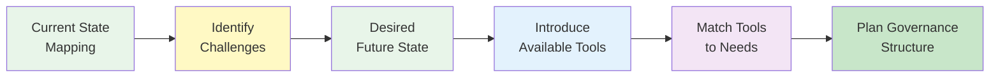

# Workshop #4: Phase 2 Sense-Making & Needs Identification

**Program:** Regenerant Catalunya  
**Phase:** Phase 2 - Network-Level Collective Governance  
**Status:** Materials prepared, ready for scheduling  
**Target Date:** Week of February 3-14, 2026

---

## Workshop Overview

Workshop #4 marks the transition from Phase 1 (individual project support) to Phase 2 (network-level collective governance). This critical workshop uses sense-making methodology to understand each network's governance challenges before introducing Web3 tools, ensuring tools serve real needs rather than being imposed.

**Duration:** 135 minutes (2 hours 15 minutes)  
**Format:** Hybrid with network-specific breakout sessions  
**Languages:** Spanish (primary), Catalan (available)  
**Networks:** Miceli Social & La Fundición/Keras Buti (separate sessions within unified workshop)

---

## Objectives

1. **Close Phase 1 properly** and celebrate achievements
2. **Introduce Phase 2 concept** of network-level collective governance
3. **Conduct sense-making** to understand current governance challenges and needs
4. **Introduce available Web3 tools** for network governance
5. **Plan Phase 2 governance structure** based on identified needs
6. **Define next steps** and support requirements

---

## Workshop Materials

### Core Documents

1. **[Facilitator-Script-Workshop-4.md](./Facilitator-Script-Workshop-4.md)** ✅
   - Complete facilitation guide with timing, scripts, and notes
   - Network-specific adaptations for Miceli Social and La Fundición
   - Pre-workshop preparation and post-workshop tasks
   - Backup plans and troubleshooting
   - **Usage:** Primary guide for facilitators during workshop

2. **[Sense-Making-Worksheet.md](./Sense-Making-Worksheet.md)** ✅
   - Structured template for network sense-making process
   - Current state mapping, challenges, desired future state
   - Tool connection and planning decisions sections
   - **Usage:** Printed for each participant, completed during workshop

3. **[Tool-Comparison-Matrix.md](./Tool-Comparison-Matrix.md)** ✅
   - Detailed comparison of Safe, Home Community, and IDK
   - Use cases, network fit, requirements, advantages/limitations
   - Decision framework and evaluation criteria
   - **Usage:** Reference handout for participants

4. **[Quick-Reference-Guide.md](./Quick-Reference-Guide.md)** ✅
   - Condensed facilitator guide for quick reference
   - Timing summary, key messages, checklists
   - **Usage:** Quick lookup during workshop facilitation

5. **[Slide-Deck-Specification.md](./Slide-Deck-Specification.md)** ✅
   - Detailed specification for 23-slide deck
   - Slide-by-slide content and visual guidelines
   - Design guidelines and branding
   - **Usage:** Build presentation slides in PowerPoint/Google Slides

### Materials to Build

- [ ] **Slide Deck** (PowerPoint/Google Slides)
  - Spanish version (primary)
  - Catalan version (available)
  - Based on Slide-Deck-Specification.md
  - Target: Feb 1-3, 2026

- [ ] **Digital Whiteboard Template** (Miro/Mural)
  - For online participants
  - Sense-making canvas
  - Tool mapping exercise
  - Target: Feb 1-3, 2026

- [ ] **Participant Handout Packet** (PDF)
  - Agenda
  - Worksheets
  - Tool comparison
  - Resources
  - Target: Feb 3-5, 2026 (print before workshop)

---

## Workshop Approach

### Sense-Making First Methodology

**Core Principle:** Understand governance needs before proposing tools.

**Why This Matters:**
- Ensures tools serve real network needs, not imposed solutions
- Honors existing governance wisdom
- Builds buy-in through collaborative design
- Reduces resistance to new technologies
- Creates context-appropriate solutions

**Process Flow:**

### Network-Specific Adaptations

**Unified Workshop with Breakouts:**
- Opening together (celebrate Phase 1, introduce Phase 2)
- Network-specific sense-making (40 min breakouts)
- Tool introduction together (learn about all tools)
- Network-specific planning (30 min breakouts)
- Closing together (share decisions, next steps)

**Miceli Social Network:**
- **Profile:** Tech-forward, interested in deep Web3 integration
- **Facilitator Approach:** Technical language okay, emphasize control/transparency, explore advanced features
- **Likely Tool Fit:** Safe multisig + IDK

**La Fundición / Keras Buti Network:**
- **Profile:** Territorial-presential, skeptical of crypto complexity
- **Facilitator Approach:** Cooperative language, hide blockchain jargon, practical benefits, in-person support
- **Likely Tool Fit:** Home Community + IDK

---

## Tools Introduced

### Primary Tools

**1. Safe (Multisigs)**
- Multi-signature wallet for network treasury
- Requires multiple approvals for transactions
- Maximum transparency and security
- Best for: Financial governance requiring approval

**2. Home Community**
- Mobile app for community governance
- Hides all blockchain complexity
- Thumbs up/down voting, participatory budgeting
- Best for: Inclusive, accessible decision-making

**3. Institutional Development Kit (IDK)**
- Facilitation framework from Regen Foundation
- Maps existing governance structures
- Identifies Web3 integration opportunities
- Best for: Understanding before adopting tools

### Optional Tools (Mentioned Briefly)

- **Gardens:** Advanced governance (conviction voting)
- **Sarafu Network:** Local currency systems
- **Cycles:** Circular economy clearing

---

## Expected Outcomes

### By End of Workshop

**Each network will have:**
- ✅ Identified current governance challenges
- ✅ Articulated desired future state
- ✅ Made initial tool selection decision
- ✅ Planned governance structure approach
- ✅ Defined learning and support needs
- ✅ Clear next steps and timeline

**Program will have:**
- ✅ Documented network sense-making outcomes
- ✅ Tool selection decisions for each network
- ✅ Phase 2 implementation plan customized per network
- ✅ Support plan tailored to network needs

---

## Pre-Workshop Checklist

### 2 Weeks Before

- [ ] Finalize workshop date with both networks
- [ ] Send save-the-date communication
- [ ] Build slide deck from specification
- [ ] Create digital whiteboard template
- [ ] Prepare facilitator team assignments

### 1 Week Before

- [ ] Send formal invitation with agenda and materials
- [ ] Print sense-making worksheets
- [ ] Print tool comparison matrices
- [ ] Prepare physical materials (sticky notes, markers)
- [ ] Test technology setup
- [ ] Coordinate catering/refreshments (if in-person)

### 3 Days Before

- [ ] Send reminder email with logistics
- [ ] Confirm attendance with network coordinators
- [ ] Final review of facilitator script with team
- [ ] Prepare backup plans
- [ ] Test hybrid technology (if applicable)

### 1 Day Before

- [ ] Final participant count
- [ ] Print final materials
- [ ] Pack physical supplies
- [ ] Review notes and key messages
- [ ] Prepare recording equipment
- [ ] Confirm room/space booking

### Day Of

- [ ] Arrive 30 minutes early
- [ ] Set up room/technology
- [ ] Test audio/video
- [ ] Arrange materials
- [ ] Create welcoming atmosphere
- [ ] Greet participants as they arrive

---

## Facilitator Team Assignments

**Lead Facilitator (Unified Sessions):**
- Likely: [Andrea or Giulio]
- Responsibilities: Opening, tool introductions, closing

**Network Facilitator A (Miceli Social):**
- Likely: [Giulio]
- Responsibilities: Sense-making, planning session with Miceli

**Network Facilitator B (La Fundición):**
- Likely: [Andrea]
- Responsibilities: Sense-making, planning session with La Fundición

**Support Role:**
- Likely: [Luiz - remote support]
- Responsibilities: Note-taking, technology support, documentation

**Note:** Actual assignments to be determined in Jan 28 planning session.

---

## Post-Workshop Tasks

### Immediately After (Same Day)

- [ ] Debrief with co-facilitators (30 min)
- [ ] Compile notes and decisions
- [ ] Photograph documentation boards/worksheets
- [ ] Draft initial summary

### Within 48 Hours

- [ ] Send thank you email to participants
- [ ] Share workshop documentation (notes, decisions, photos)
- [ ] Schedule tool setup sessions based on decisions
- [ ] Update Phase 2 timeline
- [ ] Share outcomes with full ReFi Barcelona team

### Within 1 Week

- [ ] Complete workshop report with insights
- [ ] Begin tool setup based on decisions
- [ ] Schedule tool-specific training workshops
- [ ] Prepare customized implementation guides
- [ ] Individual check-ins with network coordinators

---

## Success Metrics

**Workshop is successful if:**
- ✅ Both networks articulate governance challenges clearly
- ✅ Tool selection decisions made based on real needs (not hype)
- ✅ Participants feel heard and supported
- ✅ Clear next steps established
- ✅ Both technical and non-technical participants engaged
- ✅ Networks feel ownership of Phase 2 design

**Red flags to watch for:**
- 🚩 Decisions made hastily without discussion
- 🚩 One voice dominating network decision
- 🚩 Tool selection based on "cool factor" not needs
- 🚩 Participants confused or overwhelmed
- 🚩 Significant disagreement within network unresolved

---

## Integration with Broader Phase 2

**Workshop #4 feeds into:**
- Tool implementation plans (Safe, Home Community, IDK)
- Workshop #5 design (BioFi and Beyond)
- Participant communications strategy
- Timeline adjustments based on network readiness
- Support plan customization
- Final report content

**Before Workshop #4:**
- Phase 1 closing workshop completed ✅
- Phase 1 disbursements in progress
- Planning session outcomes documented

**After Workshop #4:**
- Tool setup and configuration begins
- Network-specific training workshops scheduled
- IDK mini-program sessions begin
- Workshop #5 scheduled

---

## Resources & Links

**Program Documentation:**
- [Network Guidebook](../../content/program/network-guidebook.md)
- [Program Timeline](../../content/program/timeline.md)
- [Project Overview](../../.cursorrules/project-overview.mdc)

**Phase 1 Reference:**
- [Phase 1 Closing Workshop](../workshop-cierre-fase-1/)
- Learnings from Phase 1 to inform Phase 2 approach

**Tools Documentation:**
- Safe: https://safe.global/
- Home Community: https://home.xyz/
- Regen Foundation: https://regen.foundation/

**Contact:**
- Email: hola@ReFiBCN.cat
- Weekly Ops Sync: Tuesdays
- Workshop Coordination: [Team member]

---

## Version History

**v1.0 - January 28, 2026**
- Initial materials creation
- Facilitator script, worksheets, comparison matrix complete
- Slide specification complete
- Ready for slide deck production and scheduling

**[Future versions will be documented here]**

---

**Status:** ✅ Core materials complete, slides to be built  
**Next Action:** Build slide deck from specification (target: Feb 1-3)  
**Owner:** ReFi Barcelona Team

---

*These materials represent a sense-making approach to governance tool adoption - understanding needs first, then matching tools to those needs. This methodology is replicable for other bioregional programs.*

**Regenerant Catalunya Phase 2**  
ReFi Barcelona | hola@ReFiBCN.cat
